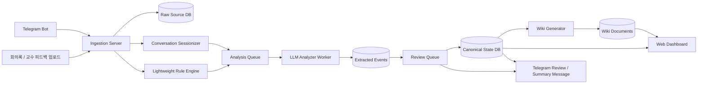
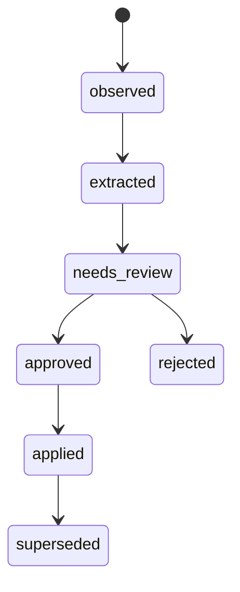

# AI 협업 코치 프로젝트 상세 설명서 (개정판 v2)

## 1. 문서 개요

- **문서명**: AI 협업 코치 프로젝트 상세 설명서 (개정판 v2)
- **프로젝트명**: AI 협업 코치
- **서비스 별칭**: 텔레그램 기반 준실시간 프로젝트 메모리 및 변경 추적 시스템
- **문서 목적**: 대학생 개발 프로젝트 협업 과정에서 발생하는 맥락 누락, 결정사항 유실, 요구사항 변경 추적 실패 문제를 해결하기 위한 서비스의 요구사항, 구조, 기능, 데이터 모델, 개발 방향을 구체적으로 정의한다.
- **주요 독자**: 팀원, 지도교수, 추후 저장소를 참고할 개발자, 발표 준비자
- **문서 성격**: 기획서 + 기술 명세서 + 구현 가이드 초안

---

## 2. 프로젝트 한 줄 설명

프로젝트 공식 채널로 사용하는 텔레그램 대화와 오프라인 회의/교수 피드백 텍스트를 표준화된 입력 경로로 수집하고, AI가 이를 구조화된 이벤트 후보로 정리한 뒤 팀장 승인에 따라 프로젝트의 정본 상태를 갱신하며, 그 결과를 위키와 대시보드로 제공하는 **준실시간 AI 협업 코치 시스템**을 개발한다.

---

## 3. 개정 배경

기존 설명서는 문제의식과 구조가 좋았지만, 실제 구현 가능성과 운영 안정성 측면에서 다음과 같은 보완이 필요했다.

1. 문제 정의와 MVP 범위를 더 정직하게 맞출 것
2. 1차 버전에 과도한 AI 기능을 한꺼번에 넣지 않을 것
3. 텔레그램 수집의 기술적 전제를 명확히 적을 것
4. 메시지 수정/삭제 추적 가능 범위를 API 수준에 맞게 조정할 것
5. Webhook 수집과 LLM 분석의 동기/비동기 경계를 명확히 할 것
6. 데이터 모델에서 무엇이 정본(canonical source)인지 분명히 할 것
7. 이벤트 상태 전이를 더 세분화하고, 사람 승인 기준을 넣을 것
8. 서비스 전체를 과장되게 “완전 실시간”으로 표현하지 않고, 입력 채널별 반영 속도를 구분할 것

이 문서는 위 1~8번 피드백을 반영한 개정판이다.

---

## 4. 문제 정의

### 4.1 현재 대학생 팀 프로젝트의 실제 문제

대학생 개발 프로젝트는 다음과 같은 이유로 협업 맥락이 쉽게 끊긴다.

- 회의 내용이 구두로 끝나고 문서화가 늦어진다.
- 교수 피드백이 팀장 개인 메모에만 남을 수 있다.
- 채팅은 많이 남지만 결정사항, 변경사항, 근거가 구조화되지 않는다.
- 초보 팀원은 지금 무엇이 바뀌었는지 이해하기 어렵다.
- 발표 준비 단계에서 “왜 이 방향으로 바뀌었는가”를 설명할 근거를 찾기 어렵다.

### 4.2 1차 버전이 실제로 해결하는 문제

이 프로젝트의 **1차 MVP는 모든 협업 채널을 완전 자동 통합하는 시스템이 아니다.**

1차 버전은 다음 상황을 전제로 한다.

- **공식 협업 대화 채널을 텔레그램으로 통일한다.**
- **오프라인 회의와 교수 피드백은 텍스트로 업로드한다.**
- **중요 변경은 팀장이 최종 확인한다.**

즉, 1차 MVP가 해결하려는 핵심 문제는 다음과 같다.

> 공식 협업 채널과 오프라인 피드백을 표준화된 방식으로 수집했을 때,
> 프로젝트의 결정사항·변경사항·근거·미해결 이슈가 누락되지 않도록 구조화하고,
> 팀 전체가 최신 상태를 같은 기준으로 이해할 수 있게 만드는 것

### 4.3 해결해야 할 핵심 질문

이 프로젝트는 다음 질문에 답해야 한다.

- 지금 프로젝트에서 **무엇이 바뀌었는가?**
- 그 변화는 **왜 생겼는가?**
- 그 결정의 **근거는 무엇인가?**
- 아직 **해결되지 않은 문제는 무엇인가?**
- 팀원은 **지금 무엇을 확인하거나 해야 하는가?**

---

## 5. 프로젝트 목표

### 5.1 최종 목표

텔레그램 공식 대화 채널과 오프라인 피드백 텍스트를 통합 수집하고, AI가 이를 구조화된 이벤트 후보로 정리하며, 팀장 승인 후 프로젝트의 정본 상태를 갱신하는 협업 코치 시스템을 구축한다.

### 5.2 세부 목표

1. 텔레그램 메시지를 안정적으로 실시간 저장한다.
2. 회의록과 교수 피드백을 텍스트로 입력받아 원문을 보존한다.
3. 대화/문서에서 결정사항, 요구사항 변경, 작업, 이슈를 **이벤트 후보**로 추출한다.
4. 중요 이벤트는 팀장 승인 후 **정본 상태**에 반영한다.
5. 위키와 대시보드는 정본 상태를 기반으로 자동 재생성한다.
6. 팀원은 긴 대화를 다시 읽지 않아도 최신 맥락을 파악할 수 있다.
7. 발표/회고 시 프로젝트 변화 이력과 근거를 빠르게 확인할 수 있다.

### 5.3 비목표

1차 버전에서 제외하거나 축소하는 항목은 다음과 같다.

- 카카오톡, 디스코드, 노션, GitHub의 완전 자동 통합
- 모든 변경에 대한 완전 자동 승인
- 강한 수준의 자동 개입 에이전트
- 일정 자동 배정 및 팀원 성과 점수화
- 코드 생성 중심 개발 도구

---

## 6. 대상 사용자

### 6.1 주요 사용자

- **대학생 개발 팀원**: 프로젝트 맥락 이해가 필요한 사용자
- **초보 개발자**: 현재 상태와 우선순위 파악이 어려운 사용자
- **팀장/PM 역할 학생**: 회의 정리와 변경 승인 부담이 큰 사용자
- **발표/문서 담당자**: 결정 근거와 변화 타임라인 정리가 필요한 사용자

### 6.2 대표 사용 시나리오

#### 시나리오 A: 회의 이후 변경사항 반영
1. 팀원들이 텔레그램에서 기능 방향을 논의한다.
2. 같은 날 교수님 면담 녹취를 텍스트로 업로드한다.
3. 시스템은 원문을 저장하고, 대화 세션 단위로 이벤트 후보를 추출한다.
4. 팀장은 요구사항 변경 후보를 검토하고 승인/반려/수정한다.
5. 승인된 변경은 정본 상태에 반영되고 위키가 재생성된다.

#### 시나리오 B: 초보 팀원의 상황 파악
1. 팀원이 대시보드에 접속한다.
2. 최근 승인된 변경사항, 현재 요구사항, 미해결 이슈를 확인한다.
3. 팀원은 긴 원문을 모두 읽지 않고도 현재 상태를 이해한다.

#### 시나리오 C: 발표 전 근거 확인
1. 발표 담당자가 “왜 로그인 기능이 빠졌는가?”를 확인한다.
2. 시스템은 관련 결정, 승인 시각, 근거 원문, 교수 피드백을 보여준다.
3. 발표 자료에 사용할 수 있는 요약을 생성한다.

---

## 7. 핵심 원칙

1. **원본은 보존한다.**
2. **AI 추출 결과와 정본 상태를 분리한다.**
3. **중요 변경은 사람이 승인한다.**
4. **위키는 정본이 아니라 파생 표현물이다.**
5. **실시간 수집과 비동기 분석을 분리한다.**
6. **사실과 추론을 구분한다.**
7. **이전 결정은 삭제보다 대체(superseded)로 관리한다.**

### 7.1 용어 정의

#### 정본(Canonical Source)
시스템이 “현재 기준으로 가장 믿을 수 있는 상태”라고 간주하는 데이터 계층을 의미한다.

이 프로젝트에서는 다음을 구분한다.

- `raw_messages`, `raw_documents`: **원본 증거**
- `extracted_events`: **AI가 제안한 구조화 이벤트 후보**
- `requirements_state`, `decisions_state`, `tasks_state`, `issues_state`: **정본 상태**
- `wiki_pages`: **정본 상태를 보기 좋게 재생성한 문서**

즉, 위키가 진실을 결정하는 것이 아니라 **정본 상태 테이블이 현재 상태의 기준**이 된다.

---

## 8. 운영 전제(Operational Assumptions)

1. 프로젝트 공식 대화 채널은 **텔레그램 단체 채팅방**으로 운영한다.
2. 그룹 메시지 전체 수집을 위해 **봇 관리자 권한 또는 privacy mode 비활성 설정**이 필요하다.
3. 텔레그램 Webhook을 받기 위해 **공개 HTTPS 엔드포인트**가 필요하다.
4. 오프라인 회의와 교수 피드백은 **텍스트 업로드 경로를 통해 반드시 입력**해야 한다.
5. 중요한 요구사항 변경, 교수 피드백 반영, 방향 전환은 **팀장 승인 대상**이다.
6. 1차 버전은 텔레그램 + 수동 업로드를 기준으로 하며, 다른 채널 연동은 차후 확장 범위로 둔다.

---

## 9. 서비스 범위

### 9.1 1차 MVP 범위

1. 텔레그램 프로젝트 단톡방 메시지 실시간 저장
2. 회의록/교수 피드백 텍스트 업로드
3. 대화 세션 단위 정리
4. 이벤트 후보 추출
5. 팀장 검토/승인 워크플로우
6. 정본 상태 갱신
7. 위키 자동 재생성
8. 기본 대시보드 제공
9. 기본 요약/검토 요청 알림

### 9.2 2차 확장 범위

1. GitHub 이슈/PR 연동
2. 노션 문서 동기화
3. 자동 충돌 탐지 고도화
4. 자동 개입/추천 기능 고도화
5. 신규 팀원 온보딩 브리핑
6. 주간 리포트 자동 생성
7. 발표자료용 타임라인 자동 정리

> **핵심 수정 포인트**: 1차 MVP는 “기억 시스템(memory-first)”에 집중하고, 고위험 자동 개입 기능은 2차로 미룬다.

---

## 10. 시스템 개념 구조

### 10.1 Raw Source Layer
원문 데이터를 저장하는 계층

- 텔레그램 채팅 메시지
- 회의 녹취/STT 텍스트
- 교수 피드백 텍스트
- 수동 노트

특징:
- 가능한 한 원문 그대로 보존
- 재분석 가능
- 수정하지 않음

### 10.2 Event Proposal Layer
AI가 원문을 바탕으로 구조화 이벤트 후보를 생성하는 계층

예:
- 요구사항 변경 후보
- 결정사항 후보
- 작업 생성/수정 후보
- 이슈 발생 후보
- 교수 피드백 후보

특징:
- AI가 제안하는 계층
- 아직 정본이 아님
- 신뢰도와 근거를 함께 저장

### 10.3 Review & Canonical State Layer
팀장 검토 후 현재 프로젝트 상태를 반영하는 계층

예:
- 현재 요구사항 목록
- 현재 유효한 결정사항
- 미해결 이슈 목록
- 작업 상태

특징:
- 정본 계층
- 사용자 화면과 위키는 이 계층을 기준으로 보여줌
- 변경은 승인 기록과 함께 남김

### 10.4 Wiki / Presentation Layer
정본 상태를 사람이 읽기 쉬운 문서와 화면으로 표현하는 계층

예:
- requirements.md
- decisions.md
- change_log.md
- professor_feedback.md
- web dashboard

특징:
- 파생 결과물
- 필요 시 언제든 재생성 가능
- 직접 편집보다 정본 갱신을 우선

### 10.5 Intervention Layer
사용자에게 요약, 검토 요청, 알림을 제공하는 계층

1차 MVP에서의 개입 범위:
- 검토 요청 알림
- 최근 승인된 변경사항 요약
- 미검토 항목 리마인드

2차 확장 개입 범위:
- 자동 충돌 경고
- 추천 행동 제안
- 장기 미반영 피드백 추적

---

## 11. 시스템 아키텍처



### 11.1 핵심 해석

- **Webhook 경로에서는 LLM을 직접 호출하지 않는다.**
- 텔레그램 메시지는 **즉시 저장**하고, 분석 대상 등록까지만 수행한다.
- LLM 분석은 **비동기 Worker**가 처리한다.
- 사용자가 보는 위키/대시보드는 **정본 상태**를 기준으로 생성된다.

---

## 12. 텔레그램 메시지 처리 전략

### 12.1 수집과 분석의 분리

텔레그램 메시지 처리에는 두 단계가 있다.

#### 1단계: 실시간 수집
- 메시지 본문 저장
- 발신자 저장
- 시각 저장
- reply 관계 저장
- 메시지 유형 메타데이터 저장

#### 2단계: 비동기 해석
- 대화 세션 단위 분류/요약
- 결정사항 후보 추출
- 변경사항 후보 추출
- 이슈 후보 추출

### 12.2 대화 세션화(Sessionization)

메시지는 1개씩 바로 LLM에 보내지 않고 **대화 세션 단위**로 묶는다.

기본 정책:
- 같은 채팅방에서 대화 흐름이 **1시간 이상 멈추면 하나의 세션 종료**로 간주
- 종료된 세션을 LLM 분석 큐에 등록
- 시간 기준은 환경설정으로 조정 가능

이 방식의 장점:
- 메시지 1개 단위보다 문맥을 더 잘 이해할 수 있음
- 비용 절감
- 실제 회의/논의 흐름 단위로 요약 가능

### 12.3 즉시 우선 처리 후보

모든 분석을 1시간 뒤로만 미루면 늦을 수 있으므로, **가벼운 규칙 기반 감지**를 추가한다.

우선 처리 예시:
- `교수님`, `마감`, `배포`, `오류`, `확정`, `결정`, `변경` 등의 키워드
- `/decision`, `/change`, `/issue` 같은 명시 명령어

이 경우:
- 메시지를 중요 후보로 즉시 표시
- Review Queue 또는 Analysis Queue에서 우선 처리

> 즉, 이 프로젝트의 “준실시간”은 **메시지 저장은 즉시**, **의미 해석은 세션 단위 비동기 처리**, **일부 긴급 후보만 우선 처리**를 의미한다.

---

## 13. 기능 요구사항

## 13.1 핵심 기능

### 13.1.1 텔레그램 메시지 실시간 저장
- Telegram Bot API를 통해 프로젝트 단톡방 메시지를 수집한다.
- 메시지 본문, 작성자, 채팅방 ID, 전송 시각, 답장 대상, 메시지 유형을 저장한다.
- **편집 이벤트는 추적 가능하도록 저장한다.**
- **일반 그룹 메시지 삭제는 완전 보장을 요구하지 않는다.** 이미 저장된 메시지는 스냅샷 기준으로 보존하고, 삭제 여부는 가능한 범위에서 `visibility_status` 등으로 관리한다.

### 13.1.2 외부 텍스트 입력
- 회의록, 교수 피드백, 음성 STT 결과를 직접 업로드할 수 있다.
- 입력 시 출처 유형을 명시한다.
  - `meeting`
  - `professor_feedback`
  - `manual_note`

### 13.1.3 대화 세션 생성
- 시간 인접성, reply 관계를 기준으로 텔레그램 메시지를 대화 세션으로 묶는다.
- 기본 idle threshold는 1시간으로 설정한다.

### 13.1.4 이벤트 후보 추출
AI는 세션 또는 문서를 분석해 다음 범주의 이벤트 후보를 생성한다.

- 질문
- 결정사항 후보
- 요구사항 변경 후보
- 작업 생성/수정 후보
- 이슈/장애 후보
- 참고/일반 대화
- 교수 피드백 후보

### 13.1.5 핵심 정보 추출
이벤트 후보에서 아래 정보를 추출한다.

- 관련 기능/주제
- 결정 또는 변경 요약
- 변경 전/후
- 관련 인물
- 근거 원문 목록
- 이유(reason)
- 신뢰도(confidence)

### 13.1.6 팀장 검토/승인
중요 이벤트는 Review Queue로 보낸다.

팀장은 다음 중 하나를 선택할 수 있다.
- 승인
- 반려
- 보류
- 수정 후 승인

근거가 부족한 경우 시스템은 팀장에게 다음 정보를 보완 요청할 수 있다.
- 변경 이유
- 영향 범위
- 관련 작업
- 결정 근거
- 변경 전/후 문장

### 13.1.7 정본 상태 갱신
승인된 이벤트는 정본 상태 테이블에 반영한다.

예:
- 요구사항 변경 승인 → `requirements_state` 갱신
- 결정사항 승인 → `decisions_state` 갱신
- 이슈 승인 → `issues_state` 갱신

### 13.1.8 Project Wiki 재생성
위키는 정본 상태를 기반으로 자동 생성/재생성한다.

생성 대상 예시:
- 프로젝트 개요
- 요구사항 문서
- 결정사항 문서
- 변경 이력 문서
- 교수 피드백 문서
- 미해결 이슈 문서
- 팀 브리핑 문서

### 13.1.9 대시보드 제공
웹 화면에서 다음을 제공한다.

- 오늘의 요약
- 최근 승인된 변경사항
- 현재 요구사항
- 미해결 이슈
- 교수 피드백 반영 현황
- 검토 대기 항목
- 최근 결정사항 타임라인

## 13.2 1차 MVP에서 제한하는 기능

다음 기능은 1차 MVP에서 “기본형”으로만 제공하거나 2차로 넘긴다.

- 고도화된 자동 충돌 탐지
- 능동 추천 메시지 다중 생성
- 장기 패턴 분석 기반 개입
- GitHub/Notion 자동 양방향 동기화

---

## 14. 비기능 요구사항

### 14.1 성능
- 텔레그램 메시지 수신 후 원문 저장까지 **1~3초 이내 목표**
- 세션 종료 후 분석 반영은 **비동기 eventual consistency**로 처리
- 단일 요약 조회는 **10초 이내 목표**

### 14.2 신뢰성
- 원본 저장과 AI 분석은 분리한다.
- Webhook 단계에서는 저장과 큐 적재만 수행한다.
- LLM 실패 시 재처리 가능해야 한다.

### 14.3 감사 가능성(Auditability)
- 모든 정본 변경은 근거 이벤트와 승인 기록을 남긴다.
- 승인자, 승인 시각, 반영 시각을 기록한다.

### 14.4 사용성
- 초보 팀원도 복잡한 설정 없이 요약을 읽을 수 있어야 한다.
- 검토 화면은 근거 원문과 변경 전/후가 함께 보여야 한다.

### 14.5 보안/개인정보
- 프로젝트 데이터는 권한 있는 팀원만 접근 가능해야 한다.
- 음성 원문은 정책에 따라 보관 기간을 둘 수 있다.
- 요약만 장기 저장하고 원본 음성은 삭제하는 정책을 선택할 수 있다.

---

## 15. 데이터 모델 설계

### 15.1 데이터 계층 요약

| 계층 | 예시 테이블 | 역할 | 정본 여부 |
|---|---|---|---|
| Raw Source | raw_messages, raw_documents | 원문 증거 저장 | 아니오 |
| Event Proposal | extracted_events, conversation_sessions | AI 추출 결과 및 분석 단위 | 아니오 |
| Review / Audit | review_actions | 승인/반려 이력 | 아니오 |
| Canonical State | requirements_state, decisions_state, tasks_state, issues_state, feedback_state | 현재 상태의 기준 | 예 |
| Presentation | wiki_pages, wiki_revisions | 정본을 문서 형태로 표현 | 아니오 |

### 15.2 주요 엔티티

| 엔티티 | 설명 |
|---|---|
| projects | 프로젝트 기본 정보 |
| users | 사용자/팀원 정보 |
| channels | 데이터 출처 채널 정보 |
| raw_messages | 텔레그램 원문 메시지 |
| raw_documents | 회의록/교수 피드백 원문 |
| conversation_sessions | 메시지 묶음 단위 세션 |
| extracted_events | AI가 추출한 구조화 이벤트 후보 |
| review_actions | 승인/보류/반려/수정 기록 |
| requirements_state | 현재 요구사항 정본 |
| decisions_state | 현재 유효한 결정사항 정본 |
| tasks_state | 현재 작업 상태 정본 |
| issues_state | 현재 이슈 상태 정본 |
| feedback_state | 교수 피드백 정본/반영 상태 |
| wiki_pages | 자동 생성 위키 문서 |
| wiki_revisions | 위키 변경 이력 |
| interventions | 알림/개입 내역 |

### 15.3 핵심 테이블 초안

#### raw_messages
| 컬럼명 | 타입 | 설명 |
|---|---|---|
| id | UUID | 내부 메시지 ID |
| project_id | UUID | 프로젝트 ID |
| channel_id | UUID | 채널 ID |
| telegram_message_id | VARCHAR | 텔레그램 원본 ID |
| sender_id | UUID | 발신자 |
| text | TEXT | 메시지 본문 |
| reply_to_message_id | UUID | 답장 대상 |
| sent_at | TIMESTAMP | 전송 시각 |
| edited_at | TIMESTAMP | 편집 시각 |
| visibility_status | VARCHAR | visible / unknown / soft_deleted |
| metadata | JSONB | 추가 메타데이터 |

#### raw_documents
| 컬럼명 | 타입 | 설명 |
|---|---|---|
| id | UUID | 문서 ID |
| project_id | UUID | 프로젝트 ID |
| source_type | VARCHAR | meeting / professor_feedback / manual_note |
| title | VARCHAR | 제목 |
| content | TEXT | 원문 |
| created_by | UUID | 업로드 사용자 |
| created_at | TIMESTAMP | 업로드 시각 |

#### conversation_sessions
| 컬럼명 | 타입 | 설명 |
|---|---|---|
| id | UUID | 세션 ID |
| project_id | UUID | 프로젝트 ID |
| channel_id | UUID | 채널 ID |
| start_at | TIMESTAMP | 세션 시작 시각 |
| end_at | TIMESTAMP | 세션 종료 시각 |
| message_count | INT | 포함 메시지 수 |
| session_status | VARCHAR | open / closed / analyzed |
| trigger_type | VARCHAR | idle_timeout / manual / priority |

#### extracted_events
| 컬럼명 | 타입 | 설명 |
|---|---|---|
| id | UUID | 이벤트 ID |
| project_id | UUID | 프로젝트 ID |
| source_kind | VARCHAR | message / document / session |
| source_id | UUID | 원문 또는 세션 ID |
| event_type | VARCHAR | decision / requirement_change / task / issue / feedback / question |
| state | VARCHAR | observed / extracted / needs_review / approved / rejected / applied / superseded |
| topic | VARCHAR | 관련 주제 |
| summary | TEXT | 한 줄 요약 |
| details | JSONB | 구조화 상세 정보 |
| confidence | FLOAT | 신뢰도 |
| created_at | TIMESTAMP | 생성 시각 |

#### review_actions
| 컬럼명 | 타입 | 설명 |
|---|---|---|
| id | UUID | 리뷰 액션 ID |
| event_id | UUID | 대상 이벤트 |
| reviewer_id | UUID | 검토자(팀장) |
| action | VARCHAR | approve / reject / hold / edit_and_approve |
| review_note | TEXT | 검토 의견 |
| patch | JSONB | 수정 내용 |
| reviewed_at | TIMESTAMP | 검토 시각 |

#### requirements_state
| 컬럼명 | 타입 | 설명 |
|---|---|---|
| id | UUID | 요구사항 상태 ID |
| project_id | UUID | 프로젝트 ID |
| item_key | VARCHAR | 요구사항 식별자 |
| title | VARCHAR | 요구사항 제목 |
| current_value | TEXT | 현재 설명 |
| priority | VARCHAR | high / medium / low |
| status | VARCHAR | active / on_hold / removed |
| source_event_id | UUID | 근거 이벤트 |
| approved_by | UUID | 승인자 |
| approved_at | TIMESTAMP | 승인 시각 |
| applied_at | TIMESTAMP | 정본 반영 시각 |
| superseded_by | UUID | 대체한 이벤트/상태 |

#### decisions_state
| 컬럼명 | 타입 | 설명 |
|---|---|---|
| id | UUID | 결정 ID |
| project_id | UUID | 프로젝트 ID |
| decision_key | VARCHAR | 결정 식별자 |
| topic | VARCHAR | 주제 |
| decision_text | TEXT | 현재 유효한 결정 내용 |
| status | VARCHAR | active / superseded / withdrawn |
| source_event_id | UUID | 근거 이벤트 |
| approved_by | UUID | 승인자 |
| approved_at | TIMESTAMP | 승인 시각 |
| applied_at | TIMESTAMP | 반영 시각 |
| superseded_by | UUID | 대체한 결정 |

#### wiki_pages
| 컬럼명 | 타입 | 설명 |
|---|---|---|
| id | UUID | 위키 페이지 ID |
| project_id | UUID | 프로젝트 ID |
| slug | VARCHAR | 문서 식별자 |
| title | VARCHAR | 문서명 |
| content_md | TEXT | 마크다운 내용 |
| derived_from | JSONB | 참조한 정본 상태 목록 |
| updated_at | TIMESTAMP | 수정 시각 |

---

## 16. 이벤트 상태 전이 설계

기존의 `proposed / confirmed / unresolved` 3단계만으로는 실제 운영 흐름을 충분히 표현하기 어렵다. 따라서 상태를 다음처럼 세분화한다.

### 16.1 상태 정의

| 상태 | 의미 |
|---|---|
| observed | 원문에서 관찰됨 |
| extracted | AI가 이벤트 후보로 추출함 |
| needs_review | 팀장 검토가 필요함 |
| approved | 팀장이 승인함 |
| rejected | 팀장이 반려함 |
| applied | 정본 상태 테이블에 반영 완료 |
| superseded | 이후 다른 결정/변경으로 대체됨 |

### 16.2 상태 전이 예시



### 16.3 중요한 설계 원칙

1. **AI의 높은 confidence만으로 approved가 되지 않는다.**
2. **approved와 applied는 다르다.**
   - `approved`: 팀장이 내용 자체를 수용함
   - `applied`: 정본 상태에 반영 완료됨
3. **이전 결정은 삭제보다 superseded로 관리한다.**
4. **팀장 승인 기록은 감사 로그로 남긴다.**

---

## 17. 팀장 검토 워크플로우

### 17.1 검토 대상
다음 항목은 기본적으로 팀장 검토 대상이다.

- 요구사항 추가/삭제/우선순위 변경
- 주요 기능 방향 변경
- 교수 피드백 반영 여부 확정
- 발표 범위 변경
- 핵심 이슈 상태 변경

### 17.2 검토 화면 제공 정보

팀장에게는 다음이 함께 보여야 한다.

- 이벤트 요약
- 관련 주제
- 신뢰도
- 원문 근거 목록
- 변경 전 / 변경 후
- AI가 추론한 이유
- 관련 작업 또는 이슈

### 17.3 정보 부족 시 보완 요청

근거가 부족할 경우 시스템은 다음과 같은 질문을 생성할 수 있다.

- 이 변경의 직접적인 이유는 무엇인가?
- 교수 피드백과 연결되는 근거가 있는가?
- 변경의 영향 범위는 어느 화면/기능까지인가?
- 이 결정은 확정인가, 임시 보류인가?

### 17.4 검토 후 반영 규칙

- 승인 → 정본 상태 갱신
- 수정 후 승인 → 수정 내용 반영 후 정본 갱신
- 보류 → 상태 유지, 추가 근거 수집
- 반려 → 이벤트는 남기되 정본에는 반영하지 않음

---

## 18. Project Wiki 설계

### 18.1 Wiki의 역할

위키는 다음을 위한 표현 계층이다.

- 현재 상태 요약
- 결정 근거 설명
- 변경 이력 제공
- 발표/회고용 문서 제공

### 18.2 Wiki는 정본이 아니다

이 프로젝트에서 위키는 사람이 보기 좋은 문서일 뿐이며, 정본 상태를 직접 수정하는 도구가 아니다.

권장 흐름:

```text
원본 수집 → 이벤트 후보 → 팀장 승인 → 정본 상태 갱신 → Wiki 재생성
```

### 18.3 필수 문서 목록

1. `project_overview.md`
2. `requirements.md`
3. `decisions.md`
4. `change_log.md`
5. `professor_feedback.md`
6. `open_issues.md`
7. `weekly_brief.md`
8. `timeline.md`

### 18.4 문서별 역할

#### requirements.md
- 현재 유효한 요구사항 목록
- 우선순위
- 보류/제외 항목
- 각 항목의 근거 이벤트 링크

#### decisions.md
- 유효한 결정사항 목록
- 승인 시각
- 승인자
- 근거 원문

#### change_log.md
- 변경 전/후 비교
- 변경 이유
- 승인 상태
- 영향 범위

#### professor_feedback.md
- 교수 피드백 요약
- 반영 여부
- 후속 조치 상태

---

## 19. AI 처리 로직 설계

### 19.1 처리 단계

1. 입력 수집
2. 원문 저장
3. 세션 생성 또는 문서 등록
4. 규칙 기반 우선 처리 후보 식별
5. LLM 분석(비동기)
6. 이벤트 후보 생성
7. Review Queue 등록
8. 팀장 승인
9. 정본 상태 갱신
10. 위키 재생성 및 알림

### 19.2 프롬프트 역할 분리

- **Classifier**: 메시지/문서 유형 분류
- **Extractor**: 구조화 이벤트 후보 생성
- **Comparator**: 기존 정본과 비교해 변경 전/후 정리
- **Review Assistant**: 팀장 검토에 필요한 누락 정보 질문 생성
- **Wiki Writer**: 정본 상태를 문서로 재구성
- **Coach**: 요약/리마인드 메시지 생성

### 19.3 사실과 추론 분리 원칙

AI가 만든 결과는 다음처럼 구분한다.

- **confirmed_facts**: 원문에서 직접 확인 가능한 사실
- **inferred_interpretations**: 맥락상 AI가 추론한 해석
- **unresolved_ambiguities**: 아직 확정하기 어려운 내용

### 19.4 Human-in-the-loop 적용 지점

다음은 자동 반영보다 사람 승인이 필수에 가깝다.

- 교수 피드백에 따른 큰 범위 변경
- 핵심 요구사항 추가/삭제
- 프로젝트 방향 전환
- 발표 범위 변경

---

## 20. 개입(Intervention) 정책

### 20.1 1차 MVP 개입 범위

1. **검토 요청 알림**
   - “요구사항 변경 후보가 1건 생성되었습니다.”
2. **최근 승인 변경 요약**
   - “오늘 승인된 핵심 변경: 로그인 기능 우선순위 하향”
3. **미검토 항목 리마인드**
   - “검토 대기 이벤트가 3건 있습니다.”

### 20.2 2차 확장 개입 범위

1. 자동 충돌 경고
2. 미반영 교수 피드백 추적
3. 장기 미해결 이슈 리마인드
4. 다음 행동 추천

> **중요**: 1차 버전은 “강한 자율 개입 에이전트”보다 “검토 가능한 프로젝트 메모리 시스템”을 우선 목표로 한다.

---

## 21. API 설계 초안

### 21.1 Telegram Webhook
- `POST /api/v1/telegram/webhook`
- 역할: 메시지 수신, 원문 저장, 세션/큐 등록
- 주의: 이 API는 LLM 분석을 직접 수행하지 않는다.

### 21.2 외부 텍스트 업로드
- `POST /api/v1/sources/documents`
- 역할: 회의록/교수 피드백 업로드

### 21.3 Review Queue 조회
- `GET /api/v1/projects/{projectId}/reviews/pending`
- 역할: 검토 대기 이벤트 조회

### 21.4 리뷰 액션 처리
- `POST /api/v1/projects/{projectId}/reviews/{eventId}`
- 역할: 승인/반려/수정 후 승인

### 21.5 프로젝트 요약 조회
- `GET /api/v1/projects/{projectId}/summary`
- 역할: 최근 승인 변경, 미해결 이슈, 검토 대기 항목 반환

### 21.6 위키 페이지 조회
- `GET /api/v1/projects/{projectId}/wiki/{slug}`

### 21.7 위키 재생성
- `POST /api/v1/projects/{projectId}/wiki/regenerate`

### 21.8 대시보드 핵심 데이터 조회
- `GET /api/v1/projects/{projectId}/dashboard`

---

## 22. 기술 스택 제안

### 22.1 백엔드
- **Python**
- **FastAPI**
- 이유:
  - 비동기 처리에 유리
  - LLM 연동이 편함
  - API 문서 자동 생성 가능

### 22.2 워커 / 큐
- **Celery / RQ / Dramatiq 중 택1**
- **Redis**
- 이유:
  - LLM 분석과 수집 서버 분리
  - 재시도 및 백그라운드 작업 관리

### 22.3 프론트엔드
- **Next.js** 또는 **React**
- 이유:
  - 대시보드 구현 용이
  - 검토 큐 화면 설계에 적합

### 22.4 데이터베이스
- **PostgreSQL**
- 선택적 확장: **pgvector**
- 이유:
  - 구조화 데이터 + 문서 메타데이터 저장에 적합
  - 추후 유사도 검색 확장 가능

### 22.5 AI/STT
- **LLM API**: 분류, 추출, 비교, 요약, 위키 생성
- **Whisper 계열 STT**: 회의 녹취 텍스트화

### 22.6 인프라
- Docker
- Railway / Render / AWS EC2 중 택1
- GitHub Actions를 통한 CI/CD 가능

---

## 23. 프로젝트 폴더 구조 제안

```text
project-root/
├─ apps/
│  ├─ api/                 # FastAPI 서버
│  ├─ bot/                 # Telegram Bot 로직
│  ├─ worker/              # 비동기 분석 워커
│  └─ web/                 # Dashboard 프론트엔드
├─ packages/
│  ├─ core/                # 공통 도메인 로직
│  ├─ llm/                 # 프롬프트, 분석기, 위키 생성기
│  ├─ db/                  # DB 모델, 마이그레이션
│  └─ shared/              # 공통 타입/상수
├─ docs/
│  ├─ AI_협업_코치_프로젝트_상세설명서_v2.md
│  ├─ API_SPEC.md
│  ├─ DB_SCHEMA.md
│  └─ PROMPT_SPEC.md
├─ data/
│  ├─ samples/
│  └─ fixtures/
├─ scripts/
│  ├─ seed_data.py
│  └─ reindex_wiki.py
├─ .env.example
├─ docker-compose.yml
└─ README.md
```

---

## 24. 화면 구성 제안

### 24.1 메인 대시보드
- 오늘의 요약
- 최근 승인된 변경사항
- 현재 요구사항
- 미해결 이슈
- 교수 피드백 반영 현황
- 검토 대기 항목

### 24.2 리뷰 큐 화면
- 이벤트 요약
- 변경 전/후
- 근거 원문
- 승인/보류/반려/수정 버튼

### 24.3 위키 문서 화면
- 문서 내용
- 근거 이벤트 링크
- 최근 수정 이력

### 24.4 소스 입력 화면
- 회의록 업로드
- 교수 피드백 업로드
- 출처 유형 선택

### 24.5 타임라인 화면
- 날짜별 승인된 변화 이력
- 어떤 입력이 어떤 변경으로 이어졌는지 확인 가능

---

## 25. 개발 단계 및 마일스톤

### Phase 1. 기획 및 설계
- 문제 정의 재정리
- 범위 축소 및 MVP 확정
- 데이터 구조 설계
- 승인 워크플로우 설계

### Phase 2. 데이터 수집 기반 구축
- Telegram Bot 생성
- Webhook 연동
- 원문 DB 저장
- 회의록/피드백 업로드 기능 구현

### Phase 3. 세션화 및 이벤트 후보 생성
- Conversation Sessionizer 구현
- 규칙 기반 우선 처리 후보 감지
- LLM 분류/추출 파이프라인 구현

### Phase 4. 검토/승인 및 정본 반영
- Review Queue 화면 구현
- 승인/반려/수정 후 승인 기능 구현
- 정본 상태 테이블 반영 로직 구현

### Phase 5. 위키/대시보드 구현
- Wiki Generator 구현
- 대시보드 UI 구성
- 타임라인/요약 화면 구성

### Phase 6. 테스트 및 개선
- 실제 샘플 데이터 적용
- 잘못된 추출 보정
- UX 개선

---

## 26. 테스트 계획

### 26.1 기능 테스트
- 텔레그램 메시지 저장 정상 여부
- 세션 생성 정상 여부
- 문서 업로드 정상 여부
- Review Queue 등록 여부
- 승인 후 정본 반영 여부
- 위키 재생성 여부

### 26.2 시나리오 테스트
- 요구사항 변경 발생 시 팀장 승인 후 `requirements_state` 반영 확인
- 교수 피드백 입력 후 검토 큐 생성 확인
- 결정 변경 후 기존 결정이 `superseded` 처리되는지 확인

### 26.3 품질 점검
- AI 추출 결과와 원문 근거 연결 정확성 확인
- 팀장 검토 화면에서 판단 가능한 수준의 정보가 제공되는지 확인
- 초보 팀원이 최신 상태를 빠르게 이해할 수 있는지 확인

> 상세한 정량 평가 지표 설계는 추후 별도 문서에서 추가한다.

---

## 27. 예상 리스크 및 대응 방안

### 27.1 리스크: 입력 채널 누락
- 일부 결정이 오프라인에서만 이루어질 수 있다.
- **대응**: 회의록/교수 피드백 업로드 경로를 간단하게 만들고, 운영 규칙으로 공식 입력을 강제한다.

### 27.2 리스크: 텔레그램 설정 미흡
- 봇 권한이나 privacy mode 설정이 맞지 않으면 전체 메시지 수집이 되지 않을 수 있다.
- **대응**: 운영 전제 문서화, 초기 설정 체크리스트 제공

### 27.3 리스크: AI 과잉 해석
- 확정되지 않은 논의를 결정처럼 추출할 수 있다.
- **대응**: 이벤트 후보와 정본 상태 분리, 팀장 승인 필수

### 27.4 리스크: 승인 병목
- 모든 이벤트를 팀장이 직접 확인하면 부담이 커질 수 있다.
- **대응**: 중요 이벤트만 승인 대상으로 두고, 일반 요약은 자동 처리한다.

### 27.5 리스크: 세션 경계 오판
- 1시간 기준이 모든 팀에 최적은 아닐 수 있다.
- **대응**: idle timeout을 설정 가능하게 하고, 수동 세션 종료 옵션 제공

### 27.6 리스크: 위키와 상태 불일치
- 문서를 직접 수정하면 정본과 어긋날 수 있다.
- **대응**: Wiki를 정본 기반 재생성 문서로 운영하고 직접 편집을 제한한다.

---

## 28. 기대 효과

### 28.1 협업 측면
- 프로젝트 상태를 팀 전체가 같은 기준으로 이해할 수 있다.
- 반복 논의와 정보 누락을 줄일 수 있다.
- 교수 피드백 반영 여부를 체계적으로 관리할 수 있다.

### 28.2 학습 측면
- 초보 팀원의 협업 참여 장벽을 낮춘다.
- 프로젝트 맥락을 빠르게 파악하도록 돕는다.
- 발표/회고 자료 정리가 쉬워진다.

### 28.3 기술 측면
- 장기 프로젝트 메모리 구조를 실제 협업 문제에 적용한다.
- 실시간 수집과 비동기 분석을 분리한 서비스형 아키텍처를 구현한다.
- 사람 승인 기반 LLM 워크플로우를 설계하고 검증한다.

---

## 29. 향후 확장 방향

1. GitHub 연동으로 코드 변경과 결정사항 연결
2. 노션 문서 자동 반영
3. 팀원별 개인 브리핑 제공
4. 일정 지연 감지 및 리스크 예측
5. 발표 자료 자동 생성 보조
6. 검색형 프로젝트 히스토리 탐색 기능
7. 고도화된 자동 충돌 탐지 및 추천 개입

> 정량 평가 지표 및 검증 설계는 추후 2차 문서에서 보완한다.

---

## 30. 저장소 반영 권장 파일 목록

- `README.md`: 프로젝트 소개와 실행 방법
- `docs/AI_협업_코치_프로젝트_상세설명서_v2.md`: 현재 문서
- `docs/API_SPEC.md`: API 세부 명세
- `docs/DB_SCHEMA.md`: DB 스키마 명세
- `docs/PROMPT_SPEC.md`: LLM 프롬프트 및 응답 스키마 명세
- `docs/WBS.md`: 일정 및 작업 분할 문서

---

## 31. 결론

본 프로젝트는 대학생 개발 프로젝트에서 반복적으로 발생하는 **맥락 누락, 변경사항 추적 실패, 피드백 반영 불투명성** 문제를 해결하기 위한 AI 협업 코치 시스템이다. 다만 1차 버전은 모든 채널을 자동 통합하는 거대한 시스템이 아니라, **텔레그램 중심의 공식 채널 + 오프라인 텍스트 업로드 + AI 이벤트 제안 + 팀장 승인 + 정본 상태 관리**라는 명확한 범위를 가진다.

핵심은 단순한 대화형 AI가 아니라,

- 원문을 보존하고,
- AI가 이벤트 후보를 제안하고,
- 사람이 중요한 변경을 승인하며,
- 시스템이 정본 상태와 위키를 일관되게 유지하는 것

에 있다.

이 문서는 이후 실제 구현 단계에서 기준 문서로 사용하며, 정량 평가 지표 설계와 2차 기능 확장에 따라 추가 개정한다.
