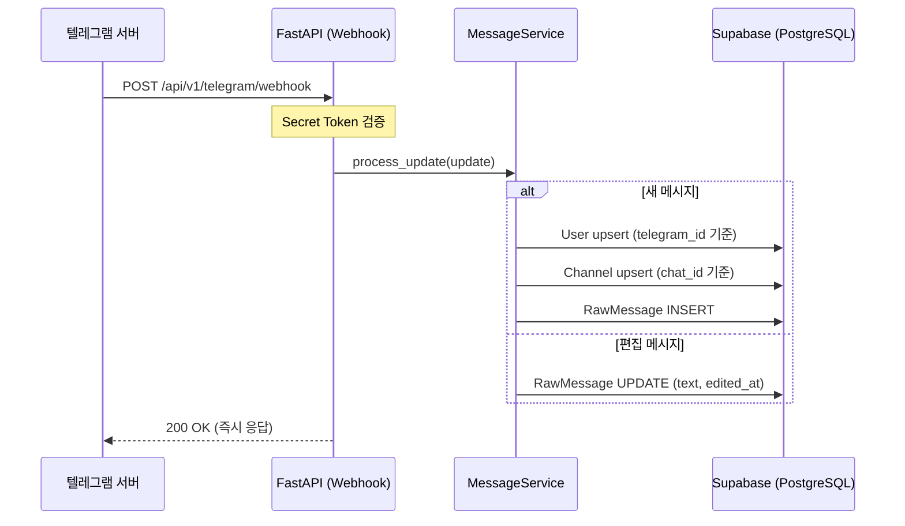

# Phase 2: 텔레그램 봇 & 메시지 수집 — 구체화된 계획서

> **상위 문서**: [implementation_plan.md](file:///c:/Users/andyw/Desktop/Like_a_Lion_myproject/implementation_plan.md)
> **기반 사양**: [상세설명서 §11, §12, §13.1.1](file:///c:/Users/andyw/Desktop/Like_a_Lion_myproject/AI_%ED%98%91%EC%97%85_%EC%BD%94%EC%B9%98_%ED%94%84%EB%A1%9C%EC%A0%9D%ED%8A%B8_%EC%83%81%EC%84%B8%EC%84%A4%EB%AA%85%EC%84%9C_v2.md)
> **작성일**: 2026-04-10
> **예상 난이도**: ⭐⭐⭐
> **예상 소요 시간**: 3~4시간
> **선행 완료**: Phase 0 ✅, Phase 1 ✅

---

## 🎯 이 Phase의 목표

Phase 2가 끝나면 다음이 완성되어야 합니다:

1. ✅ 텔레그램 봇이 BotFather에서 생성되고 Privacy Mode가 비활성화됨
2. ✅ `POST /api/v1/telegram/webhook` 엔드포인트가 텔레그램 Update를 수신함
3. ✅ 수신된 메시지가 `raw_messages` 테이블에 저장됨
4. ✅ 발신자가 `users` 테이블에 자동 등록/매핑됨
5. ✅ 채팅방이 `channels` 테이블에 자동 등록됨
6. ✅ 편집 메시지가 감지되어 `edited_at`이 업데이트됨
7. ✅ Webhook 등록 스크립트가 동작함
8. ✅ 응답 시간 1~3초 이내 (§14.1)

---

## 🏗️ 아키텍처 흐름



> [!IMPORTANT]
> **Webhook에서는 저장만 수행합니다.** (§11.1)
> LLM 호출, 세션화, 분석은 Phase 4~5에서 구현합니다.

---

## 📋 사전 준비: 텔레그램 봇 생성

코드 작성 전에 텔레그램에서 봇을 생성해야 합니다.

### 1. BotFather로 봇 생성

텔레그램에서 [@BotFather](https://t.me/BotFather)에게 다음 명령어를 보냅니다:

```
/newbot
```
- 봇 이름: `AI 협업 코치` (또는 원하는 이름)
- 봇 유저네임: `ai_collab_coach_bot` (또는 원하는 유저네임, `_bot`으로 끝나야 함)
- 생성 완료되면 **Bot Token** 발급 → `.env`에 저장

### 2. Privacy Mode 비활성화 (필수!)

> [!CAUTION]
> **반드시 Privacy Mode를 비활성화해야 합니다!**
> 기본값은 `Enabled`이며, 이 상태에서는 그룹 채팅의 일반 메시지를 봇이 수신하지 못합니다.
> 봇이 그룹에서 모든 메시지를 수신하려면 반드시 비활성화해야 합니다.

```
/mybots → 봇 선택 → Bot Settings → Group Privacy → Turn off
```

### 3. `.env` 파일 업데이트

```env
TELEGRAM_BOT_TOKEN=7123456789:AAFxxxxxxxxxxxxxxxxxxxxxxxxxxxxxxxx
TELEGRAM_SECRET_TOKEN=my-webhook-secret-token-change-me
WEBHOOK_URL=https://your-domain.railway.app/api/v1/telegram/webhook
```

> `TELEGRAM_SECRET_TOKEN`은 Webhook 요청의 `X-Telegram-Bot-Api-Secret-Token` 헤더 검증에 사용됩니다.
> 로컬 테스트 시에는 ngrok 등을 사용하여 임시 HTTPS URL을 생성할 수 있습니다.

---

## 📋 작업 목록 (총 7단계)

---

### Step 2-1. Pydantic 스키마 정의 (`apps/api/schemas/telegram.py`)

텔레그램 Update 객체의 핵심 필드를 Pydantic 모델로 정의합니다.
`python-telegram-bot` 라이브러리의 타입도 활용하지만, Webhook 라우터에서는 직접 파싱합니다.

```python
"""Pydantic schemas for Telegram webhook payloads."""

from __future__ import annotations
from pydantic import BaseModel


class TelegramUser(BaseModel):
    """텔레그램 사용자 정보 (Update 내부)"""
    id: int
    is_bot: bool = False
    first_name: str
    last_name: str | None = None
    username: str | None = None
    language_code: str | None = None


class TelegramChat(BaseModel):
    """텔레그램 채팅방 정보"""
    id: int
    type: str  # "private", "group", "supergroup", "channel"
    title: str | None = None
    username: str | None = None


class TelegramMessage(BaseModel):
    """텔레그램 메시지"""
    message_id: int
    from_: TelegramUser | None = None  # 필드명 'from'은 예약어
    chat: TelegramChat
    date: int  # Unix timestamp
    text: str | None = None
    reply_to_message: TelegramMessage | None = None

    # 미디어 메시지용 (캡션)
    caption: str | None = None

    # 메시지 유형 감지용 필드들
    photo: list | None = None
    document: dict | None = None
    sticker: dict | None = None
    voice: dict | None = None
    video: dict | None = None

    model_config = {"populate_by_name": True}

    class Config:
        # 'from' 필드를 'from_'으로 매핑
        fields = {"from_": {"alias": "from"}}


class TelegramUpdate(BaseModel):
    """텔레그램 Webhook Update 객체"""
    update_id: int
    message: TelegramMessage | None = None
    edited_message: TelegramMessage | None = None

    def get_message(self) -> TelegramMessage | None:
        """메시지 또는 편집 메시지 반환"""
        return self.message or self.edited_message

    @property
    def is_edit(self) -> bool:
        """편집 메시지인지 여부"""
        return self.edited_message is not None
```

> [!NOTE]
> 텔레그램 API의 `from` 필드는 Python 예약어이므로 `from_`으로 매핑하고 `alias="from"`을 설정합니다.

---

### Step 2-2. 메시지 서비스 (`packages/core/services/message_service.py`)

비즈니스 로직의 핵심입니다. Webhook 핸들러와 DB 사이의 모든 처리를 담당합니다.

```python
"""Message ingestion service — 텔레그램 메시지 저장 로직."""

from __future__ import annotations

import uuid
from datetime import datetime, timezone

from sqlalchemy import select
from sqlalchemy.ext.asyncio import AsyncSession

from packages.db.models.user import User
from packages.db.models.channel import Channel
from packages.db.models.raw_message import RawMessage
from apps.api.schemas.telegram import TelegramUpdate, TelegramMessage, TelegramUser, TelegramChat

import structlog

logger = structlog.get_logger()


class MessageService:
    """텔레그램 메시지를 수신하여 DB에 저장하는 서비스."""

    def __init__(self, db: AsyncSession, project_id: uuid.UUID):
        self.db = db
        self.project_id = project_id

    # ──────────────────────────────────────────
    # 공개 메서드
    # ──────────────────────────────────────────

    async def process_update(self, update: TelegramUpdate) -> RawMessage | None:
        """
        텔레그램 Update를 처리합니다.
        - 새 메시지: User/Channel upsert → RawMessage INSERT
        - 편집 메시지: 기존 RawMessage의 text, edited_at UPDATE
        """
        msg = update.get_message()
        if msg is None:
            logger.warning("update_has_no_message", update_id=update.update_id)
            return None

        if update.is_edit:
            return await self._handle_edit(msg)
        else:
            return await self._handle_new_message(msg)

    # ──────────────────────────────────────────
    # 새 메시지 처리
    # ──────────────────────────────────────────

    async def _handle_new_message(self, msg: TelegramMessage) -> RawMessage | None:
        """새 메시지를 저장합니다."""
        # 1. 발신자 upsert
        sender = None
        if msg.from_:
            sender = await self._upsert_user(msg.from_)

        # 2. 채널 upsert
        channel = await self._upsert_channel(msg.chat)

        # 3. reply_to 관계 처리
        reply_to_id = None
        if msg.reply_to_message:
            reply_to_id = await self._find_message_by_telegram_id(
                msg.chat.id, msg.reply_to_message.message_id
            )

        # 4. 메시지 유형 감지
        message_type = self._detect_message_type(msg)

        # 5. 텍스트 추출 (본문 또는 캡션)
        text = msg.text or msg.caption

        # 6. RawMessage 생성
        raw_message = RawMessage(
            project_id=self.project_id,
            channel_id=channel.id,
            sender_id=sender.id if sender else None,
            telegram_message_id=msg.message_id,
            text=text,
            message_type=message_type,
            reply_to_message_id=reply_to_id,
            sent_at=datetime.fromtimestamp(msg.date, tz=timezone.utc),
            visibility_status="visible",
            metadata_=self._extract_metadata(msg),
        )
        self.db.add(raw_message)
        await self.db.commit()
        await self.db.refresh(raw_message)

        logger.info(
            "message_saved",
            message_id=str(raw_message.id),
            telegram_msg_id=msg.message_id,
            chat_id=msg.chat.id,
            type=message_type,
        )
        return raw_message

    # ──────────────────────────────────────────
    # 편집 메시지 처리
    # ──────────────────────────────────────────

    async def _handle_edit(self, msg: TelegramMessage) -> RawMessage | None:
        """편집된 메시지를 업데이트합니다."""
        # 기존 메시지 찾기
        stmt = select(RawMessage).where(
            RawMessage.channel_id.in_(
                select(Channel.id).where(Channel.telegram_chat_id == msg.chat.id)
            ),
            RawMessage.telegram_message_id == msg.message_id,
        )
        result = await self.db.execute(stmt)
        existing = result.scalar_one_or_none()

        if existing is None:
            logger.warning(
                "edit_for_unknown_message",
                telegram_msg_id=msg.message_id,
                chat_id=msg.chat.id,
            )
            # 편집 메시지가 원본보다 먼저 도착한 경우 → 새 메시지로 저장
            return await self._handle_new_message(msg)

        # 기존 메시지 업데이트
        new_text = msg.text or msg.caption
        existing.text = new_text
        existing.edited_at = datetime.fromtimestamp(msg.date, tz=timezone.utc)
        await self.db.commit()

        logger.info(
            "message_edited",
            message_id=str(existing.id),
            telegram_msg_id=msg.message_id,
        )
        return existing

    # ──────────────────────────────────────────
    # User Upsert (자동 등록/매핑)
    # ──────────────────────────────────────────

    async def _upsert_user(self, tg_user: TelegramUser) -> User:
        """
        텔레그램 user_id 기준으로 User를 찾거나 새로 생성합니다.
        이미 있으면 username, first_name 등을 업데이트합니다.
        """
        stmt = select(User).where(User.telegram_id == tg_user.id)
        result = await self.db.execute(stmt)
        user = result.scalar_one_or_none()

        if user is None:
            # 새 유저 생성
            user = User(
                project_id=self.project_id,
                telegram_id=tg_user.id,
                username=tg_user.username,
                first_name=tg_user.first_name,
                last_name=tg_user.last_name,
                role="member",  # 기본 역할
            )
            self.db.add(user)
            await self.db.commit()
            await self.db.refresh(user)
            logger.info("user_created", user_id=str(user.id), telegram_id=tg_user.id)
        else:
            # 기존 유저 정보 업데이트 (이름/유저네임이 변경될 수 있음)
            updated = False
            if tg_user.username and user.username != tg_user.username:
                user.username = tg_user.username
                updated = True
            if tg_user.first_name and user.first_name != tg_user.first_name:
                user.first_name = tg_user.first_name
                updated = True
            if tg_user.last_name and user.last_name != tg_user.last_name:
                user.last_name = tg_user.last_name
                updated = True
            if updated:
                await self.db.commit()

        return user

    # ──────────────────────────────────────────
    # Channel Upsert (자동 등록)
    # ──────────────────────────────────────────

    async def _upsert_channel(self, tg_chat: TelegramChat) -> Channel:
        """
        텔레그램 chat_id 기준으로 Channel을 찾거나 새로 생성합니다.
        """
        stmt = select(Channel).where(Channel.telegram_chat_id == tg_chat.id)
        result = await self.db.execute(stmt)
        channel = result.scalar_one_or_none()

        if channel is None:
            channel_name = tg_chat.title or tg_chat.username or f"chat_{tg_chat.id}"
            channel = Channel(
                project_id=self.project_id,
                telegram_chat_id=tg_chat.id,
                channel_name=channel_name,
                channel_type="telegram",
            )
            self.db.add(channel)
            await self.db.commit()
            await self.db.refresh(channel)
            logger.info("channel_created", channel_id=str(channel.id), chat_id=tg_chat.id)
        else:
            # 채널 이름 업데이트 (그룹명이 변경될 수 있음)
            new_name = tg_chat.title or tg_chat.username
            if new_name and channel.channel_name != new_name:
                channel.channel_name = new_name
                await self.db.commit()

        return channel

    # ──────────────────────────────────────────
    # 유틸리티
    # ──────────────────────────────────────────

    async def _find_message_by_telegram_id(
        self, chat_id: int, telegram_message_id: int
    ) -> uuid.UUID | None:
        """telegram_message_id로 내부 UUID를 찾습니다 (reply 관계 매핑)."""
        stmt = select(RawMessage.id).where(
            RawMessage.channel_id.in_(
                select(Channel.id).where(Channel.telegram_chat_id == chat_id)
            ),
            RawMessage.telegram_message_id == telegram_message_id,
        )
        result = await self.db.execute(stmt)
        row = result.scalar_one_or_none()
        return row

    @staticmethod
    def _detect_message_type(msg: TelegramMessage) -> str:
        """메시지 유형을 감지합니다."""
        if msg.photo:
            return "photo"
        if msg.document:
            return "document"
        if msg.sticker:
            return "sticker"
        if msg.voice:
            return "voice"
        if msg.video:
            return "video"
        return "text"

    @staticmethod
    def _extract_metadata(msg: TelegramMessage) -> dict | None:
        """미디어 메시지의 추가 메타데이터를 추출합니다."""
        meta = {}
        if msg.photo:
            meta["photo_count"] = len(msg.photo)
        if msg.document:
            meta["document"] = msg.document
        if msg.sticker:
            meta["sticker"] = msg.sticker
        if msg.voice:
            meta["voice"] = msg.voice
        if msg.video:
            meta["video"] = msg.video
        return meta if meta else None
```

---

### Step 2-3. Webhook 라우터 (`apps/api/routers/telegram.py`)

```python
"""Telegram webhook router — 텔레그램 Webhook 수신 엔드포인트."""

from __future__ import annotations

import uuid

from fastapi import APIRouter, Header, HTTPException, Request, Depends
from sqlalchemy.ext.asyncio import AsyncSession

from apps.api.config import settings
from apps.api.dependencies import get_db
from apps.api.schemas.telegram import TelegramUpdate
from packages.core.services.message_service import MessageService

import structlog

logger = structlog.get_logger()

router = APIRouter(prefix="/api/v1/telegram", tags=["telegram"])

# ──────────────────────────────────────────
# 임시 프로젝트 ID (Phase 3 이후 동적으로 변경)
# 지금은 단일 프로젝트를 가정합니다.
# ──────────────────────────────────────────
# TODO: 프로젝트-채널 매핑이 구현되면 chat_id로 project_id를 조회하도록 변경
DEFAULT_PROJECT_ID: uuid.UUID | None = None


async def _get_or_create_default_project(db: AsyncSession) -> uuid.UUID:
    """기본 프로젝트가 없으면 생성합니다."""
    global DEFAULT_PROJECT_ID
    if DEFAULT_PROJECT_ID is not None:
        return DEFAULT_PROJECT_ID

    from sqlalchemy import select
    from packages.db.models.project import Project

    result = await db.execute(select(Project).limit(1))
    project = result.scalar_one_or_none()

    if project is None:
        project = Project(name="기본 프로젝트", description="자동 생성된 기본 프로젝트")
        db.add(project)
        await db.commit()
        await db.refresh(project)
        logger.info("default_project_created", project_id=str(project.id))

    DEFAULT_PROJECT_ID = project.id
    return DEFAULT_PROJECT_ID


def _verify_secret_token(
    x_telegram_bot_api_secret_token: str | None = Header(None),
) -> None:
    """
    텔레그램 Webhook 요청의 Secret Token을 검증합니다.
    설정된 TELEGRAM_SECRET_TOKEN과 일치하지 않으면 403 반환.
    """
    if not settings.telegram_secret_token:
        # Secret token이 설정되지 않은 경우 검증 건너뜀 (개발 환경)
        return

    if x_telegram_bot_api_secret_token != settings.telegram_secret_token:
        logger.warning("webhook_auth_failed")
        raise HTTPException(status_code=403, detail="Invalid secret token")


@router.post("/webhook")
async def telegram_webhook(
    request: Request,
    db: AsyncSession = Depends(get_db),
    _: None = Depends(_verify_secret_token),
) -> dict:
    """
    텔레그램 Webhook 수신 엔드포인트.

    §11.1: Webhook 경로에서는 LLM을 직접 호출하지 않는다.
    저장과 큐 적재만 수행한다.
    """
    # 1. 요청 본문 파싱
    try:
        body = await request.json()
        update = TelegramUpdate.model_validate(body)
    except Exception as e:
        logger.error("webhook_parse_error", error=str(e))
        # 텔레그램에 200을 반환해야 재전송을 방지함
        return {"ok": False, "error": "Parse error"}

    # 2. 프로젝트 ID 결정
    project_id = await _get_or_create_default_project(db)

    # 3. 메시지 처리
    service = MessageService(db=db, project_id=project_id)
    try:
        result = await service.process_update(update)
        return {
            "ok": True,
            "message_id": str(result.id) if result else None,
        }
    except Exception as e:
        logger.error("webhook_process_error", error=str(e), update_id=update.update_id)
        # 에러가 나도 200을 반환하여 텔레그램 재전송 방지
        return {"ok": False, "error": "Processing error"}
```

> [!IMPORTANT]
> **항상 200을 반환합니다.**
> 텔레그램은 non-200 응답을 받으면 같은 Update를 반복 전송합니다.
> 에러가 발생해도 200을 반환하고, 에러는 로그로 추적합니다.

---

### Step 2-4. FastAPI 앱에 라우터 등록 (`apps/api/main.py` 수정)

기존 `main.py`에 텔레그램 라우터를 추가합니다.

```python
# main.py 하단에 추가 (기존 코드 유지)

# --- 라우터 등록 ---
from apps.api.routers.telegram import router as telegram_router
app.include_router(telegram_router)
```

---

### Step 2-5. Webhook 등록 스크립트 (`scripts/set_webhook.py`)

```python
"""텔레그램 Webhook URL 등록/해제 스크립트.

사용법:
    # Webhook 등록
    python -m scripts.set_webhook --set

    # Webhook 해제
    python -m scripts.set_webhook --delete

    # 현재 Webhook 정보 확인
    python -m scripts.set_webhook --info
"""

import argparse
import httpx
import sys
import os

# 프로젝트 루트를 Python 경로에 추가
sys.path.insert(0, os.path.dirname(os.path.dirname(os.path.abspath(__file__))))

from apps.api.config import settings


TELEGRAM_API_BASE = f"https://api.telegram.org/bot{settings.telegram_bot_token}"


def set_webhook():
    """Webhook URL을 등록합니다."""
    url = f"{TELEGRAM_API_BASE}/setWebhook"
    params = {
        "url": settings.webhook_url,
        "allowed_updates": ["message", "edited_message"],
    }
    if settings.telegram_secret_token:
        params["secret_token"] = settings.telegram_secret_token

    response = httpx.post(url, json=params)
    result = response.json()

    if result.get("ok"):
        print(f"✅ Webhook 등록 성공: {settings.webhook_url}")
    else:
        print(f"❌ Webhook 등록 실패: {result}")


def delete_webhook():
    """Webhook URL을 해제합니다."""
    url = f"{TELEGRAM_API_BASE}/deleteWebhook"
    response = httpx.post(url)
    result = response.json()

    if result.get("ok"):
        print("✅ Webhook 해제 성공")
    else:
        print(f"❌ Webhook 해제 실패: {result}")


def get_webhook_info():
    """현재 Webhook 정보를 확인합니다."""
    url = f"{TELEGRAM_API_BASE}/getWebhookInfo"
    response = httpx.get(url)
    result = response.json()

    if result.get("ok"):
        info = result["result"]
        print(f"📌 URL: {info.get('url', '(없음)')}")
        print(f"📌 Pending Updates: {info.get('pending_update_count', 0)}")
        print(f"📌 Last Error: {info.get('last_error_message', '(없음)')}")
        print(f"📌 Allowed Updates: {info.get('allowed_updates', [])}")
    else:
        print(f"❌ 정보 조회 실패: {result}")


if __name__ == "__main__":
    parser = argparse.ArgumentParser(description="텔레그램 Webhook 관리")
    group = parser.add_mutually_exclusive_group(required=True)
    group.add_argument("--set", action="store_true", help="Webhook 등록")
    group.add_argument("--delete", action="store_true", help="Webhook 해제")
    group.add_argument("--info", action="store_true", help="Webhook 정보 확인")

    args = parser.parse_args()

    if not settings.telegram_bot_token:
        print("❌ TELEGRAM_BOT_TOKEN이 설정되지 않았습니다. .env 파일을 확인하세요.")
        sys.exit(1)

    if args.set:
        if not settings.webhook_url:
            print("❌ WEBHOOK_URL이 설정되지 않았습니다. .env 파일을 확인하세요.")
            sys.exit(1)
        set_webhook()
    elif args.delete:
        delete_webhook()
    elif args.info:
        get_webhook_info()
```

---

### Step 2-6. 로컬 테스트 가이드 (ngrok 사용)

로컬 개발 환경에서 Webhook을 테스트하려면 **ngrok**을 사용하여 HTTPS 터널을 생성합니다.

```bash
# 1. ngrok 설치 (이미 설치되어 있다면 생략)
# https://ngrok.com/download 에서 다운로드

# 2. FastAPI 서버 실행
uvicorn apps.api.main:app --reload --port 8000

# 3. 별도 터미널에서 ngrok 터널 생성
ngrok http 8000

# 4. ngrok이 제공하는 HTTPS URL을 .env에 설정
# 예: https://a1b2c3d4.ngrok-free.app
# WEBHOOK_URL=https://a1b2c3d4.ngrok-free.app/api/v1/telegram/webhook

# 5. Webhook 등록
python -m scripts.set_webhook --set

# 6. 텔레그램 그룹에서 메시지 전송 → 서버 로그에서 저장 확인
```

---

### Step 2-7. 봇 설정 가이드 문서 (`docs/TELEGRAM_SETUP.md`)

```markdown
# 텔레그램 봇 설정 가이드

## 1. 봇 생성

1. 텔레그램에서 [@BotFather](https://t.me/BotFather)에게 `/newbot` 전송
2. 봇 이름과 유저네임 설정 (유저네임은 `_bot`으로 끝나야 함)
3. 발급받은 Bot Token을 `.env`에 저장

## 2. Privacy Mode 비활성화 (필수!)

봇이 그룹 채팅의 **모든 메시지**를 수신하려면 Privacy Mode를 반드시 비활성화해야 합니다.

```
@BotFather → /mybots → 봇 선택 → Bot Settings → Group Privacy → Turn off
```

⚠️ Privacy Mode가 Enabled(기본값)이면 봇은 다음만 수신합니다:
- `/` 명령어
- 봇을 멘션한 메시지
- 봇이 보낸 메시지의 답장

## 3. 봇을 그룹에 추가

1. 텔레그램 그룹 채팅 → 구성원 추가 → 봇 유저네임 검색하여 추가
2. 봇에게 관리자 권한 부여 (선택, 하지만 권장)

## 4. Webhook 설정

### 로컬 개발 (ngrok)
```bash
# 서버 실행
uvicorn apps.api.main:app --reload --port 8000

# ngrok 터널
ngrok http 8000

# .env 업데이트 후 Webhook 등록
python -m scripts.set_webhook --set
```

### 프로덕션 (Railway)
```bash
# .env에 Railway 도메인 설정
WEBHOOK_URL=https://your-app.railway.app/api/v1/telegram/webhook

# Webhook 등록
python -m scripts.set_webhook --set
```

## 5. 확인

```bash
# Webhook 상태 확인
python -m scripts.set_webhook --info

# 텔레그램 그룹에 메시지 전송 → 서버 로그 확인
```
```

---

## 📁 디렉토리 변경 요약

```text
Like_a_Lion_myproject/
├── apps/
│   ├── api/
│   │   ├── main.py                           # [수정] 라우터 등록 추가
│   │   ├── routers/
│   │   │   ├── __init__.py
│   │   │   └── telegram.py                   # [신규] Webhook 라우터
│   │   └── schemas/
│   │       ├── __init__.py                   # [신규]
│   │       └── telegram.py                   # [신규] TelegramUpdate 스키마
│   └── bot/
│       └── __init__.py
│
├── packages/
│   └── core/
│       ├── __init__.py
│       └── services/
│           ├── __init__.py                   # [신규]
│           └── message_service.py            # [신규] 메시지 저장 서비스
│
├── scripts/
│   └── set_webhook.py                        # [신규] Webhook 등록 스크립트
│
├── docs/
│   └── TELEGRAM_SETUP.md                     # [신규] 봇 설정 가이드
│
└── tests/
    └── unit/
        └── test_message_service.py           # [신규] 메시지 서비스 테스트
```

---

## ✅ 검증 체크리스트

### 1단계: Import 확인
```bash
python -c "from apps.api.schemas.telegram import TelegramUpdate; print('✅ 스키마 OK')"
python -c "from packages.core.services.message_service import MessageService; print('✅ 서비스 OK')"
python -c "from apps.api.routers.telegram import router; print('✅ 라우터 OK')"
```

### 2단계: 서버 기동
```bash
uvicorn apps.api.main:app --reload --port 8000
```
- `GET http://localhost:8000/docs` → Swagger UI에서 `/api/v1/telegram/webhook` 엔드포인트 확인

### 3단계: 수동 Webhook 테스트 (curl)
```bash
curl -X POST http://localhost:8000/api/v1/telegram/webhook \
  -H "Content-Type: application/json" \
  -d '{
    "update_id": 123456789,
    "message": {
      "message_id": 1,
      "from": {
        "id": 111222333,
        "is_bot": false,
        "first_name": "테스트",
        "username": "testuser"
      },
      "chat": {
        "id": -1001234567890,
        "type": "supergroup",
        "title": "프로젝트 단톡방"
      },
      "date": 1712700000,
      "text": "내일 발표 범위를 줄이는 게 좋겠어요"
    }
  }'
```
→ `{"ok": true, "message_id": "xxxx-xxxx-..."}`

### 4단계: DB 확인
- Supabase 대시보드에서 `raw_messages` 테이블에 레코드 생성 확인
- `users` 테이블에 `telegram_id=111222333` 유저 자동 생성 확인
- `channels` 테이블에 `telegram_chat_id=-1001234567890` 채널 자동 생성 확인

### 5단계: 실제 텔레그램 테스트 (ngrok)
1. ngrok 터널 생성 → Webhook 등록
2. 텔레그램 그룹에서 메시지 전송
3. 서버 로그에서 `message_saved` 확인
4. Supabase에서 `raw_messages` 데이터 확인

### 6단계: 편집 메시지 테스트
1. 텔레그램 그룹에서 메시지 전송
2. 해당 메시지 편집
3. Supabase에서 `edited_at` 필드가 업데이트 되었는지 확인

---

## 📄 이 Phase의 최종 산출물 목록

| # | 파일 | 유형 | 설명 |
|:---:|------|:---:|------|
| 1 | `apps/api/schemas/__init__.py` | 신규 | 스키마 패키지 |
| 2 | `apps/api/schemas/telegram.py` | 신규 | TelegramUpdate Pydantic 스키마 |
| 3 | `packages/core/services/__init__.py` | 신규 | 서비스 패키지 |
| 4 | `packages/core/services/message_service.py` | 신규 | 메시지 저장 비즈니스 로직 |
| 5 | `apps/api/routers/telegram.py` | 신규 | Webhook 라우터 |
| 6 | `apps/api/main.py` | 수정 | 라우터 등록 추가 |
| 7 | `scripts/set_webhook.py` | 신규 | Webhook 등록/해제 스크립트 |
| 8 | `docs/TELEGRAM_SETUP.md` | 신규 | 봇 설정 가이드 |

**총 8개 파일** (신규 7개 + 수정 1개)

---

## ⏭️ 다음 Phase 연결

Phase 2 완료 후:
- **Phase 3 (외부 텍스트 입력)** → Phase 1에만 의존하므로 바로 진행 가능
- **Phase 4 (대화 세션화 & 우선 처리)** → Phase 2 + Phase 3 완료 후 진행
  - Phase 2의 메시지 저장 로직 위에 세션화(Sessionizer) 로직을 추가
  - 이 계획서에서는 세션화 로직을 의도적으로 제외 (Phase 4의 범위)
