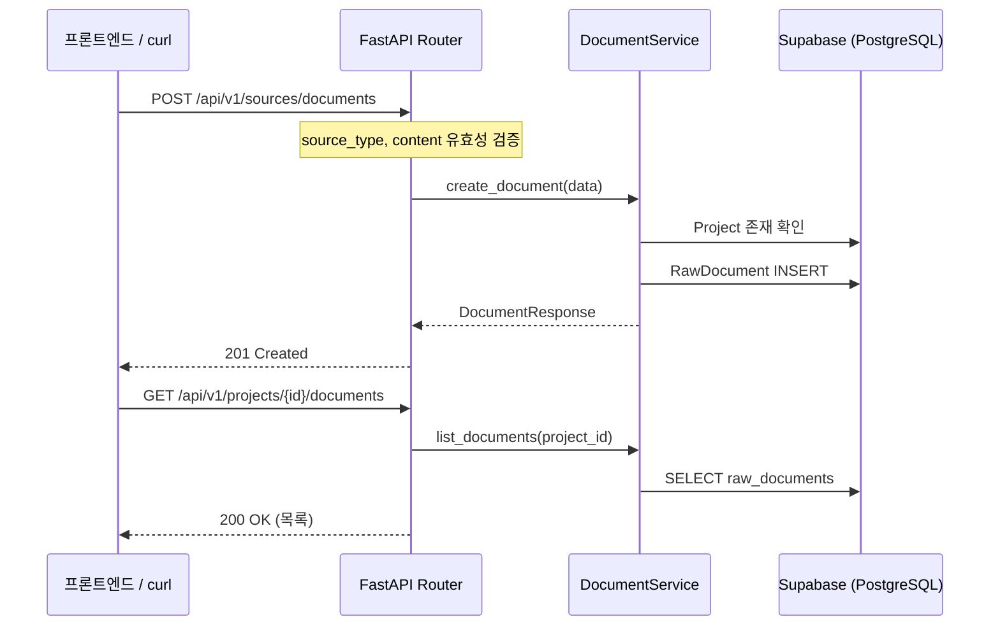

# Phase 3: 외부 텍스트 입력 시스템 — 구체화된 계획서

> **상위 문서**: [implementation_plan.md](file:///c:/Users/andyw/Desktop/Like_a_Lion_myproject/implementation_plan.md)
> **기반 사양**: [상세설명서 §13.1.2](file:///c:/Users/andyw/Desktop/Like_a_Lion_myproject/AI_%ED%98%91%EC%97%85_%EC%BD%94%EC%B9%98_%ED%94%84%EB%A1%9C%EC%A0%9D%ED%8A%B8_%EC%83%81%EC%84%B8%EC%84%A4%EB%AA%85%EC%84%9C_v2.md)
> **작성일**: 2026-04-10
> **예상 난이도**: ⭐⭐
> **예상 소요 시간**: 1~2시간
> **선행 완료**: Phase 0 ✅, Phase 1 ✅

---

## 🎯 이 Phase의 목표

Phase 3이 끝나면 다음이 완성되어야 합니다:

1. ✅ `POST /api/v1/sources/documents` — 문서 업로드 API
2. ✅ `GET /api/v1/projects/{projectId}/documents` — 문서 목록 조회 API
3. ✅ `GET /api/v1/sources/documents/{documentId}` — 개별 문서 조회 API
4. ✅ `source_type` Enum 검증, 빈 content 방지 등 유효성 검증
5. ✅ 원문 보존 원칙 준수 (수정 불가, 새 버전으로만 관리)

---

## 🏗️ 아키텍처 흐름



---

## 📋 작업 목록 (총 4단계)

---

### Step 3-1. Pydantic 스키마 (`apps/api/schemas/document.py`)

```python
"""Pydantic schemas for document upload / retrieval."""

from __future__ import annotations

import uuid
from datetime import datetime
from enum import StrEnum

from pydantic import BaseModel, Field, field_validator

from packages.shared.enums import SourceType


class DocumentCreate(BaseModel):
    """문서 업로드 요청 스키마."""

    project_id: uuid.UUID
    source_type: SourceType
    title: str = Field(..., min_length=1, max_length=300)
    content: str = Field(..., min_length=1)
    created_by: uuid.UUID | None = None  # 업로드 사용자 (선택)

    @field_validator("content")
    @classmethod
    def content_not_blank(cls, v: str) -> str:
        if not v.strip():
            raise ValueError("content는 비어있을 수 없습니다.")
        return v


class DocumentResponse(BaseModel):
    """문서 응답 스키마."""

    id: uuid.UUID
    project_id: uuid.UUID
    source_type: str
    title: str
    content: str
    created_by: uuid.UUID | None = None
    created_at: datetime

    model_config = {"from_attributes": True}


class DocumentListItem(BaseModel):
    """문서 목록 항목 스키마 (content 제외)."""

    id: uuid.UUID
    project_id: uuid.UUID
    source_type: str
    title: str
    created_by: uuid.UUID | None = None
    created_at: datetime

    model_config = {"from_attributes": True}


class DocumentListResponse(BaseModel):
    """문서 목록 응답."""

    documents: list[DocumentListItem]
    total: int
```

---

### Step 3-2. 문서 서비스 (`packages/core/services/document_service.py`)

```python
"""Document service — 외부 텍스트 문서 업로드/조회 서비스."""

from __future__ import annotations

import uuid

from sqlalchemy import select, func
from sqlalchemy.ext.asyncio import AsyncSession

from packages.db.models.project import Project
from packages.db.models.raw_document import RawDocument
from apps.api.schemas.document import DocumentCreate

import structlog

logger = structlog.get_logger()


class DocumentNotFoundError(Exception):
    """문서를 찾을 수 없을 때 발생."""
    pass


class ProjectNotFoundError(Exception):
    """프로젝트를 찾을 수 없을 때 발생."""
    pass


class DocumentService:
    """외부 텍스트 문서(회의록, 교수 피드백, 수동 노트) 관리 서비스."""

    def __init__(self, db: AsyncSession):
        self.db = db

    async def create_document(self, data: DocumentCreate) -> RawDocument:
        """
        새 문서를 생성합니다.

        원문 보존 원칙: 한 번 저장된 문서는 수정 불가.
        수정이 필요한 경우 새 문서를 업로드합니다.
        """
        # 1. 프로젝트 존재 확인
        project = await self.db.get(Project, data.project_id)
        if project is None:
            raise ProjectNotFoundError(f"프로젝트를 찾을 수 없습니다: {data.project_id}")

        # 2. RawDocument 생성
        doc = RawDocument(
            project_id=data.project_id,
            source_type=data.source_type.value,
            title=data.title,
            content=data.content,
            created_by=data.created_by,
        )
        self.db.add(doc)
        await self.db.commit()
        await self.db.refresh(doc)

        logger.info(
            "document_created",
            document_id=str(doc.id),
            source_type=data.source_type.value,
            title=data.title,
        )
        return doc

    async def get_document(self, document_id: uuid.UUID) -> RawDocument:
        """개별 문서를 조회합니다."""
        doc = await self.db.get(RawDocument, document_id)
        if doc is None:
            raise DocumentNotFoundError(f"문서를 찾을 수 없습니다: {document_id}")
        return doc

    async def list_documents(
        self,
        project_id: uuid.UUID,
        source_type: str | None = None,
        offset: int = 0,
        limit: int = 50,
    ) -> tuple[list[RawDocument], int]:
        """
        프로젝트별 문서 목록을 조회합니다.

        Returns:
            (문서 목록, 전체 개수) 튜플
        """
        # 프로젝트 존재 확인
        project = await self.db.get(Project, project_id)
        if project is None:
            raise ProjectNotFoundError(f"프로젝트를 찾을 수 없습니다: {project_id}")

        # 쿼리 기본 조건
        base_filter = RawDocument.project_id == project_id
        if source_type:
            base_filter = base_filter & (RawDocument.source_type == source_type)

        # 전체 개수
        count_stmt = select(func.count(RawDocument.id)).where(base_filter)
        total = (await self.db.execute(count_stmt)).scalar() or 0

        # 목록 조회 (최신순)
        list_stmt = (
            select(RawDocument)
            .where(base_filter)
            .order_by(RawDocument.created_at.desc())
            .offset(offset)
            .limit(limit)
        )
        result = await self.db.execute(list_stmt)
        documents = list(result.scalars().all())

        return documents, total
```

---

### Step 3-3. 문서 라우터 (`apps/api/routers/documents.py`)

```python
"""Document router — 외부 텍스트 입력 API 엔드포인트."""

from __future__ import annotations

import uuid

from fastapi import APIRouter, Depends, HTTPException, Query
from sqlalchemy.ext.asyncio import AsyncSession

from apps.api.dependencies import get_db
from apps.api.schemas.document import (
    DocumentCreate,
    DocumentListItem,
    DocumentListResponse,
    DocumentResponse,
)
from packages.core.services.document_service import (
    DocumentNotFoundError,
    DocumentService,
    ProjectNotFoundError,
)

router = APIRouter(prefix="/api/v1", tags=["documents"])


@router.post("/sources/documents", response_model=DocumentResponse, status_code=201)
async def upload_document(
    data: DocumentCreate,
    db: AsyncSession = Depends(get_db),
) -> DocumentResponse:
    """
    외부 텍스트 문서를 업로드합니다.

    - **source_type**: `meeting` (회의록), `professor_feedback` (교수 피드백), `manual_note` (수동 노트)
    - **원문 보존 원칙**: 한 번 저장된 문서는 수정 불가. 수정이 필요하면 새 문서를 업로드.
    """
    service = DocumentService(db)
    try:
        doc = await service.create_document(data)
        return DocumentResponse.model_validate(doc)
    except ProjectNotFoundError as e:
        raise HTTPException(status_code=404, detail=str(e))


@router.get("/projects/{project_id}/documents", response_model=DocumentListResponse)
async def list_documents(
    project_id: uuid.UUID,
    source_type: str | None = Query(None, description="필터: meeting, professor_feedback, manual_note"),
    offset: int = Query(0, ge=0),
    limit: int = Query(50, ge=1, le=100),
    db: AsyncSession = Depends(get_db),
) -> DocumentListResponse:
    """프로젝트별 문서 목록을 조회합니다."""
    service = DocumentService(db)
    try:
        documents, total = await service.list_documents(
            project_id=project_id,
            source_type=source_type,
            offset=offset,
            limit=limit,
        )
        return DocumentListResponse(
            documents=[DocumentListItem.model_validate(d) for d in documents],
            total=total,
        )
    except ProjectNotFoundError as e:
        raise HTTPException(status_code=404, detail=str(e))


@router.get("/sources/documents/{document_id}", response_model=DocumentResponse)
async def get_document(
    document_id: uuid.UUID,
    db: AsyncSession = Depends(get_db),
) -> DocumentResponse:
    """개별 문서를 조회합니다 (본문 포함)."""
    service = DocumentService(db)
    try:
        doc = await service.get_document(document_id)
        return DocumentResponse.model_validate(doc)
    except DocumentNotFoundError as e:
        raise HTTPException(status_code=404, detail=str(e))
```

---

### Step 3-4. FastAPI 앱에 라우터 등록 (`apps/api/main.py` 수정)

기존 `main.py`에 문서 라우터를 추가합니다.

```python
# 기존 telegram_router 등록 아래에 추가
from apps.api.routers.documents import router as documents_router
app.include_router(documents_router)
```

---

## 📁 디렉토리 변경 요약

```text
Like_a_Lion_myproject/
├── apps/api/
│   ├── main.py                               # [수정] documents 라우터 등록
│   ├── routers/
│   │   ├── telegram.py                        # (기존)
│   │   └── documents.py                       # [신규] 문서 업로드/조회 라우터
│   └── schemas/
│       ├── telegram.py                        # (기존)
│       └── document.py                        # [신규] 문서 Pydantic 스키마
│
├── packages/core/services/
│   ├── message_service.py                     # (기존)
│   └── document_service.py                    # [신규] 문서 저장/조회 서비스
│
└── tests/unit/
    └── test_document_upload.py                # [신규] 문서 업로드 테스트
```

---

## ✅ 검증 체크리스트

### 1단계: Import 확인
```bash
python -c "from apps.api.schemas.document import DocumentCreate; print('✅ 스키마 OK')"
python -c "from packages.core.services.document_service import DocumentService; print('✅ 서비스 OK')"
python -c "from apps.api.routers.documents import router; print('✅ 라우터 OK')"
```

### 2단계: Swagger UI 확인
```bash
uvicorn apps.api.main:app --reload --port 8000
```
`http://localhost:8000/docs` → 3개 엔드포인트 확인:
- `POST /api/v1/sources/documents`
- `GET /api/v1/projects/{project_id}/documents`
- `GET /api/v1/sources/documents/{document_id}`

### 3단계: 문서 업로드 테스트 (curl)

먼저 프로젝트 ID가 필요합니다 (Supabase의 `projects` 테이블에서 확인):

```bash
# 회의록 업로드
curl -X POST http://localhost:8000/api/v1/sources/documents \
  -H "Content-Type: application/json" \
  -d '{
    "project_id": "YOUR-PROJECT-UUID",
    "source_type": "meeting",
    "title": "4월 10일 팀 회의록",
    "content": "참석자: 김철수, 이영희\n\n1. 로그인 기능 우선순위를 높이기로 결정\n2. DB를 PostgreSQL에서 Supabase로 변경\n3. 다음 주 목요일까지 프로토타입 완성 목표"
  }'
```
→ `201 Created` + 문서 UUID 반환

### 4단계: 유효성 검증 테스트

```bash
# ❌ 잘못된 source_type
curl -X POST http://localhost:8000/api/v1/sources/documents \
  -H "Content-Type: application/json" \
  -d '{"project_id":"YOUR-UUID","source_type":"invalid","title":"test","content":"test"}'
# → 422 Unprocessable Entity

# ❌ 빈 content
curl -X POST http://localhost:8000/api/v1/sources/documents \
  -H "Content-Type: application/json" \
  -d '{"project_id":"YOUR-UUID","source_type":"meeting","title":"test","content":"   "}'
# → 422 Unprocessable Entity

# ❌ 존재하지 않는 project_id
curl -X POST http://localhost:8000/api/v1/sources/documents \
  -H "Content-Type: application/json" \
  -d '{"project_id":"00000000-0000-0000-0000-000000000000","source_type":"meeting","title":"test","content":"real content"}'
# → 404 Not Found
```

### 5단계: 목록/상세 조회 테스트

```bash
# 문서 목록 조회
curl http://localhost:8000/api/v1/projects/YOUR-PROJECT-UUID/documents

# source_type 필터
curl "http://localhost:8000/api/v1/projects/YOUR-PROJECT-UUID/documents?source_type=meeting"

# 개별 문서 조회
curl http://localhost:8000/api/v1/sources/documents/YOUR-DOCUMENT-UUID
```

---

## 📄 이 Phase의 최종 산출물 목록

| # | 파일 | 유형 | 설명 |
|:---:|------|:---:|------|
| 1 | `apps/api/schemas/document.py` | 신규 | 문서 Pydantic 스키마 |
| 2 | `packages/core/services/document_service.py` | 신규 | 문서 저장/조회 서비스 |
| 3 | `apps/api/routers/documents.py` | 신규 | 문서 REST API 라우터 |
| 4 | `apps/api/main.py` | 수정 | 라우터 등록 추가 (1줄) |

**총 4개 파일** (신규 3개 + 수정 1개)

---

## ⏭️ 다음 Phase 연결

Phase 3 완료 후 **Phase 4 (대화 세션화 & 우선 처리 감지)** 로 진행합니다:
- Phase 2에서 저장된 메시지를 시간 기반으로 세션 단위로 묶음
- 키워드 감지로 우선 처리 후보 식별
- Redis Analysis Queue에 등록
