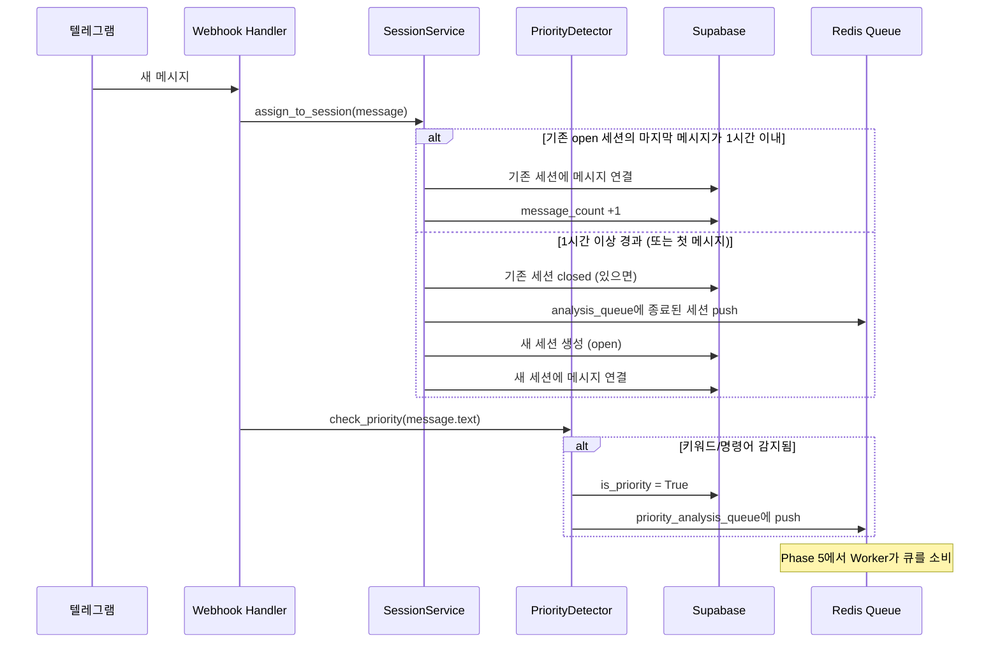
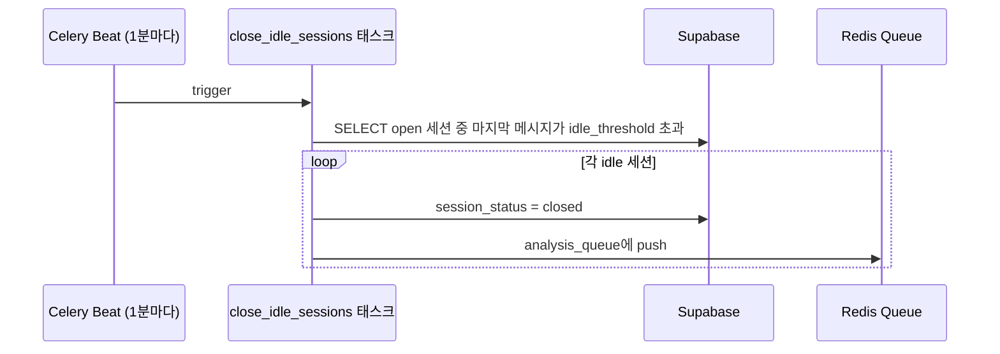

# Phase 4: 대화 세션화 & 우선 처리 감지 — 구체화된 계획서

> **상위 문서**: [implementation_plan.md](file:///c:/Users/andyw/Desktop/Like_a_Lion_myproject/implementation_plan.md)
> **기반 사양**: [상세설명서 §12.2, §12.3](file:///c:/Users/andyw/Desktop/Like_a_Lion_myproject/AI_%ED%98%91%EC%97%85_%EC%BD%94%EC%B9%98_%ED%94%84%EB%A1%9C%EC%A0%9D%ED%8A%B8_%EC%83%81%EC%84%B8%EC%84%A4%EB%AA%85%EC%84%9C_v2.md)
> **작성일**: 2026-04-10
> **예상 난이도**: ⭐⭐⭐
> **예상 소요 시간**: 2~3시간
> **선행 완료**: Phase 0 ✅, Phase 1 ✅, Phase 2 ✅, Phase 3 ✅

---

## 🎯 이 Phase의 목표

Phase 4가 끝나면 다음이 완성되어야 합니다:

1. ✅ 메시지가 수신될 때 자동으로 세션에 연결됨 (1시간 idle → 새 세션)
2. ✅ 세선 종료 시 Analysis Queue(Redis)에 등록됨
3. ✅ 키워드/명령어 감지로 `is_priority=True` 표시 및 우선 큐 등록
4. ✅ Celery Beat가 주기적으로 idle 세션을 강제 종료함
5. ✅ Phase 2의 MessageService와 자연스럽게 통합됨

---

## 🏗️ 아키텍처 흐름



### Celery Beat (주기적 세션 정리)



---

## 📋 작업 목록 (총 6단계)

---

### Step 4-1. 우선 처리 키워드 상수 (`packages/shared/constants.py`)

```python
"""프로젝트 전역 상수."""

# ──────────────────────────────────────────
# 우선 처리 키워드 (§12.3)
# 이 키워드가 포함된 메시지는 즉시 우선 분석 대상으로 표시됩니다.
# ──────────────────────────────────────────

PRIORITY_KEYWORDS_KR: list[str] = [
    "교수님",
    "마감",
    "배포",
    "오류",
    "확정",
    "결정",
    "변경",
    "긴급",
    "발표",
    "버그",
    "장애",
    "수정",
    "삭제",
    "추가",
    "필수",
]

PRIORITY_KEYWORDS_EN: list[str] = [
    "deadline",
    "deploy",
    "bug",
    "decision",
    "change",
    "urgent",
    "critical",
    "hotfix",
]

PRIORITY_KEYWORDS: set[str] = {
    *PRIORITY_KEYWORDS_KR,
    *PRIORITY_KEYWORDS_EN,
}

# ──────────────────────────────────────────
# 명시 명령어 (§12.3)
# 슬래시 명령어로 즉시 이벤트 후보를 등록합니다.
# ──────────────────────────────────────────

PRIORITY_COMMANDS: set[str] = {
    "/decision",
    "/change",
    "/issue",
    "/feedback",
    "/todo",
}

# ──────────────────────────────────────────
# Redis Queue 이름
# ──────────────────────────────────────────

ANALYSIS_QUEUE = "analysis_queue"
PRIORITY_ANALYSIS_QUEUE = "priority_analysis_queue"
```

---

### Step 4-2. 우선 처리 감지기 (`packages/core/services/priority_detector.py`)

```python
"""Priority detector — 규칙 기반 우선 처리 감지 (§12.3)."""

from __future__ import annotations

from dataclasses import dataclass

from packages.shared.constants import PRIORITY_KEYWORDS, PRIORITY_COMMANDS


@dataclass
class PriorityResult:
    """우선 처리 감지 결과."""
    is_priority: bool
    matched_keywords: list[str]
    matched_command: str | None


class PriorityDetector:
    """
    메시지 텍스트에서 우선 처리 대상을 감지합니다.

    두 가지 규칙:
    1. 키워드 매칭: 텍스트에 우선 키워드가 포함되어 있는지 확인
    2. 명시 명령어: /decision, /change 등 슬래시 명령어 감지
    """

    def check(self, text: str | None) -> PriorityResult:
        """텍스트를 검사하여 우선 처리 여부를 판단합니다."""
        if not text:
            return PriorityResult(is_priority=False, matched_keywords=[], matched_command=None)

        text_lower = text.lower().strip()

        # 1. 명시 명령어 감지
        matched_command = self._check_commands(text_lower)

        # 2. 키워드 감지
        matched_keywords = self._check_keywords(text_lower)

        is_priority = matched_command is not None or len(matched_keywords) > 0

        return PriorityResult(
            is_priority=is_priority,
            matched_keywords=matched_keywords,
            matched_command=matched_command,
        )

    def _check_commands(self, text: str) -> str | None:
        """슬래시 명령어를 감지합니다."""
        for cmd in PRIORITY_COMMANDS:
            if text.startswith(cmd):
                return cmd
        return None

    def _check_keywords(self, text: str) -> list[str]:
        """우선 처리 키워드를 감지합니다."""
        matched = []
        for keyword in PRIORITY_KEYWORDS:
            if keyword.lower() in text:
                matched.append(keyword)
        return matched
```

---

### Step 4-3. 세션 서비스 (`packages/core/services/session_service.py`)

```python
"""Session service — 대화 세션화 로직 (§12.2)."""

from __future__ import annotations

import uuid
from datetime import datetime, timedelta, timezone

from sqlalchemy import select, and_
from sqlalchemy.ext.asyncio import AsyncSession

from packages.db.models.conversation_session import ConversationSession
from packages.db.models.raw_message import RawMessage
from packages.shared.enums import SessionStatus, SessionTriggerType
from packages.shared.constants import ANALYSIS_QUEUE, PRIORITY_ANALYSIS_QUEUE

import structlog

logger = structlog.get_logger()


class SessionService:
    """
    메시지를 대화 세션에 배정하는 서비스.

    규칙 (§12.2):
    - 같은 채널에서 마지막 메시지로부터 idle_threshold 이상 경과 → 세션 종료
    - 종료된 세션은 Analysis Queue에 등록
    - 새 메시지는 새 세션에 배정
    """

    def __init__(
        self,
        db: AsyncSession,
        redis_client=None,
        idle_threshold_minutes: int = 60,
    ):
        self.db = db
        self.redis = redis_client
        self.idle_threshold = timedelta(minutes=idle_threshold_minutes)

    async def assign_to_session(
        self,
        message: RawMessage,
    ) -> ConversationSession:
        """
        메시지를 적절한 세션에 배정합니다.

        1. 같은 채널의 open 세션을 찾음
        2. 마지막 메시지와의 시간 차이 확인
        3. idle_threshold 초과 → 기존 세션 종료, 새 세션 생성
        4. idle_threshold 이내 → 기존 세션에 연결
        """
        # 1. 같은 채널의 open 세션 찾기
        current_session = await self._get_open_session(message.channel_id)

        if current_session is None:
            # 첫 세션 생성
            session = await self._create_session(message)
            return session

        # 2. 마지막 메시지와의 시간 차이 계산
        last_message_time = await self._get_last_message_time(current_session.id)
        time_gap = message.sent_at - last_message_time if last_message_time else timedelta(0)

        if time_gap > self.idle_threshold:
            # 3. idle_threshold 초과 → 기존 세션 종료
            await self._close_session(
                current_session,
                trigger=SessionTriggerType.IDLE_TIMEOUT,
                end_at=last_message_time,
            )

            # 4. 새 세션 생성
            session = await self._create_session(message)
            return session
        else:
            # 5. 기존 세션에 연결
            await self._add_to_session(current_session, message)
            return current_session

    async def close_idle_sessions(self, project_id: uuid.UUID | None = None) -> int:
        """
        idle_threshold를 초과한 open 세션을 강제 종료합니다.
        Celery Beat에서 주기적으로 호출됩니다.

        Returns:
            종료된 세션 수
        """
        now = datetime.now(timezone.utc)
        cutoff = now - self.idle_threshold

        # open 세션 중 마지막 메시지가 cutoff 이전인 세션 찾기
        stmt = select(ConversationSession).where(
            ConversationSession.session_status == SessionStatus.OPEN.value,
        )
        if project_id:
            stmt = stmt.where(ConversationSession.project_id == project_id)

        result = await self.db.execute(stmt)
        open_sessions = list(result.scalars().all())

        closed_count = 0
        for session in open_sessions:
            last_time = await self._get_last_message_time(session.id)
            if last_time and last_time < cutoff:
                await self._close_session(
                    session,
                    trigger=SessionTriggerType.IDLE_TIMEOUT,
                    end_at=last_time,
                )
                closed_count += 1

        if closed_count > 0:
            logger.info("idle_sessions_closed", count=closed_count)

        return closed_count

    # ──────────────────────────────────────────
    # 내부 메서드
    # ──────────────────────────────────────────

    async def _get_open_session(self, channel_id: uuid.UUID) -> ConversationSession | None:
        """채널의 현재 open 세션을 반환합니다."""
        stmt = select(ConversationSession).where(
            and_(
                ConversationSession.channel_id == channel_id,
                ConversationSession.session_status == SessionStatus.OPEN.value,
            )
        )
        result = await self.db.execute(stmt)
        return result.scalar_one_or_none()

    async def _get_last_message_time(self, session_id: uuid.UUID) -> datetime | None:
        """세션의 마지막 메시지 시각을 반환합니다."""
        from sqlalchemy import func
        stmt = select(func.max(RawMessage.sent_at)).where(
            RawMessage.session_id == session_id
        )
        result = await self.db.execute(stmt)
        return result.scalar_one_or_none()

    async def _create_session(self, message: RawMessage) -> ConversationSession:
        """새 세션을 생성하고 메시지를 연결합니다."""
        session = ConversationSession(
            project_id=message.project_id,
            channel_id=message.channel_id,
            start_at=message.sent_at,
            message_count=1,
            session_status=SessionStatus.OPEN.value,
        )
        self.db.add(session)
        await self.db.flush()  # session.id 발급

        message.session_id = session.id
        await self.db.commit()

        logger.info("session_created", session_id=str(session.id), channel_id=str(message.channel_id))
        return session

    async def _add_to_session(
        self,
        session: ConversationSession,
        message: RawMessage,
    ) -> None:
        """기존 세션에 메시지를 추가합니다."""
        message.session_id = session.id
        session.message_count += 1
        await self.db.commit()

    async def _close_session(
        self,
        session: ConversationSession,
        trigger: SessionTriggerType,
        end_at: datetime | None = None,
    ) -> None:
        """세션을 종료하고 Analysis Queue에 등록합니다."""
        session.session_status = SessionStatus.CLOSED.value
        session.trigger_type = trigger.value
        session.end_at = end_at or datetime.now(timezone.utc)
        await self.db.commit()

        # Redis Analysis Queue에 등록
        await self._enqueue_for_analysis(session)

        logger.info(
            "session_closed",
            session_id=str(session.id),
            trigger=trigger.value,
            message_count=session.message_count,
        )

    async def _enqueue_for_analysis(self, session: ConversationSession) -> None:
        """종료된 세션을 Redis Analysis Queue에 등록합니다."""
        if self.redis is None:
            logger.warning("redis_not_available", session_id=str(session.id))
            return

        payload = str(session.id)
        await self.redis.lpush(ANALYSIS_QUEUE, payload)
        logger.info("session_enqueued", session_id=str(session.id), queue=ANALYSIS_QUEUE)


async def enqueue_priority(redis_client, message_id: uuid.UUID) -> None:
    """우선 처리 메시지를 Priority Queue에 등록합니다."""
    if redis_client is None:
        return
    await redis_client.lpush(PRIORITY_ANALYSIS_QUEUE, str(message_id))
```

---

### Step 4-4. MessageService 통합 (Phase 2 수정)

Phase 2의 `MessageService._handle_new_message()`에 세션 배정과 우선 처리 감지를 추가합니다.

#### `packages/core/services/message_service.py` 수정사항

```python
# === 기존 import에 추가 ===
from packages.core.services.session_service import SessionService, enqueue_priority
from packages.core.services.priority_detector import PriorityDetector
from apps.api.config import settings

# === __init__에 redis_client 파라미터 추가 ===
class MessageService:
    def __init__(self, db: AsyncSession, project_id: uuid.UUID, redis_client=None):
        self.db = db
        self.project_id = project_id
        self.redis = redis_client
        self.session_service = SessionService(
            db=db,
            redis_client=redis_client,
            idle_threshold_minutes=settings.session_idle_threshold_minutes,
        )
        self.priority_detector = PriorityDetector()

    # === _handle_new_message() 끝 부분에 추가 ===
    async def _handle_new_message(self, msg: TelegramMessage) -> RawMessage | None:
        # ... (기존 코드: sender upsert, channel upsert, RawMessage 생성) ...

        # ------ Phase 4 추가 시작 ------

        # 7. 세션 배정
        session = await self.session_service.assign_to_session(raw_message)

        # 8. 우선 처리 감지
        priority_result = self.priority_detector.check(text)
        if priority_result.is_priority:
            raw_message.is_priority = True
            await self.db.commit()
            await enqueue_priority(self.redis, raw_message.id)
            logger.info(
                "priority_detected",
                message_id=str(raw_message.id),
                keywords=priority_result.matched_keywords,
                command=priority_result.matched_command,
            )

        # ------ Phase 4 추가 끝 ------

        return raw_message
```

> [!IMPORTANT]
> `MessageService`의 기존 코드를 유지하면서, 메시지 저장 **직후**에 세션 배정과 우선 처리 감지를 추가합니다.
> 기존의 `self.db.commit()` 이후에 추가해야 `raw_message.id`가 존재합니다.

---

### Step 4-5. Celery Beat 스케줄러 태스크 (`apps/worker/tasks/session_tasks.py`)

```python
"""Session maintenance tasks — Celery Beat으로 주기적 실행."""

from apps.worker.celery_app import celery_app

import structlog

logger = structlog.get_logger()


@celery_app.task(name="close_idle_sessions")
def close_idle_sessions_task() -> dict:
    """
    idle_threshold를 초과한 open 세션을 강제 종료합니다.
    Celery Beat에 의해 1분마다 호출됩니다.

    Note: Celery 태스크는 동기 함수이므로 asyncio.run()을 사용합니다.
    """
    import asyncio
    result = asyncio.run(_close_idle_sessions_async())
    return result


async def _close_idle_sessions_async() -> dict:
    """비동기 세션 종료 로직."""
    import redis.asyncio as aioredis
    from apps.api.config import settings
    from packages.db.session import get_session_factory
    from packages.core.services.session_service import SessionService

    # DB 세션 생성
    session_factory = get_session_factory()
    async with session_factory() as db:
        # Redis 클라이언트
        redis_client = aioredis.from_url(settings.redis_url)

        try:
            service = SessionService(
                db=db,
                redis_client=redis_client,
                idle_threshold_minutes=settings.session_idle_threshold_minutes,
            )
            closed_count = await service.close_idle_sessions()
            return {"closed": closed_count}
        finally:
            await redis_client.aclose()
```

#### Celery Beat 스케줄 등록 (`apps/worker/celery_app.py` 수정)

```python
# celery_app.py에 추가
from celery.schedules import crontab

celery_app.conf.beat_schedule = {
    "close-idle-sessions-every-minute": {
        "task": "close_idle_sessions",
        "schedule": 60.0,  # 60초마다 실행
    },
}
```

---

### Step 4-6. Webhook 라우터에 Redis 연결 추가

Phase 2의 Webhook 라우터에서 `MessageService`에 Redis 클라이언트를 전달하도록 수정합니다.

#### `apps/api/routers/telegram.py` 수정사항

```python
# === webhook 핸들러 내부 수정 ===

@router.post("/webhook")
async def telegram_webhook(
    request: Request,
    db: AsyncSession = Depends(get_db),
    _: None = Depends(_verify_secret_token),
) -> dict:
    # ... (기존 파싱 코드) ...

    # Redis 클라이언트 생성
    import redis.asyncio as aioredis
    redis_client = aioredis.from_url(settings.redis_url)

    try:
        project_id = await _get_or_create_default_project(db)
        service = MessageService(db=db, project_id=project_id, redis_client=redis_client)
        result = await service.process_update(update)
        return {"ok": True, "message_id": str(result.id) if result else None}
    except Exception as e:
        logger.error("webhook_process_error", error=str(e))
        return {"ok": False, "error": "Processing error"}
    finally:
        await redis_client.aclose()
```

---

## 📁 디렉토리 변경 요약

```text
Like_a_Lion_myproject/
├── packages/
│   ├── shared/
│   │   ├── enums.py                         # (기존)
│   │   └── constants.py                     # [신규] 키워드, 큐 이름 상수
│   └── core/services/
│       ├── message_service.py               # [수정] 세션 배정 + 우선 감지 통합
│       ├── session_service.py               # [신규] 세션화 서비스
│       └── priority_detector.py             # [신규] 우선 처리 감지기
│
├── apps/
│   ├── api/routers/
│   │   └── telegram.py                      # [수정] Redis 전달
│   └── worker/
│       ├── celery_app.py                    # [수정] Beat 스케줄 추가
│       └── tasks/
│           └── session_tasks.py             # [신규] idle 세션 종료 태스크
│
└── tests/unit/
    ├── test_sessionizer.py                  # [신규]
    └── test_priority_detector.py            # [신규]
```

---

## ✅ 검증 체크리스트

### 1단계: 우선 처리 감지 단위 테스트
```bash
python -c "
from packages.core.services.priority_detector import PriorityDetector
pd = PriorityDetector()

r1 = pd.check('교수님이 마감을 앞당기라고 하셨어')
assert r1.is_priority == True
assert '교수님' in r1.matched_keywords
print(f'✅ 키워드 감지: {r1.matched_keywords}')

r2 = pd.check('/decision 로그인 기능은 OAuth로 결정')
assert r2.is_priority == True
assert r2.matched_command == '/decision'
print(f'✅ 명령어 감지: {r2.matched_command}')

r3 = pd.check('오늘 점심 뭐 먹지?')
assert r3.is_priority == False
print('✅ 일반 메시지: 우선 아님')
"
```

### 2단계: 세션 배정 테스트 (curl)
```bash
# 메시지 1 전송 → 세션 A 생성
curl -X POST http://localhost:8000/api/v1/telegram/webhook \
  -H "Content-Type: application/json" \
  -d '{"update_id":1,"message":{"message_id":100,"from":{"id":111,"is_bot":false,"first_name":"김"},"chat":{"id":-100,"type":"supergroup","title":"테스트방"},"date":1712700000,"text":"안녕하세요"}}'

# DB에서 conversation_sessions 확인 → open 세션 1개
# DB에서 raw_messages.session_id 확인 → 세션 연결됨
```

### 3단계: 우선 처리 감지 테스트
```bash
curl -X POST http://localhost:8000/api/v1/telegram/webhook \
  -H "Content-Type: application/json" \
  -d '{"update_id":2,"message":{"message_id":101,"from":{"id":111,"is_bot":false,"first_name":"김"},"chat":{"id":-100,"type":"supergroup","title":"테스트방"},"date":1712700060,"text":"교수님이 마감을 앞당기라고 하셨어"}}'

# DB에서 raw_messages.is_priority = true 확인
# Redis에서 priority_analysis_queue에 메시지 ID 확인
```

### 4단계: Celery Beat 테스트
```bash
# Celery Worker 실행
celery -A apps.worker.celery_app worker --loglevel=info

# Celery Beat 실행 (별도 터미널)
celery -A apps.worker.celery_app beat --loglevel=info

# 1분 후 close_idle_sessions 태스크가 실행되는지 로그 확인
```

---

## 📄 이 Phase의 최종 산출물 목록

| # | 파일 | 유형 | 설명 |
|:---:|------|:---:|------|
| 1 | `packages/shared/constants.py` | 신규 | 키워드, 명령어, 큐 이름 상수 |
| 2 | `packages/core/services/priority_detector.py` | 신규 | 규칙 기반 우선 처리 감지기 |
| 3 | `packages/core/services/session_service.py` | 신규 | 세션화 서비스 (핵심) |
| 4 | `apps/worker/tasks/session_tasks.py` | 신규 | Celery Beat 세션 종료 태스크 |
| 5 | `packages/core/services/message_service.py` | 수정 | 세션 배정 + 우선 감지 통합 |
| 6 | `apps/api/routers/telegram.py` | 수정 | Redis 클라이언트 전달 |
| 7 | `apps/worker/celery_app.py` | 수정 | Beat 스케줄 등록 |

**총 7개 파일** (신규 4개 + 수정 3개)

---

## ⏭️ 다음 Phase 연결

Phase 4 완료 후 **Phase 5 (LLM 분석 파이프라인)** 으로 진행합니다:
- Celery Worker가 `analysis_queue` / `priority_analysis_queue`에서 세션/메시지를 꺼냄
- GPT-4.1으로 이벤트 후보 추출 (Classifier → Extractor 파이프라인)
- `extracted_events` 테이블에 저장

> **Phase 5는 이 프로젝트의 핵심 AI 로직이며 가장 난이도가 높습니다 (⭐⭐⭐⭐⭐)**
