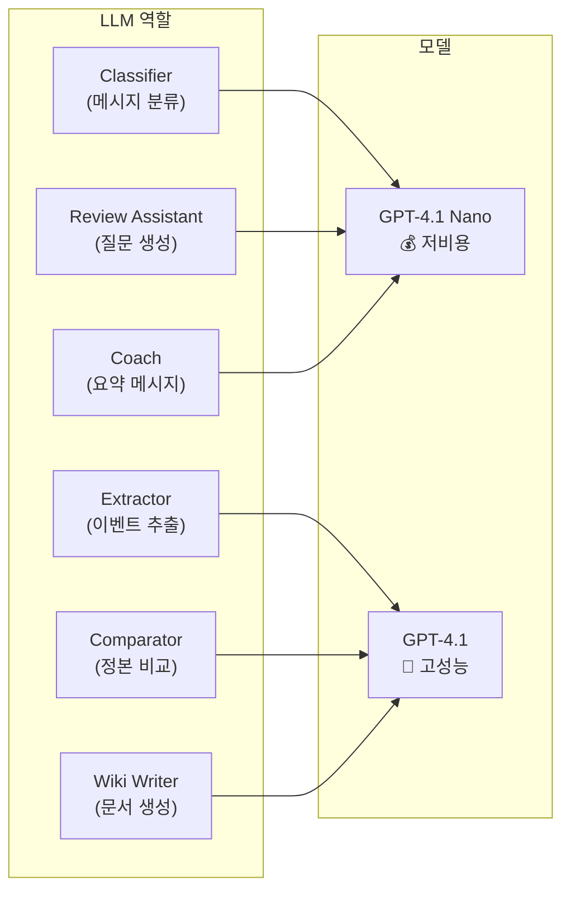

# Phase 5-A: LLM 인프라 & 프롬프트 설계 — 구체화된 계획서

> **상위 문서**: [implementation_plan.md](file:///c:/Users/andyw/Desktop/Like_a_Lion_myproject/implementation_plan.md)
> **모델 전략**: [기술_스택_추천서.md §6](file:///c:/Users/andyw/Desktop/Like_a_Lion_myproject/%EA%B8%B0%EC%88%A0_%EC%8A%A4%ED%83%9D_%EC%B6%94%EC%B2%9C%EC%84%9C.md)
> **기반 사양**: [상세설명서 §19.2, §19.3](file:///c:/Users/andyw/Desktop/Like_a_Lion_myproject/AI_%ED%98%91%EC%97%85_%EC%BD%94%EC%B9%98_%ED%94%84%EB%A1%9C%EC%A0%9D%ED%8A%B8_%EC%83%81%EC%84%B8%EC%84%A4%EB%AA%85%EC%84%9C_v2.md)
> **작성일**: 2026-04-10
> **예상 난이도**: ⭐⭐⭐
> **예상 소요 시간**: 2~3시간
> **선행 완료**: Phase 0~4 ✅
> **후속**: Phase 5-B (분석 파이프라인)

---

## 🎯 이 Phase의 목표

Phase 5-A가 끝나면 다음이 완성되어야 합니다:

1. ✅ `LLMClient`가 역할별로 GPT-4.1 Nano / GPT-4.1을 자동 선택
2. ✅ Structured Outputs용 JSON 스키마가 정의됨
3. ✅ Classifier 프롬프트로 대화를 6개 이벤트 유형으로 분류 가능
4. ✅ Extractor 프롬프트로 구조화된 이벤트 후보를 JSON으로 추출 가능
5. ✅ 간단한 텍스트로 LLM 호출 → JSON 응답 수신 확인
6. ✅ LLM 실패 시 최대 3회 자동 재시도 (exponential backoff)

> [!NOTE]
> Phase 5-A는 **LLM과의 통신 인프라**에 집중합니다.
> 실제 DB 연동 파이프라인(세션 분석, Celery)은 Phase 5-B에서 구현합니다.

---

## 🏗️ 모델 라우팅 전략



| 역할 | 모델 | 비용 (1M tokens) | 이유 |
|------|------|:---:|------|
| Classifier | GPT-4.1 Nano | ~$0.10 | 단순 분류, 빠르고 저렴 |
| Extractor | GPT-4.1 | ~$2.00 | 한국어 구조화 추출에 높은 정확도 |
| Comparator | GPT-4.1 | ~$2.00 | 정본 상태와 비교하는 추론 필요 |
| Review Assistant | GPT-4.1 Nano | ~$0.10 | 정형화된 질문 생성 |
| Wiki Writer | GPT-4.1 | ~$2.00 | 자연스러운 한국어 문서 작성 |
| Coach | GPT-4.1 Nano | ~$0.10 | 짧은 알림 메시지 |

---

## 📋 작업 목록 (총 5단계)

---

### Step 5A-1. pyproject.toml 의존성 추가

> [!NOTE]
> `openai>=1.50`은 이미 `pyproject.toml`에 존재합니다. `tenacity`만 추가하세요.

```toml
# pyproject.toml [project.dependencies]에 추가
"tenacity>=8.2",
```

---

### Step 5A-2. LLM 클라이언트 래퍼 (`packages/llm/client.py`)

```python
"""OpenAI LLM client wrapper with model routing and retry logic."""

from __future__ import annotations

import json
from enum import StrEnum
from typing import Any

from openai import AsyncOpenAI, APIConnectionError, RateLimitError, APITimeoutError
from tenacity import (
    retry,
    stop_after_attempt,
    wait_exponential,
    retry_if_exception_type,
)

from apps.api.config import settings

import structlog

logger = structlog.get_logger()


class LLMRole(StrEnum):
    """LLM 역할별 모델 라우팅 (기술 스택 추천서 §6)"""
    CLASSIFIER = "classifier"       # GPT-4.1 Nano — 단순 분류
    EXTRACTOR = "extractor"         # GPT-4.1 — 구조화 추출
    COMPARATOR = "comparator"       # GPT-4.1 — 정본 비교
    REVIEW_ASSISTANT = "review_assistant"  # GPT-4.1 Nano — 질문 생성
    WIKI_WRITER = "wiki_writer"     # GPT-4.1 — 문서 작성
    COACH = "coach"                 # GPT-4.1 Nano — 요약 메시지


# 역할 → 모델 매핑
MODEL_ROUTING: dict[LLMRole, str] = {
    LLMRole.CLASSIFIER: "gpt-4.1-nano",
    LLMRole.EXTRACTOR: "gpt-4.1",
    LLMRole.COMPARATOR: "gpt-4.1",
    LLMRole.REVIEW_ASSISTANT: "gpt-4.1-nano",
    LLMRole.WIKI_WRITER: "gpt-4.1",
    LLMRole.COACH: "gpt-4.1-nano",
}


class LLMClient:
    """
    OpenAI API 호출 래퍼.

    기능:
    - 역할별 모델 자동 선택 (model routing)
    - Structured Outputs (JSON 스키마 강제)
    - Exponential backoff 재시도 (최대 3회)
    - 토큰 사용량 로깅
    """

    def __init__(self):
        self.client = AsyncOpenAI(api_key=settings.openai_api_key)

    @retry(
        stop=stop_after_attempt(3),
        wait=wait_exponential(multiplier=1, min=2, max=30),
        # 일시적 에러만 재시도 (스키마 오류, 파싱 에러 등 영구적 에러는 즉시 실패)
        retry=retry_if_exception_type((APIConnectionError, RateLimitError, APITimeoutError)),
        reraise=True,
    )
    async def call(
        self,
        role: LLMRole,
        system_prompt: str,
        user_prompt: str,
        response_schema: dict | None = None,
        temperature: float = 0.2,
    ) -> dict[str, Any]:
        """
        LLM을 호출하고 JSON 응답을 반환합니다.

        Args:
            role: LLM 역할 (모델 자동 선택)
            system_prompt: 시스템 프롬프트
            user_prompt: 사용자 프롬프트 (대화/문서 텍스트)
            response_schema: Structured Outputs JSON 스키마 (선택)
            temperature: 생성 온도 (분류/추출은 낮게)

        Returns:
            파싱된 JSON 딕셔너리
        """
        model = MODEL_ROUTING[role]

        messages = [
            {"role": "system", "content": system_prompt},
            {"role": "user", "content": user_prompt},
        ]

        kwargs: dict[str, Any] = {
            "model": model,
            "messages": messages,
            "temperature": temperature,
        }

        # Structured Outputs 사용 시
        if response_schema:
            kwargs["response_format"] = {
                "type": "json_schema",
                "json_schema": {
                    "name": "response",
                    "strict": True,
                    "schema": response_schema,
                },
            }
        else:
            kwargs["response_format"] = {"type": "json_object"}

        logger.info("llm_call_start", role=role.value, model=model)

        response = await self.client.chat.completions.create(**kwargs)

        # 토큰 사용량 로깅
        usage = response.usage
        if usage:
            logger.info(
                "llm_call_complete",
                role=role.value,
                model=model,
                prompt_tokens=usage.prompt_tokens,
                completion_tokens=usage.completion_tokens,
                total_tokens=usage.total_tokens,
            )

        # 응답 파싱
        content = response.choices[0].message.content
        if content is None:
            raise ValueError("LLM returned empty content")

        return json.loads(content)


# 싱글톤 인스턴스
llm_client = LLMClient()
```

---

### Step 5A-3. 응답 스키마 정의 (`packages/llm/schemas.py`)

Structured Outputs를 위한 JSON 스키마를 정의합니다.

```python
"""LLM 응답 JSON 스키마 — Structured Outputs용."""

# ──────────────────────────────────────────
# Classifier 응답 스키마
# ──────────────────────────────────────────

CLASSIFIER_SCHEMA = {
    "type": "object",
    "properties": {
        "events": {
            "type": "array",
            "items": {
                "type": "object",
                "properties": {
                    "event_type": {
                        "type": "string",
                        "enum": [
                            "decision",
                            "requirement_change",
                            "task",
                            "issue",
                            "feedback",
                            "question",
                            "general",
                        ],
                    },
                    "related_message_indices": {
                        "type": "array",
                        "items": {"type": "integer"},
                        "description": "이 이벤트와 관련된 메시지의 인덱스 (0-based)",
                    },
                    "brief": {
                        "type": "string",
                        "description": "이벤트 내용 한 줄 요약",
                    },
                },
                "required": ["event_type", "related_message_indices", "brief"],
                "additionalProperties": False,
            },
        },
        "has_events": {
            "type": "boolean",
            "description": "이벤트가 존재하는지 여부",
        },
    },
    "required": ["events", "has_events"],
    "additionalProperties": False,
}


# ──────────────────────────────────────────
# Extractor 응답 스키마
# ──────────────────────────────────────────

EXTRACTOR_SCHEMA = {
    "type": "object",
    "properties": {
        "event_type": {
            "type": "string",
            "enum": [
                "decision",
                "requirement_change",
                "task",
                "issue",
                "feedback",
                "question",
            ],
        },
        "summary": {
            "type": "string",
            "description": "이벤트의 핵심 내용을 한 줄로 요약",
        },
        "topic": {
            "type": "string",
            "description": "관련 기능/주제 (예: 로그인 기능, DB 설계, 발표 준비)",
        },
        "details": {
            "type": "object",
            "properties": {
                "before": {
                    "type": ["string", "null"],
                    "description": "변경 전 상태 (해당 시에만)",
                },
                "after": {
                    "type": ["string", "null"],
                    "description": "변경 후 상태 (해당 시에만)",
                },
                "reason": {
                    "type": ["string", "null"],
                    "description": "변경/결정의 이유",
                },
                "related_people": {
                    "type": "array",
                    "items": {"type": "string"},
                    "description": "관련 인물",
                },
                "source_quotes": {
                    "type": "array",
                    "items": {"type": "string"},
                    "description": "근거가 되는 원문 인용",
                },
            },
            "required": [
                "before",
                "after",
                "reason",
                "related_people",
                "source_quotes",
            ],
            "additionalProperties": False,
        },
        "confidence": {
            "type": "number",
            # strict 모드에서 minimum/maximum 미지원 → 프롬프트 규칙 + 애플리케이션 레벨 clamp로 보장
            "description": "0.0~1.0 범위의 신뢰도 (반드시 0 이상 1 이하의 값을 사용할 것)",
        },
        "fact_type": {
            "type": "string",
            "enum": [
                "confirmed_fact",
                "inferred_interpretation",
                "unresolved_ambiguity",
            ],
            "description": "사실/추론 분류 (§19.3)",
        },
    },
    "required": [
        "event_type",
        "summary",
        "topic",
        "details",
        "confidence",
        "fact_type",
    ],
    "additionalProperties": False,
}
```

---

### Step 5A-4. Classifier 프롬프트 (`packages/llm/prompts/classifier.py`)

```python
"""Classifier prompt — 대화/문서에서 이벤트 후보를 분류합니다. (GPT-4.1 Nano)"""

CLASSIFIER_SYSTEM_PROMPT = """\
당신은 대학생 팀 프로젝트 대화를 분석하는 분류 전문가입니다.

## 역할
주어진 대화 메시지들을 읽고, 프로젝트 관리에 중요한 이벤트를 식별하여 분류합니다.

## 이벤트 유형 (event_type)
- **decision**: 팀이 무언가를 결정함 (기술 선택, 방향 설정, 일정 확정 등)
- **requirement_change**: 요구사항이 추가/수정/삭제됨
- **task**: 작업이 생성/배정/완료됨
- **issue**: 문제/장애/걱정사항이 발견됨
- **feedback**: 교수 피드백 또는 외부 피드백 언급
- **question**: 아직 답이 나오지 않은 질문
- **general**: 위 범주에 해당하지 않는 일상 대화

## 규칙
1. 하나의 대화에서 여러 이벤트가 추출될 수 있습니다.
2. 일상적인 인사, 잡담은 `general`로 분류하세요.
3. `general`은 events 배열에 포함하지 마세요.
4. 확실하지 않은 경우에도 후보로 포함하되, brief에 불확실성을 명시하세요.
5. related_message_indices는 해당 이벤트와 관련된 메시지의 인덱스(0부터 시작)입니다.
"""


# 프롬프트 길이 가드: Nano 모델의 context window 초과 방지
MAX_MESSAGES_FOR_CLASSIFIER = 100  # 최대 메시지 수
MAX_CHARS_PER_MESSAGE = 500        # 메시지당 최대 글자 수


def build_classifier_user_prompt(messages: list[dict]) -> str:
    """
    분류할 메시지 리스트를 사용자 프롬프트로 변환합니다.

    Args:
        messages: [{"index": 0, "sender": "김철수", "text": "...", "time": "14:30"}]
    """
    # 길이 제한: 최근 N개 메시지만 사용
    truncated = messages[-MAX_MESSAGES_FOR_CLASSIFIER:]

    lines = ["다음 대화에서 프로젝트 관리에 중요한 이벤트를 식별하세요.\n"]
    if len(messages) > MAX_MESSAGES_FOR_CLASSIFIER:
        lines.append(f"(전체 {len(messages)}개 중 최근 {MAX_MESSAGES_FOR_CLASSIFIER}개만 표시)\n")
    lines.append("---")

    for msg in truncated:
        sender = msg.get("sender", "알 수 없음")
        text = msg.get("text", "")[:MAX_CHARS_PER_MESSAGE]  # 메시지 길이 제한
        time = msg.get("time", "")
        idx = msg.get("index", 0)
        lines.append(f"[{idx}] ({time}) {sender}: {text}")

    lines.append("---")
    return "\n".join(lines)


def build_classifier_document_prompt(title: str, content: str, source_type: str) -> str:
    """문서 분류용 프롬프트."""
    return f"""\
다음 {source_type} 문서에서 프로젝트 관리에 중요한 이벤트를 식별하세요.

제목: {title}
출처 유형: {source_type}

---
{content}
---
"""
```

---

### Step 5A-5. Extractor 프롬프트 (`packages/llm/prompts/extractor.py`)

```python
"""Extractor prompt — 분류된 이벤트를 구조화합니다. (GPT-4.1 Standard)"""

EXTRACTOR_SYSTEM_PROMPT = """\
당신은 대학생 팀 프로젝트의 이벤트를 구조화하는 전문가입니다.

## 역할
Classifier가 식별한 이벤트 후보에 대해, 관련 메시지를 분석하여 구조화된 이벤트 정보를 생성합니다.

## 추출 규칙

### 1. summary (한 줄 요약)
- 한국어로, 30자 이내로 핵심을 요약하세요.
- 예: "로그인 기능 우선순위를 높임으로 변경"

### 2. topic (관련 주제)
- 관련 기능이나 영역을 명시하세요.
- 예: "로그인", "DB 설계", "발표 준비", "UI 디자인"

### 3. details
- **before**: 이전 상태 (변경/결정 이벤트에서만, 없으면 null)
- **after**: 현재/새로운 상태 (변경/결정 이벤트에서만, 없으면 null)
- **reason**: 변경/결정의 이유 (원문에 나와 있다면 인용)
- **related_people**: 관련된 사람들의 이름/닉네임
- **source_quotes**: 근거가 되는 원문 메시지를 그대로 인용 (최대 3개)

### 4. confidence (신뢰도 0.0~1.0)
- **0.9~1.0**: 원문에서 명확하게 확인됨 ("~으로 결정했습니다")
- **0.7~0.9**: 맥락상 높은 확률로 맞음
- **0.5~0.7**: 추론이 필요하며 확실하지 않음
- **0.5 미만**: 매우 불확실하거나 추측

### 5. fact_type (사실/추론 분류 §19.3)
- **confirmed_fact**: 원문에서 직접 확인할 수 있는 사실
  - 예: "로그인은 OAuth로 하기로 했다" → confirmed_fact
- **inferred_interpretation**: AI가 맥락상 추론한 해석
  - 예: "아마 ~인 것 같다" → inferred_interpretation
- **unresolved_ambiguity**: 아직 확정되지 않은 내용
  - 예: "~할지 아직 모르겠다" → unresolved_ambiguity
"""


def build_extractor_user_prompt(
    event_type: str,
    brief: str,
    related_messages: list[dict],
) -> str:
    """
    Extractor 사용자 프롬프트를 생성합니다.

    Args:
        event_type: Classifier가 분류한 이벤트 유형
        brief: Classifier의 한 줄 요약
        related_messages: 관련 메시지 리스트
    """
    lines = [
        f"이벤트 유형: {event_type}",
        f"Classifier 요약: {brief}",
        "",
        "관련 메시지:",
        "---",
    ]

    for msg in related_messages:
        sender = msg.get("sender", "알 수 없음")
        text = msg.get("text", "")
        time = msg.get("time", "")
        lines.append(f"({time}) {sender}: {text}")

    lines.append("---")
    lines.append("")
    lines.append("위 메시지를 분석하여 구조화된 이벤트 정보를 생성하세요.")

    return "\n".join(lines)


def build_extractor_document_prompt(
    event_type: str,
    brief: str,
    title: str,
    content: str,
) -> str:
    """문서 기반 Extractor 프롬프트."""
    return f"""\
이벤트 유형: {event_type}
Classifier 요약: {brief}

문서 제목: {title}

---
{content}
---

위 문서를 분석하여 구조화된 이벤트 정보를 생성하세요.
"""
```

---

## 📁 디렉토리 변경 요약

```text
Like_a_Lion_myproject/
├── packages/
│   └── llm/
│       ├── __init__.py              # [신규] 패키지 초기화
│       ├── client.py                # [신규] LLM 클라이언트 + 모델 라우팅
│       ├── schemas.py               # [신규] Structured Outputs JSON 스키마
│       └── prompts/
│           ├── __init__.py          # [신규] 프롬프트 패키지
│           ├── classifier.py        # [신규] 분류 프롬프트
│           └── extractor.py         # [신규] 추출 프롬프트
│
└── pyproject.toml                   # [수정] tenacity 추가
```

---

## ✅ 검증 체크리스트

### 1단계: 패키지 Import 확인
```bash
python -c "from packages.llm.client import llm_client, LLMRole; print('✅ LLM Client OK')"
python -c "from packages.llm.schemas import CLASSIFIER_SCHEMA, EXTRACTOR_SCHEMA; print('✅ Schemas OK')"
python -c "from packages.llm.prompts.classifier import CLASSIFIER_SYSTEM_PROMPT; print('✅ Classifier OK')"
python -c "from packages.llm.prompts.extractor import EXTRACTOR_SYSTEM_PROMPT; print('✅ Extractor OK')"
```

### 2단계: LLM 연결 테스트 (API 키 필요)
```bash
python -c "
import asyncio
from packages.llm.client import llm_client, LLMRole
from packages.llm.schemas import CLASSIFIER_SCHEMA

async def test():
    # 스키마 기반 호출로 통일 (no-schema 호출은 파싱 실패 위험)
    result = await llm_client.call(
        role=LLMRole.CLASSIFIER,
        system_prompt='당신은 테스트 봇입니다. 주어진 스키마대로 응답하세요.',
        user_prompt='테스트 메시지입니다. 이벤트를 분류하세요.',
        response_schema=CLASSIFIER_SCHEMA,
    )
    print(f'✅ LLM 응답 (Nano): {result}')
    assert 'events' in result, '스키마 검증 실패: events 필드 없음'
    assert 'has_events' in result, '스키마 검증 실패: has_events 필드 없음'
    print('✅ 스키마 구조 정상')

asyncio.run(test())
"
```
→ API 키가 유효하고 스키마가 올바르면 구조화된 JSON 응답 수신

### 3단계: Classifier 통합 테스트 (핵심!)
```bash
python -c "
import asyncio
from packages.llm.client import llm_client, LLMRole
from packages.llm.schemas import CLASSIFIER_SCHEMA
from packages.llm.prompts.classifier import (
    CLASSIFIER_SYSTEM_PROMPT,
    build_classifier_user_prompt,
)

async def test():
    messages = [
        {'index': 0, 'sender': '김철수', 'text': '로그인 기능은 OAuth로 하는 게 좋겠어', 'time': '14:30'},
        {'index': 1, 'sender': '이영희', 'text': '좋아 그렇게 하자', 'time': '14:31'},
        {'index': 2, 'sender': '김철수', 'text': '점심 뭐 먹을까?', 'time': '14:35'},
        {'index': 3, 'sender': '박민수', 'text': '교수님이 발표 범위를 줄이라고 하셨어', 'time': '14:40'},
    ]

    result = await llm_client.call(
        role=LLMRole.CLASSIFIER,
        system_prompt=CLASSIFIER_SYSTEM_PROMPT,
        user_prompt=build_classifier_user_prompt(messages),
        response_schema=CLASSIFIER_SCHEMA,
    )

    print(f'이벤트 존재: {result[\"has_events\"]}')
    for ev in result['events']:
        print(f'  [{ev[\"event_type\"]}] {ev[\"brief\"]} → 메시지 {ev[\"related_message_indices\"]}')

asyncio.run(test())
"
```

**기대 출력:**
```
이벤트 존재: True
  [decision] 로그인 기능을 OAuth로 결정 → 메시지 [0, 1]
  [feedback] 교수님이 발표 범위 축소 지시 → 메시지 [3]
```

### 4단계: Extractor 통합 테스트
```bash
python -c "
import asyncio
from packages.llm.client import llm_client, LLMRole
from packages.llm.schemas import EXTRACTOR_SCHEMA
from packages.llm.prompts.extractor import (
    EXTRACTOR_SYSTEM_PROMPT,
    build_extractor_user_prompt,
)

async def test():
    messages = [
        {'sender': '김철수', 'text': '로그인 기능은 OAuth로 하는 게 좋겠어', 'time': '14:30'},
        {'sender': '이영희', 'text': '좋아 그렇게 하자', 'time': '14:31'},
    ]

    result = await llm_client.call(
        role=LLMRole.EXTRACTOR,
        system_prompt=EXTRACTOR_SYSTEM_PROMPT,
        user_prompt=build_extractor_user_prompt('decision', '로그인 OAuth 결정', messages),
        response_schema=EXTRACTOR_SCHEMA,
    )

    print(f'이벤트 유형: {result[\"event_type\"]}')
    print(f'요약: {result[\"summary\"]}')
    print(f'주제: {result[\"topic\"]}')
    print(f'신뢰도: {result[\"confidence\"]}')
    print(f'사실 유형: {result[\"fact_type\"]}')
    print(f'근거 원문: {result[\"details\"][\"source_quotes\"]}')

asyncio.run(test())
"
```

**기대 출력:**
```
이벤트 유형: decision
요약: 로그인 기능을 OAuth 방식으로 결정
주제: 로그인
신뢰도: 0.9
사실 유형: confirmed_fact
근거 원문: ['로그인 기능은 OAuth로 하는 게 좋겠어', '좋아 그렇게 하자']
```

---

## 📄 이 Phase의 최종 산출물 목록

| # | 파일 | 유형 | 설명 |
|:---:|------|:---:|------|
| 1 | `packages/llm/__init__.py` | 신규 | LLM 패키지 초기화 |
| 2 | `packages/llm/client.py` | 신규 | LLM 클라이언트 + 모델 라우팅 + 재시도 |
| 3 | `packages/llm/schemas.py` | 신규 | Classifier/Extractor JSON 스키마 |
| 4 | `packages/llm/prompts/__init__.py` | 신규 | 프롬프트 패키지 |
| 5 | `packages/llm/prompts/classifier.py` | 신규 | 분류 프롬프트 |
| 6 | `packages/llm/prompts/extractor.py` | 신규 | 추출 프롬프트 |
| 7 | `pyproject.toml` | 수정 | 의존성 추가 |

**총 7개 파일** (신규 6개 + 수정 1개)

---

## ⏭️ 다음: Phase 5-B

Phase 5-A의 LLM 인프라가 검증되면 **Phase 5-B (분석 파이프라인 & Celery 연동)** 으로 진행:
- `AnalysisService` — Classifier → Extractor 오케스트레이션
- Celery 분석 태스크
- Phase 4 통합 (세션/문서 → 자동 분석 트리거)
