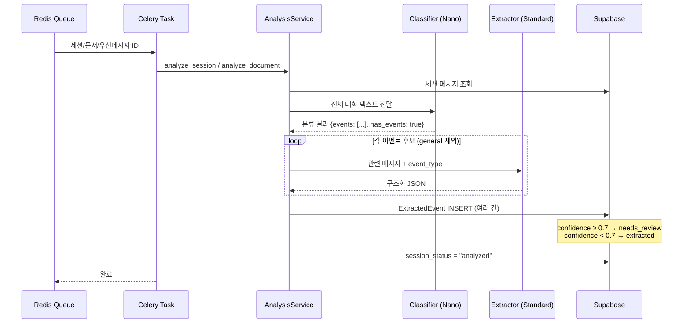

# Phase 5-B: 분석 파이프라인 & Celery 연동 — 구체화된 계획서

> **상위 문서**: [implementation_plan.md](file:///c:/Users/andyw/Desktop/Like_a_Lion_myproject/implementation_plan.md)
> **선행 문서**: [Phase 5-A](file:///c:/Users/andyw/Desktop/Like_a_Lion_myproject/Phase5A_LLM_%EC%9D%B8%ED%94%84%EB%9D%BC_%ED%94%84%EB%A1%AC%ED%94%84%ED%8A%B8.md)
> **기반 사양**: [상세설명서 §19.1](file:///c:/Users/andyw/Desktop/Like_a_Lion_myproject/AI_%ED%98%91%EC%97%85_%EC%BD%94%EC%B9%98_%ED%94%84%EB%A1%9C%EC%A0%9D%ED%8A%B8_%EC%83%81%EC%84%B8%EC%84%A4%EB%AA%85%EC%84%9C_v2.md)
> **작성일**: 2026-04-10
> **예상 난이도**: ⭐⭐⭐⭐
> **예상 소요 시간**: 2~3시간
> **선행 완료**: Phase 0~4 ✅, Phase 5-A ✅

---

## 🎯 이 Phase의 목표

Phase 5-B가 끝나면 다음이 완성되어야 합니다:

1. ✅ `AnalysisService`가 Classifier → Extractor 2단계 파이프라인을 실행
2. ✅ 세션 종료 시 `analyze_session_task.delay()`로 분석 태스크 자동 트리거
3. ✅ 문서 업로드 시 `analyze_document_task.delay()`로 분석 자동 트리거
4. ✅ 우선 메시지 발견 시 `analyze_priority_message_task.delay()`로 즉시 분석
5. ✅ 추출된 이벤트가 `extracted_events` 테이블에 저장됨
6. ✅ confidence ≥ threshold → `needs_review` 상태로 자동 설정
7. ✅ 세션 상태가 `analyzed`로 업데이트됨
8. ✅ 재시도 시 중복 이벤트 생성 방지 (idempotency guard)

> [!NOTE]
> Phase 5-A에서 만든 `LLMClient`, `CLASSIFIER_SCHEMA`, `EXTRACTOR_SCHEMA`, 프롬프트를 **이 Phase에서 조합**합니다.

---

## 🏗️ 아키텍처 흐름



---

## 📋 작업 목록 (총 5단계)

---

### Step 5B-0. 의존성 추가 및 Celery 설정 변경

#### ① `pyproject.toml`에 `celery-aio-pool` 추가

> [!IMPORTANT]
> `asyncio.run()`을 Celery 태스크 안에서 사용하면 이벤트 루프 충돌로 크래시합니다.
> `celery-aio-pool`을 사용하면 태스크를 `async def`로 직접 정의할 수 있습니다.

> [!WARNING]
> `celery-aio-pool`은 Celery 공식 패키지가 아닌 **서드파티 라이브러리**입니다.
> PyPI에서 maintenance 상태와 Celery 5.4+ 호환성을 반드시 확인하세요.
> 만약 호환 문제가 발생하면 아래 **동기 태스크 래퍼 패턴**을 대안으로 사용합니다:
> ```python
> # 대안: celery-aio-pool 없이 동기 태스크로 감싸기
> import asyncio
> @celery_app.task(name="analyze_session", bind=True, max_retries=3)
> def analyze_session_task(self, session_id: str) -> dict:
>     loop = asyncio.new_event_loop()
>     try:
>         return loop.run_until_complete(_run_analysis("session", uuid.UUID(session_id)))
>     finally:
>         loop.close()
> ```

```toml
# pyproject.toml [project.dependencies]에 추가
"celery-aio-pool>=0.1.0",
```

#### ② `apps/worker/celery_app.py` Task Routing 수정

현재 태스크에 `name="analyze_session"` 같은 명시적 이름을 부여하므로,
라우팅 규칙도 이 이름 기준으로 맞춰야 합니다.

> [!TIP]
> 현재 `celery_app.py`에 이미 `"apps.worker.tasks.analysis_tasks.*"` glob 패턴이 존재합니다.
> 명시적 이름 기반 라우팅(`"analyze_session"`)이 **더 안전**하므로, glob 패턴을 제거하고
> 명시적 이름만 유지하는 것을 추천합니다.

```python
# apps/worker/celery_app.py — task_routes 수정
# ⚠️ 기존 glob 패턴 "apps.worker.tasks.analysis_tasks.*"를 제거하고
#    명시적 이름 기반 라우팅으로 교체합니다.
task_routes={
    "close_idle_sessions": {"queue": "session"},
    "analyze_session": {"queue": "analysis"},
    "analyze_document": {"queue": "analysis"},
    "analyze_priority_message": {"queue": "analysis"},
    "apps.worker.tasks.session_tasks.*": {"queue": "session"},
    "apps.worker.tasks.notification_tasks.*": {"queue": "notification"},
},
```

#### ③ Celery Worker 실행 방법 변경

```powershell
# 기존 (prefork pool)
celery -A apps.worker.celery_app worker --loglevel=info -Q analysis,session

# 변경 후 (async pool — Windows PowerShell)
$env:CELERY_CUSTOM_WORKER_POOL='celery_aio_pool.pool:AsyncIOPool'
celery -A apps.worker.celery_app worker --pool=custom --loglevel=info -Q analysis,session

# Linux/Mac Bash
# export CELERY_CUSTOM_WORKER_POOL='celery_aio_pool.pool:AsyncIOPool'
# celery -A apps.worker.celery_app worker --pool=custom --loglevel=info -Q analysis,session
```

---

### Step 5B-1. 분석 파이프라인 서비스 (`packages/core/services/analysis_service.py`)

```python
"""Analysis service — Classifier → Extractor 2단계 LLM 파이프라인."""

from __future__ import annotations

import uuid
from datetime import datetime, timezone

from sqlalchemy import select
from sqlalchemy.ext.asyncio import AsyncSession
from sqlalchemy.orm import selectinload

from packages.db.models.raw_message import RawMessage
from packages.db.models.raw_document import RawDocument
from packages.db.models.conversation_session import ConversationSession
from packages.db.models.extracted_event import ExtractedEvent
from packages.shared.enums import EventState, SessionStatus, SourceKind

from packages.llm.client import llm_client, LLMRole
from packages.llm.schemas import CLASSIFIER_SCHEMA, EXTRACTOR_SCHEMA
from packages.llm.prompts.classifier import (
    CLASSIFIER_SYSTEM_PROMPT,
    build_classifier_user_prompt,
    build_classifier_document_prompt,
)
from packages.llm.prompts.extractor import (
    EXTRACTOR_SYSTEM_PROMPT,
    build_extractor_user_prompt,
    build_extractor_document_prompt,
)

from apps.api.config import settings

import structlog

logger = structlog.get_logger()


class AnalysisService:
    """Classifier → Extractor 2단계 LLM 분석 파이프라인."""

    def __init__(self, db: AsyncSession):
        self.db = db
        self.confidence_threshold = settings.llm_confidence_threshold

    # ──────────────────────────────────────────
    # 세션 분석
    # ──────────────────────────────────────────

    async def analyze_session(self, session_id: uuid.UUID) -> list[ExtractedEvent]:
        """
        종료된 세션을 분석하여 이벤트 후보를 추출합니다.

        1. 세션 메시지 조회
        2. Classifier로 이벤트 분류
        3. 각 이벤트에 대해 Extractor로 구조화
        4. ExtractedEvent 저장
        5. 세션 상태를 analyzed로 업데이트
        """
        # 1. 세션 조회
        session = await self.db.get(ConversationSession, session_id)
        if session is None:
            logger.error("session_not_found", session_id=str(session_id))
            return []

        # Idempotency guard: 이미 분석된 세션은 스킵 (retry 시 중복 방지)
        if session.session_status == SessionStatus.ANALYZED.value:
            logger.info("session_already_analyzed", session_id=str(session_id))
            return []

        # ⚠️ 전제 조건: RawMessage 모델에 sender relationship이 정의되어 있어야 합니다.
        #    예: sender = relationship("User", lazy="select")
        #    또한 RawMessage.project_id 필드가 직접 존재하는지 확인 필요.
        #    없다면 Channel → Project 경로로 접근해야 합니다.
        stmt = (
            select(RawMessage)
            .where(RawMessage.session_id == session_id)
            .options(selectinload(RawMessage.sender))  # async에서 lazy loading 방지
            .order_by(RawMessage.sent_at)
        )
        result = await self.db.execute(stmt)
        messages = list(result.scalars().all())

        if not messages:
            logger.warning("session_has_no_messages", session_id=str(session_id))
            await self._mark_session_analyzed(session)
            return []

        # 2. 메시지를 프롬프트 형식으로 변환
        msg_dicts = self._messages_to_dicts(messages)

        # 3. Classifier 호출 (GPT-4.1 Nano)
        classifier_result = await llm_client.call(
            role=LLMRole.CLASSIFIER,
            system_prompt=CLASSIFIER_SYSTEM_PROMPT,
            user_prompt=build_classifier_user_prompt(msg_dicts),
            response_schema=CLASSIFIER_SCHEMA,
        )

        if not classifier_result.get("has_events", False):
            logger.info("no_events_found", session_id=str(session_id))
            await self._mark_session_analyzed(session)
            return []

        # 4. 각 이벤트에 대해 Extractor 호출 (GPT-4.1 Standard)
        events: list[ExtractedEvent] = []
        for event_candidate in classifier_result.get("events", []):
            event_type = event_candidate.get("event_type")
            if event_type == "general":
                continue

            brief = event_candidate.get("brief", "")
            indices = event_candidate.get("related_message_indices", [])

            # 관련 메시지 추출
            related = [msg_dicts[i] for i in indices if i < len(msg_dicts)]
            if not related:
                related = msg_dicts  # 인덱스가 없으면 전체 전달

            # Extractor 호출
            try:
                extractor_result = await llm_client.call(
                    role=LLMRole.EXTRACTOR,
                    system_prompt=EXTRACTOR_SYSTEM_PROMPT,
                    user_prompt=build_extractor_user_prompt(event_type, brief, related),
                    response_schema=EXTRACTOR_SCHEMA,
                )

                extracted = self._create_event(
                    project_id=session.project_id,
                    source_kind=SourceKind.SESSION,
                    source_id=session_id,
                    data=extractor_result,
                )
                events.append(extracted)

            except Exception as e:
                logger.error(
                    "extractor_failed",
                    event_type=event_type,
                    error=str(e),
                )
                continue

        # 5. DB 저장 + 세션 상태 업데이트 (단일 트랜잭션 — 중복 방지)
        if events:
            self.db.add_all(events)
            await self.db.flush()  # 한 번의 flush로 모든 이벤트에 ID 할당 (N번 flush는 불필요한 round-trip)

        # 이벤트 저장과 상태 변경을 하나의 commit으로 묶음 (중간 실패 시 전체 롤백)
        session.session_status = SessionStatus.ANALYZED.value
        await self.db.commit()

        if events:
            for ev in events:
                await self.db.refresh(ev)

        logger.info(
            "session_analyzed",
            session_id=str(session_id),
            events_count=len(events),
        )
        return events

    # ──────────────────────────────────────────
    # 문서 분석
    # ──────────────────────────────────────────

    async def analyze_document(self, document_id: uuid.UUID) -> list[ExtractedEvent]:
        """업로드된 문서를 분석하여 이벤트 후보를 추출합니다."""
        doc = await self.db.get(RawDocument, document_id)
        if doc is None:
            logger.error("document_not_found", document_id=str(document_id))
            return []

        # Idempotency guard: 이미 분석된 문서는 스킵 (Celery retry 시 중복 이벤트 방지)
        existing_stmt = (
            select(ExtractedEvent)
            .where(ExtractedEvent.source_id == document_id)
            .where(ExtractedEvent.source_kind == SourceKind.DOCUMENT.value)
            .limit(1)
        )
        existing = await self.db.execute(existing_stmt)
        if existing.scalar_one_or_none() is not None:
            logger.info("document_already_analyzed", document_id=str(document_id))
            return []

        # 1. Classifier 호출
        classifier_result = await llm_client.call(
            role=LLMRole.CLASSIFIER,
            system_prompt=CLASSIFIER_SYSTEM_PROMPT,
            user_prompt=build_classifier_document_prompt(
                doc.title, doc.content, doc.source_type
            ),
            response_schema=CLASSIFIER_SCHEMA,
        )

        if not classifier_result.get("has_events", False):
            logger.info("no_events_in_document", document_id=str(document_id))
            return []

        # 2. 각 이벤트에 대해 Extractor 호출
        events: list[ExtractedEvent] = []
        for event_candidate in classifier_result.get("events", []):
            event_type = event_candidate.get("event_type")
            if event_type == "general":
                continue
            brief = event_candidate.get("brief", "")

            try:
                extractor_result = await llm_client.call(
                    role=LLMRole.EXTRACTOR,
                    system_prompt=EXTRACTOR_SYSTEM_PROMPT,
                    user_prompt=build_extractor_document_prompt(
                        event_type, brief, doc.title, doc.content
                    ),
                    response_schema=EXTRACTOR_SCHEMA,
                )

                extracted = self._create_event(
                    project_id=doc.project_id,
                    source_kind=SourceKind.DOCUMENT,
                    source_id=document_id,
                    data=extractor_result,
                )
                events.append(extracted)

            except Exception as e:
                logger.error("extractor_failed", event_type=event_type, error=str(e))
                continue

        if events:
            self.db.add_all(events)
            await self.db.commit()
            for ev in events:
                await self.db.refresh(ev)

        logger.info(
            "document_analyzed",
            document_id=str(document_id),
            events_count=len(events),
        )
        return events

    # ──────────────────────────────────────────
    # 우선 메시지 분석 (개별 메시지)
    # ──────────────────────────────────────────

    async def analyze_priority_message(self, message_id: uuid.UUID) -> list[ExtractedEvent]:
        """우선 처리 표시된 개별 메시지를 분석합니다."""
        # selectinload로 sender를 즉시 로딩 (async lazy loading 방지)
        stmt = (
            select(RawMessage)
            .where(RawMessage.id == message_id)
            .options(selectinload(RawMessage.sender))
        )
        result = await self.db.execute(stmt)
        msg = result.scalar_one_or_none()
        if msg is None or not msg.text:
            return []

        msg_dicts = self._messages_to_dicts([msg])

        # Classifier
        classifier_result = await llm_client.call(
            role=LLMRole.CLASSIFIER,
            system_prompt=CLASSIFIER_SYSTEM_PROMPT,
            user_prompt=build_classifier_user_prompt(msg_dicts),
            response_schema=CLASSIFIER_SCHEMA,
        )

        if not classifier_result.get("has_events", False):
            return []

        events: list[ExtractedEvent] = []
        for event_candidate in classifier_result.get("events", []):
            event_type = event_candidate.get("event_type")
            if event_type == "general":
                continue
            brief = event_candidate.get("brief", "")

            try:
                extractor_result = await llm_client.call(
                    role=LLMRole.EXTRACTOR,
                    system_prompt=EXTRACTOR_SYSTEM_PROMPT,
                    user_prompt=build_extractor_user_prompt(event_type, brief, msg_dicts),
                    response_schema=EXTRACTOR_SCHEMA,
                )
                extracted = self._create_event(
                    project_id=msg.project_id,
                    source_kind=SourceKind.MESSAGE,
                    source_id=message_id,
                    data=extractor_result,
                )
                events.append(extracted)
            except Exception as e:
                logger.error("extractor_failed", error=str(e))
                continue

        if events:
            self.db.add_all(events)
            await self.db.commit()

        return events

    # ──────────────────────────────────────────
    # 유틸리티
    # ──────────────────────────────────────────

    def _messages_to_dicts(self, messages: list[RawMessage]) -> list[dict]:
        """RawMessage를 프롬프트용 dict 리스트로 변환."""
        result = []
        for i, msg in enumerate(messages):
            sender = "알 수 없음"
            if msg.sender:
                sender = msg.sender.username or msg.sender.first_name or "알 수 없음"
            result.append({
                "index": i,
                "sender": sender,
                "text": msg.text or "(미디어 메시지)",
                "time": msg.sent_at.strftime("%H:%M") if msg.sent_at else "",
            })
        return result

    def _create_event(
        self,
        project_id: uuid.UUID,
        source_kind: SourceKind,
        source_id: uuid.UUID,
        data: dict,
    ) -> ExtractedEvent:
        """Extractor 응답으로 ExtractedEvent를 생성합니다."""
        # strict 모드에서 minimum/maximum 미지원 → 애플리케이션 레벨 clamp
        raw_confidence = data.get("confidence", 0.0)
        confidence = max(0.0, min(1.0, raw_confidence))

        # confidence >= threshold → needs_review, 그 외 → extracted
        state = (
            EventState.NEEDS_REVIEW
            if confidence >= self.confidence_threshold
            else EventState.EXTRACTED
        )

        return ExtractedEvent(
            project_id=project_id,
            source_kind=source_kind.value,
            source_id=source_id,
            event_type=data.get("event_type", ""),
            state=state.value,
            topic=data.get("topic"),
            summary=data.get("summary", ""),
            details=data.get("details"),
            confidence=confidence,
            fact_type=data.get("fact_type"),
        )

    async def _mark_session_analyzed(self, session: ConversationSession) -> None:
        """세션 상태를 analyzed로 업데이트합니다."""
        session.session_status = SessionStatus.ANALYZED.value
        await self.db.commit()
```

---

### Step 5B-2. Celery 분석 태스크 (`apps/worker/tasks/analysis_tasks.py`)

> [!IMPORTANT]
> `celery-aio-pool`을 사용하므로 태스크를 `async def`로 직접 정의합니다.
> `asyncio.run()`은 이벤트 루프 충돌을 일으키므로 **사용하지 않습니다.**

```python
"""Analysis tasks — Celery Worker에서 LLM 분석 파이프라인 실행.

celery-aio-pool을 사용하여 async def 태스크를 직접 실행합니다.
Worker 실행 시 --pool=custom 옵션과 CELERY_CUSTOM_WORKER_POOL 환경변수가 필요합니다.
"""

import uuid

from apps.worker.celery_app import celery_app

import structlog

logger = structlog.get_logger()


async def _run_analysis(task_type: str, target_id: uuid.UUID) -> dict:
    """비동기 분석 로직 실행."""
    from packages.db.session import get_session_factory
    from packages.core.services.analysis_service import AnalysisService

    session_factory = get_session_factory()
    async with session_factory() as db:
        service = AnalysisService(db=db)

        if task_type == "session":
            events = await service.analyze_session(target_id)
        elif task_type == "document":
            events = await service.analyze_document(target_id)
        elif task_type == "priority_message":
            events = await service.analyze_priority_message(target_id)
        else:
            raise ValueError(f"Unknown task type: {task_type}")

        return {
            "target_id": str(target_id),
            "task_type": task_type,
            "events_extracted": len(events),
            "event_ids": [str(e.id) for e in events],
        }


@celery_app.task(
    name="analyze_session",
    bind=True,
    max_retries=3,
    default_retry_delay=60,
    acks_late=True,
)
async def analyze_session_task(self, session_id: str) -> dict:
    """
    종료된 세션을 분석합니다.
    Phase 4의 SessionService가 세션 종료 시 이 태스크를 트리거합니다.
    """
    try:
        result = await _run_analysis("session", uuid.UUID(session_id))
        logger.info("analyze_session_complete", **result)
        return result
    except Exception as exc:
        logger.error("analyze_session_failed", session_id=session_id, error=str(exc))
        raise self.retry(exc=exc)


@celery_app.task(
    name="analyze_document",
    bind=True,
    max_retries=3,
    default_retry_delay=60,
    acks_late=True,
)
async def analyze_document_task(self, document_id: str) -> dict:
    """업로드된 문서를 분석합니다."""
    try:
        result = await _run_analysis("document", uuid.UUID(document_id))
        logger.info("analyze_document_complete", **result)
        return result
    except Exception as exc:
        logger.error("analyze_document_failed", document_id=document_id, error=str(exc))
        raise self.retry(exc=exc)


@celery_app.task(
    name="analyze_priority_message",
    bind=True,
    max_retries=3,
    default_retry_delay=30,
    acks_late=True,
)
async def analyze_priority_message_task(self, message_id: str) -> dict:
    """우선 처리 메시지를 분석합니다."""
    try:
        result = await _run_analysis("priority_message", uuid.UUID(message_id))
        logger.info("analyze_priority_message_complete", **result)
        return result
    except Exception as exc:
        logger.error("analyze_priority_failed", message_id=message_id, error=str(exc))
        raise self.retry(exc=exc)
```

---

### Step 5B-3. Phase 4 코드 통합 (기존 서비스 수정)

Phase 4에서는 Redis 큐에 push만 했습니다. 이제 Celery 태스크를 직접 호출하도록 변경합니다.

#### ① `packages/core/services/session_service.py` 수정

`_enqueue_for_analysis` 메서드를 Celery 태스크 직접 호출로 변경:

```python
# 변경 전 (Phase 4)
async def _enqueue_for_analysis(self, session: ConversationSession) -> None:
    if self.redis is None:
        return
    await self.redis.lpush(ANALYSIS_QUEUE, str(session.id))

# 변경 후 (Phase 5-B)
async def _enqueue_for_analysis(self, session: ConversationSession) -> None:
    """종료된 세션을 분석 태스크로 등록합니다."""
    from apps.worker.tasks.analysis_tasks import analyze_session_task
    analyze_session_task.delay(str(session.id))
    logger.info("session_analysis_queued", session_id=str(session.id))
```

#### ② `enqueue_priority` 함수 수정

```python
# 변경 전 (Phase 4)
async def enqueue_priority(redis_client, message_id: uuid.UUID) -> None:
    if redis_client is None:
        return
    await redis_client.lpush(PRIORITY_ANALYSIS_QUEUE, str(message_id))

# 변경 후 (Phase 5-B)
async def enqueue_priority(redis_client, message_id: uuid.UUID) -> None:
    """우선 처리 메시지를 분석 태스크로 등록합니다."""
    from apps.worker.tasks.analysis_tasks import analyze_priority_message_task
    analyze_priority_message_task.delay(str(message_id))
```

#### ③ `packages/core/services/document_service.py` 수정

`create_document` 메서드 끝에 분석 자동 트리거 추가:

```python
async def create_document(self, data: DocumentCreate) -> RawDocument:
    # ... (기존 코드: 프로젝트 확인, RawDocument 생성, DB 저장) ...

    # --- Phase 5-B: 문서 분석 자동 트리거 ---
    from apps.worker.tasks.analysis_tasks import analyze_document_task
    analyze_document_task.delay(str(doc.id))
    logger.info("document_analysis_queued", document_id=str(doc.id))

    return doc
```

---

### Step 5B-4. `__init__.py` 파일 수정

> [!WARNING]
> 기존 `__init__.py`를 **덮어쓰지 말것.** 아래 import를 **기존 파일에 추가**하세요.

#### ① `packages/core/services/__init__.py`에 추가

```python
# packages/core/services/__init__.py — 기존 코드 아래에 추가
from packages.core.services.analysis_service import AnalysisService

# __all__에 "AnalysisService" 추가
__all__ = [
    "MessageService",
    "DocumentService",
    "PriorityDetector",
    "SessionService",
    "AnalysisService",  # ← 신규
]
```

#### ② `apps/worker/tasks/__init__.py`에 추가

```python
# apps/worker/tasks/__init__.py — 기존 코드 아래에 추가
from apps.worker.tasks.analysis_tasks import (
    analyze_session_task,
    analyze_document_task,
    analyze_priority_message_task,
)

# __all__에 추가
__all__ = [
    "health_check_task",
    "close_idle_sessions_task",
    "analyze_session_task",        # ← 신규
    "analyze_document_task",       # ← 신규
    "analyze_priority_message_task",  # ← 신규
]
```
```

---

## 📁 디렉토리 변경 요약

```text
Like_a_Lion_myproject/
├── packages/
│   ├── llm/                                 # (Phase 5-A에서 생성됨)
│   │   ├── client.py
│   │   ├── schemas.py
│   │   └── prompts/
│   │
│   └── core/services/
│       ├── analysis_service.py              # [신규] ← 핵심 파이프라인
│       ├── session_service.py               # [수정] Celery 직접 호출
│       └── document_service.py              # [수정] 분석 자동 트리거
│
├── apps/worker/
│   ├── celery_app.py                        # [수정] task_routes 명시적 이름 추가
│   └── tasks/
│       ├── session_tasks.py                 # (기존 Phase 4)
│       └── analysis_tasks.py               # [신규] async Celery 분석 태스크
│
├── pyproject.toml                           # [수정] celery-aio-pool 추가
│
└── tests/unit/
    └── test_analysis_pipeline.py            # [신규] 필수 (중복방지/상태전이/retry 시나리오)
```

---

## ✅ 검증 체크리스트

### 1단계: Import 확인
```bash
python -c "from packages.core.services.analysis_service import AnalysisService; print('✅ AnalysisService OK')"
python -c "from apps.worker.tasks.analysis_tasks import analyze_session_task; print('✅ Celery Tasks OK')"
```

### 2단계: 분석 파이프라인 수동 테스트 (DB + LLM)

> [!IMPORTANT]
> 이 테스트에는 **실제 Supabase 연결**과 **OpenAI API 키**가 필요합니다.
> 테스트 세션 데이터가 DB에 있어야 합니다.

```bash
python -c "
import asyncio, uuid
from packages.db.session import get_session_factory
from packages.core.services.analysis_service import AnalysisService

async def test():
    factory = get_session_factory()
    async with factory() as db:
        service = AnalysisService(db=db)

        # Supabase의 conversation_sessions에서 세션 ID를 복사해서 사용
        events = await service.analyze_session(uuid.UUID('YOUR-SESSION-UUID'))

        print(f'✅ 추출된 이벤트: {len(events)}개')
        for ev in events:
            print(f'  [{ev.event_type}] {ev.summary}')
            print(f'    신뢰도: {ev.confidence} | 상태: {ev.state} | 사실유형: {ev.fact_type}')

asyncio.run(test())
"
```

### 3단계: Celery Worker 통합 테스트

```powershell
# 터미널 1: Celery Worker 실행 (celery-aio-pool 필수!)
$env:CELERY_CUSTOM_WORKER_POOL='celery_aio_pool.pool:AsyncIOPool'
celery -A apps.worker.celery_app worker --pool=custom --loglevel=info -Q analysis,session

# 터미널 2: 태스크 수동 등록
python -c "
from apps.worker.tasks.analysis_tasks import analyze_session_task
result = analyze_session_task.delay('YOUR-SESSION-UUID')
print(f'태스크 ID: {result.id}')
"

# 터미널 1 로그에서 확인:
# → llm_call_start (Classifier)
# → llm_call_complete (Classifier)
# → llm_call_start (Extractor)
# → llm_call_complete (Extractor)
# → session_analyzed (events_count=N)
```

### 4단계: End-to-End 테스트 (Webhook → 세션 → 분석)

```powershell
# 1. Celery Worker + Beat 실행 (터미널 1)
$env:CELERY_CUSTOM_WORKER_POOL='celery_aio_pool.pool:AsyncIOPool'
celery -A apps.worker.celery_app worker --pool=custom --loglevel=info -Q analysis,session
celery -A apps.worker.celery_app beat --loglevel=info

# 2. FastAPI 서버 실행 (터미널 2)
uvicorn apps.api.main:app --reload --port 8000

# 3. 텔레그램 그룹에서 메시지 전송
# 4. 1시간 이상 대기 (또는 idle_threshold를 테스트용으로 1분으로 변경)
# 5. 세션이 자동 종료되고 분석 태스크가 실행되는지 확인
# 6. Supabase extracted_events 테이블에서 이벤트 확인
```

### 5단계: Supabase 확인

`extracted_events` 테이블에서:

| 확인 항목 | 기대 값 |
|-----------|---------|
| `event_type` | `decision` / `requirement_change` / `task` 등 |
| `state` | `needs_review` (conf ≥ 0.7) 또는 `extracted` (conf < 0.7) |
| `confidence` | 0.0~1.0 범위 |
| `fact_type` | `confirmed_fact` / `inferred_interpretation` / `unresolved_ambiguity` |
| `summary` | 한국어 한 줄 요약 |
| `details` → `source_quotes` | 원문 인용 (비어있지 않음) |

---

## 📄 이 Phase의 최종 산출물 목록

| # | 파일 | 유형 | 설명 |
|:---:|------|:---:|------|
| 1 | `packages/core/services/analysis_service.py` | 신규 | 분석 파이프라인 핵심 (Classifier → Extractor) |
| 2 | `apps/worker/tasks/analysis_tasks.py` | 신규 | async Celery 분석 태스크 (celery-aio-pool) |
| 3 | `packages/core/services/session_service.py` | 수정 | Redis push → Celery 직접 호출 |
| 4 | `packages/core/services/document_service.py` | 수정 | 문서 업로드 시 분석 자동 트리거 |
| 5 | `apps/worker/celery_app.py` | 수정 | task_routes 명시적 이름 추가 |
| 6 | `pyproject.toml` | 수정 | celery-aio-pool 의존성 추가 |

**총 6개 파일** (신규 2개 + 수정 4개)

---

## ⏭️ 다음 Phase 연결

Phase 5-A + 5-B 모두 완료 후 **Phase 6 (검토/승인 워크플로우 & 정본 상태 관리)** 으로 진행:
- `needs_review` 상태인 이벤트를 팀장이 검토
- 승인 → 정본 상태 테이블 갱신 (`requirements_state`, `decisions_state` 등)
- 반려 → 이벤트는 남기되 정본에 반영하지 않음
