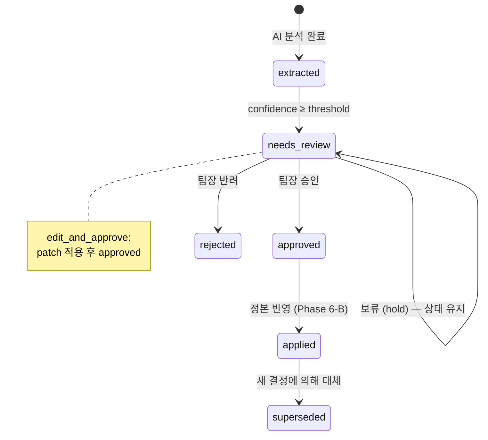

# Phase 6-A: 검토/승인 워크플로우 — 구체화된 계획서

> **상위 문서**: [implementation_plan.md](file:///c:/Users/andyw/Desktop/Like_a_Lion_myproject/implementation_plan.md)
> **선행 문서**: [Phase 5-B](file:///c:/Users/andyw/Desktop/Like_a_Lion_myproject/Phase5B_%EB%B6%84%EC%84%9D_%ED%8C%8C%EC%9D%B4%ED%94%84%EB%9D%BC%EC%9D%B8_Celery_%EC%97%B0%EB%8F%99.md)
> **기반 사양**: [상세설명서 §16, §17, §21.3~21.4](file:///c:/Users/andyw/Desktop/Like_a_Lion_myproject/AI_%ED%98%91%EC%97%85_%EC%BD%94%EC%B9%98_%ED%94%84%EB%A1%9C%EC%A0%9D%ED%8A%B8_%EC%83%81%EC%84%B8%EC%84%A4%EB%AA%85%EC%84%9C_v2.md)
> **작성일**: 2026-04-19
> **예상 난이도**: ⭐⭐⭐
> **예상 소요 시간**: 2~3시간
> **선행 완료**: Phase 0~5 ✅
> **후속**: Phase 6-B (정본 상태 갱신)

---

## 🎯 이 Phase의 목표

Phase 6-A가 끝나면 다음이 완성되어야 합니다:

1. ✅ Review Queue API로 `needs_review` 상태 이벤트 목록 조회 가능
2. ✅ 개별 이벤트 상세 정보 (요약, 신뢰도, 원문 근거, 변경 전/후) 조회 가능
3. ✅ 팀장이 이벤트를 **승인 / 반려 / 보류 / 수정 후 승인** 처리 가능
4. ✅ 이벤트 상태 전이 규칙이 엄격하게 적용됨 (잘못된 전이 차단)
5. ✅ 모든 리뷰 액션이 `review_actions` 테이블에 감사 로그로 기록됨
6. ✅ 수정 후 승인 시 `patch`로 이벤트 내용 수정 반영

> [!NOTE]
> Phase 6-A는 **Review Queue와 상태 전이 로직**에 집중합니다.
> 승인된 이벤트를 정본 상태 테이블에 반영하는 로직은 Phase 6-B에서 구현합니다.
> 이 Phase에서는 승인 시 이벤트 상태만 `approved`로 전환하고, Phase 6-B에서 `applied`까지 처리합니다.

---

## 🏗️ 이벤트 상태 전이 다이어그램



### 허용되는 상태 전이

| 현재 상태 | → 가능한 다음 상태 |
|:---:|---|
| `extracted` | `needs_review` |
| `needs_review` | `approved`, `rejected`, `needs_review`(hold) |
| `approved` | `applied` |
| `applied` | `superseded` |

> [!WARNING]
> 위 전이 규칙 외의 전이는 모두 **차단**합니다.
> 예: `rejected` → `approved` ❌, `applied` → `rejected` ❌
> 잘못된 전이 시도 시 `400 Bad Request` + 상세 에러 메시지를 반환합니다.

---

## 📋 작업 목록 (총 5단계)

---

### Step 6A-1. 이벤트 상태 전이 머신 (`packages/core/services/state_transition.py`)

> [!IMPORTANT]
> 상태 전이 로직은 서비스 레이어의 **핵심 가드**입니다.
> 모든 상태 변경은 반드시 `validate_transition()`으로 검증한 뒤 할당해야 합니다.
> `validate_transition()` 없이 직접 `event.state = ...`를 할당하는 것은 금지합니다.

```python
"""Event state transition machine — 이벤트 상태 전이 규칙 적용."""

from __future__ import annotations

from packages.shared.enums import EventState, ReviewActionType

# 허용되는 상태 전이 맵
# key: 현재 상태, value: set of 허용 다음 상태
ALLOWED_TRANSITIONS: dict[EventState, set[EventState]] = {
    EventState.OBSERVED: {EventState.EXTRACTED},
    EventState.EXTRACTED: {EventState.NEEDS_REVIEW},
    EventState.NEEDS_REVIEW: {EventState.APPROVED, EventState.REJECTED},
    EventState.APPROVED: {EventState.APPLIED},
    EventState.APPLIED: {EventState.SUPERSEDED},
    # REJECTED, SUPERSEDED → 종료 상태 (더 이상 전이 불가)
}

# 리뷰 액션 → 대상 상태 매핑
ACTION_TO_STATE: dict[ReviewActionType, EventState] = {
    ReviewActionType.APPROVE: EventState.APPROVED,
    ReviewActionType.REJECT: EventState.REJECTED,
    ReviewActionType.EDIT_AND_APPROVE: EventState.APPROVED,
    # HOLD는 상태 변경 없이 감사 로그만 남김
}


class InvalidTransitionError(Exception):
    """잘못된 상태 전이 시도."""

    def __init__(self, current: str, target: str):
        self.current = current
        self.target = target
        # current가 유효하지 않은 enum 값일 수 있으므로 안전하게 처리
        try:
            allowed = [s.value for s in ALLOWED_TRANSITIONS.get(EventState(current), set())]
        except ValueError:
            allowed = []
        super().__init__(
            f"상태 전이 불가: {current!r} → {target!r}. "
            f"허용 전이: {allowed}"
        )


def validate_transition(current_state: str, target_state: str) -> None:
    """
    상태 전이가 유효한지 검증합니다.

    Args:
        current_state: 현재 이벤트 상태
        target_state: 전이 대상 상태

    Raises:
        InvalidTransitionError: 허용되지 않는 전이 시도
    """
    try:
        current = EventState(current_state)
        target = EventState(target_state)
    except ValueError as e:
        raise InvalidTransitionError(current_state, target_state) from e

    allowed = ALLOWED_TRANSITIONS.get(current, set())
    if target not in allowed:
        raise InvalidTransitionError(current_state, target_state)


def get_target_state(action: ReviewActionType) -> EventState | None:
    """
    리뷰 액션에 대응하는 대상 상태를 반환합니다.

    Returns:
        대상 상태, HOLD일 경우 None (상태 변경 없음)
    """
    return ACTION_TO_STATE.get(action)
```

---

### Step 6A-2. Pydantic 스키마 (`apps/api/schemas/review.py`)

```python
"""Review API schemas — 검토 큐 요청/응답 스키마."""

from __future__ import annotations

import uuid
from datetime import datetime
from typing import Any

from pydantic import BaseModel, Field, field_validator

from packages.shared.enums import ReviewActionType


# ──────────────────────────────────────────
# 요청 스키마
# ──────────────────────────────────────────

class ReviewActionRequest(BaseModel):
    """리뷰 액션 요청 스키마 (§21.4)."""

    action: ReviewActionType = Field(
        ...,
        description="승인/반려/보류/수정 후 승인",
        examples=["approve"],
    )
    review_note: str | None = Field(
        None,
        description="검토 의견 (선택)",
        max_length=2000,
    )
    patch: dict[str, Any] | None = Field(
        None,
        description="수정 내용 (edit_and_approve 시 필수). "
                    "예: {\"summary\": \"수정된 요약\", \"details\": {...}}",
    )

    # edit_and_approve 시 patch 필수 검증
    def model_post_init(self, __context: Any) -> None:
        if self.action == ReviewActionType.EDIT_AND_APPROVE and not self.patch:
            raise ValueError(
                "edit_and_approve 액션 시 patch 필드는 필수입니다."
            )


class PatchData(BaseModel):
    """edit_and_approve 시 허용되는 patch 필드 (타입/범위 검증)."""

    summary: str | None = Field(None, max_length=500)
    topic: str | None = Field(None, max_length=200)
    details: dict[str, Any] | None = None
    confidence: float | None = Field(None, ge=0.0, le=1.0)
    fact_type: str | None = None

    @field_validator("fact_type")
    @classmethod
    def validate_fact_type(cls, v: str | None) -> str | None:
        if v is not None:
            allowed = {"confirmed_fact", "inferred_interpretation", "unresolved_ambiguity"}
            if v not in allowed:
                raise ValueError(f"fact_type은 {allowed} 중 하나여야 합니다: {v!r}")
        return v

# ──────────────────────────────────────────
# 응답 스키마
# ──────────────────────────────────────────

class EventDetailResponse(BaseModel):
    """이벤트 상세 응답 (§17.2 검토 화면용)."""

    id: uuid.UUID
    project_id: uuid.UUID
    source_kind: str
    source_id: uuid.UUID
    event_type: str
    state: str
    topic: str | None
    summary: str
    details: dict[str, Any] | None
    confidence: float
    fact_type: str | None
    created_at: datetime | None

    class Config:
        from_attributes = True


class EventSummaryResponse(BaseModel):
    """이벤트 요약 응답 (목록용)."""

    id: uuid.UUID
    event_type: str
    state: str
    topic: str | None
    summary: str
    confidence: float
    fact_type: str | None
    created_at: datetime | None

    class Config:
        from_attributes = True


class ReviewActionResponse(BaseModel):
    """리뷰 액션 처리 결과."""

    event_id: uuid.UUID
    action: str
    previous_state: str
    new_state: str
    review_action_id: uuid.UUID
    message: str


class PendingReviewsResponse(BaseModel):
    """검토 대기 이벤트 목록 응답."""

    project_id: uuid.UUID
    total_count: int
    events: list[EventSummaryResponse]
```

---

### Step 6A-3. 리뷰 서비스 (`packages/core/services/review_service.py`)

```python
"""Review service — 검토/승인 워크플로우 비즈니스 로직."""

from __future__ import annotations

import uuid
from datetime import datetime, timezone

from sqlalchemy import func, select
from sqlalchemy.ext.asyncio import AsyncSession

from packages.db.models.extracted_event import ExtractedEvent
from packages.db.models.review_action import ReviewAction
from packages.shared.enums import EventState, ReviewActionType

from packages.core.services.state_transition import (
    InvalidTransitionError,
    get_target_state,
    validate_transition,
)

import structlog

logger = structlog.get_logger()


class ReviewService:
    """이벤트 검토/승인 워크플로우를 관리합니다."""

    def __init__(self, db: AsyncSession):
        self.db = db

    # ──────────────────────────────────────────
    # 검토 대기 이벤트 조회 (§21.3)
    # ──────────────────────────────────────────

    async def get_pending_events(
        self,
        project_id: uuid.UUID,
        limit: int = 50,
        offset: int = 0,
    ) -> tuple[list[ExtractedEvent], int]:
        """
        프로젝트의 검토 대기(needs_review) 이벤트를 반환합니다.

        Returns:
            (이벤트 리스트, 전체 건수) 튜플
        """
        # 전체 건수 조회
        count_stmt = (
            select(func.count(ExtractedEvent.id))
            .where(ExtractedEvent.project_id == project_id)
            .where(ExtractedEvent.state == EventState.NEEDS_REVIEW.value)
        )
        total_result = await self.db.execute(count_stmt)
        total_count = total_result.scalar() or 0

        # 이벤트 목록 조회 (최신순)
        stmt = (
            select(ExtractedEvent)
            .where(ExtractedEvent.project_id == project_id)
            .where(ExtractedEvent.state == EventState.NEEDS_REVIEW.value)
            .order_by(ExtractedEvent.created_at.desc())
            .offset(offset)
            .limit(limit)
        )
        result = await self.db.execute(stmt)
        events = list(result.scalars().all())

        logger.info(
            "pending_events_fetched",
            project_id=str(project_id),
            count=len(events),
            total=total_count,
        )
        return events, total_count

    # ──────────────────────────────────────────
    # 이벤트 상세 조회
    # ──────────────────────────────────────────

    async def get_event_detail(
        self,
        project_id: uuid.UUID,
        event_id: uuid.UUID,
    ) -> ExtractedEvent | None:
        """
        프로젝트의 특정 이벤트 상세 정보를 반환합니다.

        Returns:
            ExtractedEvent 또는 None (미존재/타 프로젝트)
        """
        stmt = (
            select(ExtractedEvent)
            .where(ExtractedEvent.id == event_id)
            .where(ExtractedEvent.project_id == project_id)
            .with_for_update()  # 동시 승인/반려 경쟁 조건 방지
        )
        result = await self.db.execute(stmt)
        return result.scalar_one_or_none()

    # ──────────────────────────────────────────
    # 리뷰 액션 처리 (§21.4)
    # ──────────────────────────────────────────

    async def process_review(
        self,
        project_id: uuid.UUID,
        event_id: uuid.UUID,
        action: ReviewActionType,
        reviewer_id: uuid.UUID | None = None,
        review_note: str | None = None,
        patch: dict | None = None,
    ) -> tuple[ExtractedEvent, ReviewAction, str]:
        """
        이벤트에 대한 리뷰 액션을 처리합니다.

        1. 이벤트 존재 확인
        2. 상태 전이 유효성 검증
        3. patch 적용 (edit_and_approve)
        4. 상태 전이
        5. 감사 로그(ReviewAction) 생성
        6. 단일 트랜잭션으로 커밋

        Args:
            project_id: 프로젝트 ID
            event_id: 대상 이벤트 ID
            action: 리뷰 액션 (approve/reject/hold/edit_and_approve)
            reviewer_id: 검토자 ID (선택)
            review_note: 검토 의견 (선택)
            patch: 수정 내용 (edit_and_approve 시)

        Returns:
            (업데이트된 이벤트, 생성된 ReviewAction, 이전 상태) 튜플

        Raises:
            ValueError: 이벤트/프로젝트 미존재
            InvalidTransitionError: 잘못된 상태 전이
        """
        # 1. 이벤트 조회
        event = await self.get_event_detail(project_id, event_id)
        if event is None:
            raise ValueError(
                f"이벤트를 찾을 수 없습니다: project={project_id}, event={event_id}"
            )

        previous_state = event.state

        # 2. 대상 상태 결정
        target_state = get_target_state(action)

        # 3. hold인 경우: needs_review 상태에서만 허용, 상태 변경 없이 감사 로그만 남김
        if target_state is None:
            if event.state != EventState.NEEDS_REVIEW.value:
                raise InvalidTransitionError(
                    event.state, "hold (상태 유지)"
                )

            review_action = ReviewAction(
                event_id=event_id,
                reviewer_id=reviewer_id,
                action=action.value,
                review_note=review_note,
                patch=patch,
            )
            self.db.add(review_action)
            await self.db.commit()
            await self.db.refresh(review_action)

            logger.info(
                "review_hold",
                event_id=str(event_id),
                reviewer_id=str(reviewer_id) if reviewer_id else None,
            )
            return event, review_action, previous_state

        # 4. 상태 전이 유효성 검증 (InvalidTransitionError 발생 가능)
        validate_transition(event.state, target_state.value)

        # 5. edit_and_approve 시 patch 적용
        if action == ReviewActionType.EDIT_AND_APPROVE and patch:
            self._apply_patch(event, patch)

        # 6. 상태 전이
        event.state = target_state.value

        # 7. 감사 로그 생성
        review_action = ReviewAction(
            event_id=event_id,
            reviewer_id=reviewer_id,
            action=action.value,
            review_note=review_note,
            patch=patch,
        )
        self.db.add(review_action)

        # 8. 단일 트랜잭션으로 커밋
        await self.db.commit()
        await self.db.refresh(event)
        await self.db.refresh(review_action)

        logger.info(
            "review_processed",
            event_id=str(event_id),
            action=action.value,
            previous_state=previous_state,
            new_state=event.state,
        )
        return event, review_action, previous_state

    # ──────────────────────────────────────────
    # 리뷰 이력 조회
    # ──────────────────────────────────────────

    async def get_review_history(
        self,
        event_id: uuid.UUID,
    ) -> list[ReviewAction]:
        """이벤트의 리뷰 이력을 시간순으로 조회합니다."""
        stmt = (
            select(ReviewAction)
            .where(ReviewAction.event_id == event_id)
            .order_by(ReviewAction.reviewed_at.asc())
        )
        result = await self.db.execute(stmt)
        return list(result.scalars().all())

    # ──────────────────────────────────────────
    # 유틸리티
    # ──────────────────────────────────────────

    @staticmethod
    def _apply_patch(event: ExtractedEvent, patch: dict) -> None:
        """
        edit_and_approve 시 이벤트에 patch를 적용합니다.

        PatchData 스키마로 검증 후 허용된 필드만 반영합니다.
        허용 필드: summary, topic, details, confidence, fact_type

        Raises:
            ValueError: patch에 잘못된 타입/범위의 값이 포함된 경우
        """
        from apps.api.schemas.review import PatchData

        # Pydantic으로 타입/범위 검증 (ValidationError → ValueError로 전환)
        validated = PatchData.model_validate(patch)

        for key, value in validated.model_dump(exclude_unset=True).items():
            setattr(event, key, value)
            logger.debug("patch_applied_field", field=key)
```

---

### Step 6A-4. Review Queue API 라우터 (`apps/api/routers/reviews.py`)

```python
"""Review Queue API — 검토 대기 이벤트 조회 및 리뷰 액션 처리."""

from __future__ import annotations

import uuid

from fastapi import APIRouter, Depends, HTTPException, Query
from sqlalchemy.ext.asyncio import AsyncSession

from apps.api.dependencies import get_db
from apps.api.schemas.review import (
    EventDetailResponse,
    EventSummaryResponse,
    PendingReviewsResponse,
    ReviewActionRequest,
    ReviewActionResponse,
)
from packages.core.services.review_service import ReviewService
from packages.core.services.state_transition import InvalidTransitionError

import structlog

logger = structlog.get_logger()

router = APIRouter(prefix="/api/v1/projects/{project_id}/reviews", tags=["reviews"])


@router.get("/pending", response_model=PendingReviewsResponse)
async def get_pending_reviews(
    project_id: uuid.UUID,
    limit: int = Query(50, ge=1, le=100, description="반환할 최대 건수"),
    offset: int = Query(0, ge=0, description="오프셋"),
    db: AsyncSession = Depends(get_db),
):
    """
    검토 대기(needs_review) 이벤트 목록을 조회합니다.

    - 최신순으로 정렬
    - 페이지네이션 지원 (offset + limit)
    """
    service = ReviewService(db=db)
    events, total_count = await service.get_pending_events(
        project_id=project_id,
        limit=limit,
        offset=offset,
    )

    return PendingReviewsResponse(
        project_id=project_id,
        total_count=total_count,
        events=[
            EventSummaryResponse.model_validate(event) for event in events
        ],
    )


@router.get("/{event_id}", response_model=EventDetailResponse)
async def get_event_for_review(
    project_id: uuid.UUID,
    event_id: uuid.UUID,
    db: AsyncSession = Depends(get_db),
):
    """
    특정 이벤트의 상세 정보를 조회합니다 (§17.2 검토 화면).

    반환 정보:
    - 이벤트 요약, 유형, 주제
    - 신뢰도, 사실 유형
    - 변경 전/후 (details 내)
    - 근거 원문 (details.source_quotes)
    """
    service = ReviewService(db=db)
    event = await service.get_event_detail(
        project_id=project_id,
        event_id=event_id,
    )

    if event is None:
        raise HTTPException(
            status_code=404,
            detail=f"이벤트를 찾을 수 없습니다: {event_id}",
        )

    return EventDetailResponse.model_validate(event)


@router.post("/{event_id}", response_model=ReviewActionResponse)
async def submit_review_action(
    project_id: uuid.UUID,
    event_id: uuid.UUID,
    body: ReviewActionRequest,
    db: AsyncSession = Depends(get_db),
):
    """
    이벤트에 대한 리뷰 액션을 처리합니다 (§21.4).

    액션 종류:
    - `approve`: 승인 → 이벤트 상태를 approved로 전환
    - `reject`: 반려 → 이벤트 상태를 rejected로 전환
    - `hold`: 보류 → 상태 유지, 감사 로그만 기록
    - `edit_and_approve`: 수정 후 승인 → patch 적용 후 approved로 전환

    모든 액션은 `review_actions` 테이블에 감사 로그로 기록됩니다.
    """
    service = ReviewService(db=db)

    try:
        event, review_action, previous_state = await service.process_review(
            project_id=project_id,
            event_id=event_id,
            action=body.action,
            reviewer_id=None,  # TODO: Phase 8에서 인증 연동 후 실제 user_id 주입
            review_note=body.review_note,
            patch=body.patch,
        )
    except ValueError as e:
        # 이벤트 미존재 → 404, 기타 비즈니스 로직 오류 → 422
        error_msg = str(e)
        if "찾을 수 없습니다" in error_msg:
            raise HTTPException(status_code=404, detail=error_msg)
        raise HTTPException(status_code=422, detail=error_msg)
    except InvalidTransitionError as e:
        raise HTTPException(status_code=409, detail=str(e))

    return ReviewActionResponse(
        event_id=event.id,
        action=body.action.value,
        previous_state=previous_state,
        new_state=event.state,
        review_action_id=review_action.id,
        message=_build_message(body.action, event.state),
    )


def _build_message(action: str, new_state: str) -> str:
    """리뷰 결과 메시지를 생성합니다."""
    messages = {
        "approve": f"이벤트가 승인되었습니다. (상태: {new_state})",
        "reject": f"이벤트가 반려되었습니다. (상태: {new_state})",
        "hold": "이벤트가 보류 처리되었습니다. 상태는 변경되지 않았습니다.",
        "edit_and_approve": f"이벤트가 수정 후 승인되었습니다. (상태: {new_state})",
    }
    return messages.get(str(action), "리뷰 처리가 완료되었습니다.")
```

---

### Step 6A-5. FastAPI 앱에 라우터 등록 + `__init__.py` 수정

#### ① `apps/api/main.py` — 라우터 등록

```python
# apps/api/main.py — 기존 import 아래에 추가
from apps.api.routers.reviews import router as reviews_router

# 기존 app.include_router() 호출 아래에 추가
app.include_router(reviews_router)
```

#### ② `apps/api/schemas/__init__.py` — 스키마 export 추가

```python
# apps/api/schemas/__init__.py — 기존 코드 아래에 추가
from apps.api.schemas.review import (
    ReviewActionRequest,
    ReviewActionResponse,
    EventDetailResponse,
    EventSummaryResponse,
    PendingReviewsResponse,
)
```

#### ③ `packages/core/services/__init__.py` — 서비스 export 추가

```python
# packages/core/services/__init__.py — 기존 코드 아래에 추가
from packages.core.services.review_service import ReviewService

# __all__에 추가
__all__ = [
    "MessageService",
    "DocumentService",
    "PriorityDetector",
    "SessionService",
    "AnalysisService",
    "ReviewService",  # ← 신규
]
```

---

## 📁 디렉토리 변경 요약

```text
Like_a_Lion_myproject/
├── packages/
│   └── core/services/
│       ├── review_service.py          # [신규] 검토/승인 비즈니스 로직
│       └── state_transition.py        # [신규] 이벤트 상태 전이 머신
│
├── apps/api/
│   ├── main.py                        # [수정] reviews 라우터 등록
│   ├── routers/
│   │   └── reviews.py                 # [신규] Review Queue + Review Action API
│   └── schemas/
│       └── review.py                  # [신규] 검토 API Pydantic 스키마
│
└── tests/unit/
    ├── test_state_transition.py       # [신규] 상태 전이 유닛 테스트
    └── test_review_workflow.py        # [신규] 리뷰 워크플로우 테스트
```

---

## ✅ 검증 체크리스트

### 1단계: Import 확인
```bash
python -c "from packages.core.services.state_transition import validate_transition, InvalidTransitionError; print('✅ StateTransition OK')"
python -c "from packages.core.services.review_service import ReviewService; print('✅ ReviewService OK')"
python -c "from apps.api.routers.reviews import router; print('✅ Reviews Router OK')"
python -c "from apps.api.schemas.review import ReviewActionRequest, EventDetailResponse; print('✅ Review Schemas OK')"
```

### 2단계: 상태 전이 로직 테스트
```bash
python -c "
from packages.core.services.state_transition import validate_transition, InvalidTransitionError

# ✅ 허용 전이
validate_transition('needs_review', 'approved')
print('✅ needs_review → approved: OK')

validate_transition('needs_review', 'rejected')
print('✅ needs_review → rejected: OK')

validate_transition('approved', 'applied')
print('✅ approved → applied: OK')

# ❌ 금지 전이
try:
    validate_transition('rejected', 'approved')
    print('❌ 실패: rejected → approved가 허용됨!')
except InvalidTransitionError as e:
    print(f'✅ rejected → approved 차단: {e}')

try:
    validate_transition('applied', 'rejected')
    print('❌ 실패: applied → rejected가 허용됨!')
except InvalidTransitionError as e:
    print(f'✅ applied → rejected 차단: {e}')
"
```

**기대 출력:**
```
✅ needs_review → approved: OK
✅ needs_review → rejected: OK
✅ approved → applied: OK
✅ rejected → approved 차단: 상태 전이 불가: 'rejected' → 'approved'. 허용 전이: []
✅ applied → rejected 차단: 상태 전이 불가: 'applied' → 'rejected'. 허용 전이: ['superseded']
```

### 3단계: API 엔드포인트 테스트 (서버 실행 필요)

```powershell
# FastAPI 서버 실행
uvicorn apps.api.main:app --reload --port 8000

# 검토 대기 이벤트 조회
curl http://localhost:8000/api/v1/projects/{PROJECT_UUID}/reviews/pending

# 이벤트 상세 조회
curl http://localhost:8000/api/v1/projects/{PROJECT_UUID}/reviews/{EVENT_UUID}

# 승인 처리
curl -X POST http://localhost:8000/api/v1/projects/{PROJECT_UUID}/reviews/{EVENT_UUID} `
  -H "Content-Type: application/json" `
  -d '{"action": "approve", "review_note": "확인 완료"}'

# 수정 후 승인
curl -X POST http://localhost:8000/api/v1/projects/{PROJECT_UUID}/reviews/{EVENT_UUID} `
  -H "Content-Type: application/json" `
  -d '{"action": "edit_and_approve", "review_note": "요약 수정", "patch": {"summary": "수정된 요약"}}'

# 잘못된 전이 시도 (이미 approved → 다시 approve)
# → 400 Bad Request 반환 확인
```

### 4단계: Supabase 확인

`review_actions` 테이블에서:

| 확인 항목 | 기대 값 |
|-----------|---------|
| `event_id` | 대상 이벤트 UUID |
| `action` | `approve` / `reject` / `hold` / `edit_and_approve` |
| `review_note` | 검토 의견 (있을 경우) |
| `patch` | 수정 내용 JSON (edit_and_approve 시) |
| `reviewed_at` | 리뷰 시각 |

`extracted_events` 테이블에서:

| 확인 항목 | 기대 값 |
|-----------|---------|
| `state` | 승인 → `approved`, 반려 → `rejected` |
| `summary` | edit_and_approve 시 patch 반영된 값 |

---

## 📄 이 Phase의 최종 산출물 목록

| # | 파일 | 유형 | 설명 |
|:---:|------|:---:|------|
| 1 | `packages/core/services/state_transition.py` | 신규 | 이벤트 상태 전이 머신 |
| 2 | `packages/core/services/review_service.py` | 신규 | 검토/승인 비즈니스 로직 |
| 3 | `apps/api/routers/reviews.py` | 신규 | Review Queue + Review Action API |
| 4 | `apps/api/schemas/review.py` | 신규 | 검토 API Pydantic 스키마 (PatchData 포함) |
| 5 | `apps/api/main.py` | 수정 | reviews 라우터 등록 |
| 6 | `apps/api/schemas/__init__.py` | 수정 | review 스키마 export |
| 7 | `packages/core/services/__init__.py` | 수정 | ReviewService export |
| 8 | `tests/unit/test_state_transition.py` | 신규 | 상태 전이 유닛 테스트 |
| 9 | `tests/unit/test_review_workflow.py` | 신규 | 리뷰 워크플로우 테스트 |

**총 9개 파일** (신규 6개 + 수정 3개)

---

## ⏭️ 다음: Phase 6-B

Phase 6-A의 Review Queue와 상태 전이가 검증되면 **Phase 6-B (정본 상태 갱신 & Supersede 처리)** 로 진행:
- `CanonicalStateService` — 승인된 이벤트를 이벤트 유형별 정본 테이블에 반영
- Supersede 로직 — 기존 결정을 새 결정으로 대체
- Review Assistant 프롬프트 — 누락 정보 자동 질문 생성
- Phase 6-A 통합 — 승인 시 자동으로 정본 갱신 트리거
