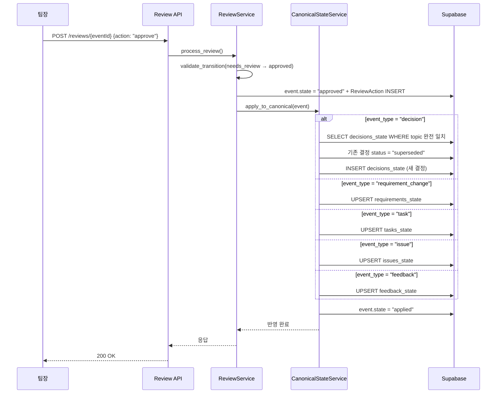

# Phase 6-B: 정본 상태 갱신 & Supersede 처리 — 구체화된 계획서

> **상위 문서**: [implementation_plan.md](file:///c:/Users/andyw/Desktop/Like_a_Lion_myproject/implementation_plan.md)
> **선행 문서**: [Phase 6-A](file:///c:/Users/andyw/Desktop/Like_a_Lion_myproject/Phase6A_%EA%B2%80%ED%86%A0_%EC%8A%B9%EC%9D%B8_%EC%9B%8C%ED%81%AC%ED%94%8C%EB%A1%9C%EC%9A%B0.md)
> **기반 사양**: [상세설명서 §7, §13.1.7, §17.3, §19.2](file:///c:/Users/andyw/Desktop/Like_a_Lion_myproject/AI_%ED%98%91%EC%97%85_%EC%BD%94%EC%B9%98_%ED%94%84%EB%A1%9C%EC%A0%9D%ED%8A%B8_%EC%83%81%EC%84%B8%EC%84%A4%EB%AA%85%EC%84%9C_v2.md)
> **작성일**: 2026-04-19
> **예상 난이도**: ⭐⭐⭐⭐
> **예상 소요 시간**: 2~3시간
> **선행 완료**: Phase 0~5 ✅, Phase 6-A ✅

---

## 🎯 이 Phase의 목표

Phase 6-B가 끝나면 다음이 완성되어야 합니다:

1. ✅ 승인된 이벤트가 이벤트 유형별 정본 테이블에 자동 반영됨
2. ✅ `requirement_change` → `requirements_state` 갱신
3. ✅ `decision` → `decisions_state` 갱신 + 기존 결정 supersede 처리
4. ✅ `task` → `tasks_state` 갱신
5. ✅ `issue` → `issues_state` 갱신
6. ✅ `feedback` → `feedback_state` 갱신
7. ✅ 이벤트 상태가 `approved` → `applied`로 전이됨
8. ✅ 기존 결정이 새 결정으로 대체될 때 `superseded` 처리 (§7 원칙 7)
9. ✅ Review Assistant 프롬프트로 누락 정보 질문 자동 생성 (§17.3)
10. ✅ Phase 6-A의 ReviewService와 통합 — 승인 시 자동 정본 갱신

> [!NOTE]
> Phase 6-A에서 만든 `ReviewService`, `state_transition`을 **이 Phase에서 확장**합니다.
> 승인 → 정본 반영 → `applied` 상태 전이까지 하나의 워크플로우로 연결합니다.

---

## 🏗️ 승인 → 정본 반영 흐름



---

## 📋 작업 목록 (총 5단계)

---

### Step 6B-1. 정본 상태 갱신 서비스 (`packages/core/services/canonical_state_service.py`)

> [!CAUTION]
> 이 서비스는 **프로젝트의 정본(ground truth)을 변경**합니다.
> 모든 갱신은 감사 로그(ReviewAction)가 먼저 존재하는 상태에서만 실행되어야 합니다.
> 트랜잭션 경계를 신중하게 관리하세요.

```python
"""Canonical State Service — 승인된 이벤트를 정본 상태 테이블에 반영합니다."""

from __future__ import annotations

import re
import uuid
from datetime import datetime, timezone

from sqlalchemy import select
from sqlalchemy.ext.asyncio import AsyncSession

from packages.db.models.extracted_event import ExtractedEvent
from packages.db.models.requirement_state import RequirementState
from packages.db.models.decision_state import DecisionState
from packages.db.models.task_state import TaskState
from packages.db.models.issue_state import IssueState
from packages.db.models.feedback_state import FeedbackState

from packages.shared.enums import (
    CanonicalStatus,
    EventState,
    EventType,
    FeedbackReflectionStatus,
    Priority,
)
from packages.core.services.state_transition import validate_transition

import structlog

logger = structlog.get_logger()


def _utc_now() -> datetime:
    """timezone-naive UTC 현재 시각."""
    return datetime.now(timezone.utc).replace(tzinfo=None)


class CanonicalStateService:
    """
    승인된 이벤트를 이벤트 유형별 정본 상태 테이블에 반영합니다.

    지원 유형:
    - requirement_change → requirements_state
    - decision → decisions_state (supersede 포함)
    - task → tasks_state
    - issue → issues_state
    - feedback → feedback_state
    """

    def __init__(self, db: AsyncSession):
        self.db = db

    # ──────────────────────────────────────────
    # 메인 디스패치
    # ──────────────────────────────────────────

    async def apply_to_canonical(
        self,
        event: ExtractedEvent,
        reviewer_id: uuid.UUID | None = None,
    ) -> None:
        """
        승인된 이벤트를 정본 테이블에 반영하고, 이벤트 상태를 applied로 전환합니다.

        Args:
            event: 승인된 ExtractedEvent (state == "approved")
            reviewer_id: 승인자 ID

        Raises:
            ValueError: 미승인 이벤트 또는 미지원 이벤트 유형
        """
        if event.state != EventState.APPROVED.value:
            raise ValueError(
                f"정본 반영은 approved 상태에서만 가능합니다. 현재: {event.state}"
            )

        # 불변식: 감사 로그(ReviewAction)가 먼저 존재해야 정본 반영 가능
        from packages.db.models.review_action import ReviewAction
        audit_stmt = (
            select(ReviewAction)
            .where(ReviewAction.event_id == event.id)
            .limit(1)
        )
        audit_result = await self.db.execute(audit_stmt)
        if audit_result.scalar_one_or_none() is None:
            raise ValueError(
                f"감사 로그(ReviewAction)가 없는 이벤트는 정본 반영할 수 없습니다: {event.id}"
            )

        # 이벤트 유형별 핸들러 디스패치
        handler = self._HANDLERS.get(event.event_type)
        if handler is None:
            logger.warning(
                "unsupported_event_type_for_canonical",
                event_type=event.event_type,
                event_id=str(event.id),
            )
            # question 등 지원하지 않는 유형도 applied로 전환
            await self._mark_applied(event)
            return

        await handler(self, event, reviewer_id)
        await self._mark_applied(event)

        logger.info(
            "canonical_state_applied",
            event_id=str(event.id),
            event_type=event.event_type,
            project_id=str(event.project_id),
        )

    # ──────────────────────────────────────────
    # requirement_change → requirements_state
    # ──────────────────────────────────────────

    async def _apply_requirement(
        self,
        event: ExtractedEvent,
        reviewer_id: uuid.UUID | None,
    ) -> None:
        """
        요구사항 변경을 requirements_state에 반영합니다.

        - topic을 item_key로 사용하여, 기존 항목이 있으면 업데이트
        - 없으면 새로 생성
        """
        details = event.details or {}
        item_key = self._make_key(event.topic or event.summary)
        now = _utc_now()

        # 기존 항목 조회
        stmt = (
            select(RequirementState)
            .where(RequirementState.project_id == event.project_id)
            .where(RequirementState.item_key == item_key)
        )
        result = await self.db.execute(stmt)
        existing = result.scalar_one_or_none()

        if existing:
            # 기존 요구사항 업데이트
            existing.current_value = details.get("after") or event.summary
            existing.source_event_id = event.id
            existing.approved_by = reviewer_id
            existing.approved_at = now
            existing.applied_at = now
            if details.get("priority"):
                existing.priority = details["priority"]
            logger.info("requirement_updated", item_key=item_key)
        else:
            # 새 요구사항 생성
            new_req = RequirementState(
                project_id=event.project_id,
                item_key=item_key,
                title=event.summary,
                current_value=details.get("after") or event.summary,
                priority=details.get("priority", Priority.MEDIUM.value),
                status=CanonicalStatus.ACTIVE.value,
                source_event_id=event.id,
                approved_by=reviewer_id,
                approved_at=now,
                applied_at=now,
            )
            self.db.add(new_req)
            logger.info("requirement_created", item_key=item_key)

    # ──────────────────────────────────────────
    # decision → decisions_state (supersede 포함)
    # ──────────────────────────────────────────

    async def _apply_decision(
        self,
        event: ExtractedEvent,
        reviewer_id: uuid.UUID | None,
    ) -> None:
        """
        결정사항을 decisions_state에 반영합니다.

        §7 원칙 7: 기존 같은 주제의 결정이 있으면 superseded로 전환합니다.
        매칭 기준: topic 문자열 **완전 일치** (LIKE/유사도 비교 아님)
        1. 같은 topic의 active 결정 조회
        2. 기존 결정의 status → superseded, superseded_by → 새 DecisionState ID
           (※ 상위 문서의 '새 이벤트 ID'는 DB FK 제약상 decisions_state.id를 의미)
        3. 새 결정 INSERT
        4. 기존 결정의 source_event(ExtractedEvent)도 superseded로 전이
        """
        details = event.details or {}
        # decision_key에 이벤트 ID prefix를 포함하여 UniqueConstraint 충돌 방지
        # (같은 topic의 결정이 supersede 패턴으로 공존하므로 key가 고유해야 함)
        base_key = self._make_key(event.topic or event.summary)
        # suffix 포함 총 길이가 String(100) 제약을 초과하지 않도록 91자로 제한
        decision_key = f"{base_key[:91]}_{str(event.id)[:8]}"
        now = _utc_now()

        # 1. 같은 프로젝트 + 같은 topic의 active 결정 조회
        #    topic이 None이면 매칭할 수 없으므로 supersede 건너뜀
        existing_decisions: list[DecisionState] = []
        if event.topic is not None:
            stmt = (
                select(DecisionState)
                .where(DecisionState.project_id == event.project_id)
                .where(DecisionState.topic == event.topic)
                .where(DecisionState.status == CanonicalStatus.ACTIVE.value)
            )
            result = await self.db.execute(stmt)
            existing_decisions = list(result.scalars().all())

        # 2. 새 결정 생성
        new_decision = DecisionState(
            project_id=event.project_id,
            decision_key=decision_key,
            topic=event.topic,
            decision_text=details.get("after") or event.summary,
            status=CanonicalStatus.ACTIVE.value,
            source_event_id=event.id,
            approved_by=reviewer_id,
            approved_at=now,
            applied_at=now,
        )
        self.db.add(new_decision)
        await self.db.flush()  # ID 할당을 위한 flush

        # 3. 기존 결정 supersede 처리
        for old_decision in existing_decisions:
            old_decision.status = CanonicalStatus.SUPERSEDED.value
            old_decision.superseded_by = new_decision.id

            # 4. 기존 결정의 source ExtractedEvent도 superseded로 전이
            if old_decision.source_event_id:
                old_event_stmt = (
                    select(ExtractedEvent)
                    .where(ExtractedEvent.id == old_decision.source_event_id)
                    .where(ExtractedEvent.state == EventState.APPLIED.value)
                )
                old_event_result = await self.db.execute(old_event_stmt)
                old_event = old_event_result.scalar_one_or_none()
                if old_event:
                    validate_transition(old_event.state, EventState.SUPERSEDED.value)
                    old_event.state = EventState.SUPERSEDED.value
                    logger.info(
                        "source_event_superseded",
                        event_id=str(old_event.id),
                    )

            logger.info(
                "decision_superseded",
                old_decision_key=old_decision.decision_key,
                superseded_by=str(new_decision.id),
            )

        logger.info(
            "decision_applied",
            decision_key=decision_key,
            superseded_count=len(existing_decisions),
        )

    # ──────────────────────────────────────────
    # task → tasks_state
    # ──────────────────────────────────────────

    async def _apply_task(
        self,
        event: ExtractedEvent,
        reviewer_id: uuid.UUID | None,
    ) -> None:
        """작업을 tasks_state에 반영합니다."""
        details = event.details or {}
        task_key = self._make_key(event.topic or event.summary)
        now = _utc_now()

        # 기존 항목 조회
        stmt = (
            select(TaskState)
            .where(TaskState.project_id == event.project_id)
            .where(TaskState.task_key == task_key)
        )
        result = await self.db.execute(stmt)
        existing = result.scalar_one_or_none()

        if existing:
            existing.title = event.summary
            if details.get("after"):
                existing.description = details["after"]
            existing.source_event_id = event.id
            existing.approved_by = reviewer_id
            existing.approved_at = now
            existing.applied_at = now
            logger.info("task_updated", task_key=task_key)
        else:
            new_task = TaskState(
                project_id=event.project_id,
                task_key=task_key,
                title=event.summary,
                description=details.get("after") or details.get("reason"),
                priority=details.get("priority", Priority.MEDIUM.value),
                status=CanonicalStatus.ACTIVE.value,
                source_event_id=event.id,
                approved_by=reviewer_id,
                approved_at=now,
                applied_at=now,
            )
            self.db.add(new_task)
            logger.info("task_created", task_key=task_key)

    # ──────────────────────────────────────────
    # issue → issues_state
    # ──────────────────────────────────────────

    async def _apply_issue(
        self,
        event: ExtractedEvent,
        reviewer_id: uuid.UUID | None,
    ) -> None:
        """이슈를 issues_state에 반영합니다."""
        details = event.details or {}
        issue_key = self._make_key(event.topic or event.summary)
        now = _utc_now()

        stmt = (
            select(IssueState)
            .where(IssueState.project_id == event.project_id)
            .where(IssueState.issue_key == issue_key)
        )
        result = await self.db.execute(stmt)
        existing = result.scalar_one_or_none()

        if existing:
            existing.title = event.summary
            if details.get("after"):
                existing.description = details["after"]
            existing.source_event_id = event.id
            existing.approved_by = reviewer_id
            existing.approved_at = now
            existing.applied_at = now
            logger.info("issue_updated", issue_key=issue_key)
        else:
            new_issue = IssueState(
                project_id=event.project_id,
                issue_key=issue_key,
                title=event.summary,
                description=details.get("after") or details.get("reason"),
                severity=details.get("severity", Priority.MEDIUM.value),
                status=CanonicalStatus.ACTIVE.value,
                source_event_id=event.id,
                approved_by=reviewer_id,
                approved_at=now,
                applied_at=now,
            )
            self.db.add(new_issue)
            logger.info("issue_created", issue_key=issue_key)

    # ──────────────────────────────────────────
    # feedback → feedback_state
    # ──────────────────────────────────────────

    async def _apply_feedback(
        self,
        event: ExtractedEvent,
        reviewer_id: uuid.UUID | None,
    ) -> None:
        """교수 피드백을 feedback_state에 반영합니다."""
        details = event.details or {}
        feedback_key = self._make_key(event.topic or event.summary)
        now = _utc_now()

        stmt = (
            select(FeedbackState)
            .where(FeedbackState.project_id == event.project_id)
            .where(FeedbackState.feedback_key == feedback_key)
        )
        result = await self.db.execute(stmt)
        existing = result.scalar_one_or_none()

        if existing:
            existing.content = details.get("after") or event.summary
            existing.source_event_id = event.id
            existing.approved_by = reviewer_id
            existing.approved_at = now
            existing.applied_at = now
            logger.info("feedback_updated", feedback_key=feedback_key)
        else:
            new_feedback = FeedbackState(
                project_id=event.project_id,
                feedback_key=feedback_key,
                title=event.summary,
                content=details.get("after") or event.summary,
                reflection_status=FeedbackReflectionStatus.PENDING.value,
                source_event_id=event.id,
                approved_by=reviewer_id,
                approved_at=now,
                applied_at=now,
            )
            self.db.add(new_feedback)
            logger.info("feedback_created", feedback_key=feedback_key)

    # ──────────────────────────────────────────
    # 유틸리티
    # ──────────────────────────────────────────

    async def _mark_applied(self, event: ExtractedEvent) -> None:
        """이벤트 상태를 applied로 전환합니다."""
        validate_transition(event.state, EventState.APPLIED.value)
        event.state = EventState.APPLIED.value
        await self.db.commit()

    @staticmethod
    def _make_key(text: str) -> str:
        """
        topic/summary에서 정본 테이블의 key를 생성합니다.

        - 소문자 변환, 공백을 언더스코어로 치환
        - 최대 100자 제한 (DB 컬럼 제약)
        """
        key = text.strip().lower().replace(" ", "_")
        # 한국어/영어/숫자/언더스코어만 유지
        key = re.sub(r"[^\w가-힣]", "_", key)
        # 연속 언더스코어 정리
        key = re.sub(r"_+", "_", key).strip("_")
        return key[:100]

    # ──────────────────────────────────────────
    # 핸들러 맵
    # ──────────────────────────────────────────

    _HANDLERS = {
        EventType.REQUIREMENT_CHANGE.value: _apply_requirement,
        EventType.DECISION.value: _apply_decision,
        EventType.TASK.value: _apply_task,
        EventType.ISSUE.value: _apply_issue,
        EventType.FEEDBACK.value: _apply_feedback,
        # question → 정본 테이블 없음, applied로만 전환
    }
```

---

### Step 6B-2. ReviewService 확장 — 승인 시 자동 정본 갱신

Phase 6-A의 `ReviewService.process_review()`를 수정하여 승인 시 자동으로 정본 갱신을 트리거합니다.

#### `packages/core/services/review_service.py` 수정

```python
# ─── 기존 import 아래에 추가 ───
from packages.core.services.canonical_state_service import CanonicalStateService


# ─── process_review() 메서드 내, 커밋 직전에 추가 ───
# (기존) event.state = target_state.value
# (기존) review_action = ReviewAction(...)
# (기존) self.db.add(review_action)

# ↓ 아래 코드를 commit() 호출 전에 삽입 ↓

        # 9. 승인 시 정본 상태 자동 갱신 (Phase 6-B)
        if target_state == EventState.APPROVED:
            canonical_service = CanonicalStateService(db=self.db)
            # commit 전 flush로 approved 상태 반영 후 canonical 갱신
            await self.db.flush()
            await canonical_service.apply_to_canonical(
                event=event,
                reviewer_id=reviewer_id,
            )
            # apply_to_canonical 내부에서 applied로 전이 + commit 처리
            await self.db.refresh(event)
            await self.db.refresh(review_action)

            logger.info(
                "canonical_state_auto_applied",
                event_id=str(event_id),
                event_type=event.event_type,
            )
            return event, review_action, previous_state

# ─── 기존 commit() 코드는 승인이 아닌 경우(reject, hold)에만 실행 ───
```

> [!IMPORTANT]
> `process_review()` 메서드의 흐름을 다음과 같이 변경합니다:
> 
> ```
> 승인(approve/edit_and_approve):
>   validate_transition → patch 적용 → state = approved
>   → flush → canonical_service.apply_to_canonical()
>   → state = applied → commit (canonical 내부)
>   → 최종 상태: applied
>
> 반려/보류:
>   validate_transition → state = rejected
>   → commit
>   → 최종 상태: rejected
> ```

**수정 후 전체 `process_review()` 코드:**

```python
    async def process_review(
        self,
        project_id: uuid.UUID,
        event_id: uuid.UUID,
        action: ReviewActionType,
        reviewer_id: uuid.UUID | None = None,
        review_note: str | None = None,
        patch: dict | None = None,
    ) -> tuple[ExtractedEvent, ReviewAction, str]:
        """Phase 6-B 확장: 승인 시 자동 정본 갱신. 반환: (event, review_action, previous_state)"""

        # 1. 이벤트 조회
        event = await self.get_event_detail(project_id, event_id)
        if event is None:
            raise ValueError(
                f"이벤트를 찾을 수 없습니다: project={project_id}, event={event_id}"
            )

        previous_state = event.state

        # 2. 대상 상태 결정
        target_state = get_target_state(action)

        # 3. hold: needs_review 상태에서만 허용, 상태 변경 없이 감사 로그만
        if target_state is None:
            if event.state != EventState.NEEDS_REVIEW.value:
                raise InvalidTransitionError(
                    event.state, "hold (상태 유지)"
                )

            review_action = ReviewAction(
                event_id=event_id,
                reviewer_id=reviewer_id,
                action=action.value,
                review_note=review_note,
                patch=patch,
            )
            self.db.add(review_action)
            await self.db.commit()
            await self.db.refresh(review_action)
            logger.info("review_hold", event_id=str(event_id))
            return event, review_action, previous_state

        # 4. 상태 전이 유효성 검증
        validate_transition(event.state, target_state.value)

        # 5. patch 적용 (edit_and_approve)
        if action == ReviewActionType.EDIT_AND_APPROVE and patch:
            self._apply_patch(event, patch)

        # 6. 상태 전이
        event.state = target_state.value

        # 7. 감사 로그 생성
        review_action = ReviewAction(
            event_id=event_id,
            reviewer_id=reviewer_id,
            action=action.value,
            review_note=review_note,
            patch=patch,
        )
        self.db.add(review_action)

        # 8. 승인인 경우: 정본 상태 자동 갱신 (Phase 6-B)
        if target_state == EventState.APPROVED:
            await self.db.flush()  # approved 상태 + ReviewAction을 먼저 반영

            canonical_service = CanonicalStateService(db=self.db)
            await canonical_service.apply_to_canonical(
                event=event,
                reviewer_id=reviewer_id,
            )
            # apply_to_canonical 내부에서 applied 전이 + commit 처리됨

            await self.db.refresh(event)
            await self.db.refresh(review_action)

            logger.info(
                "review_approved_and_applied",
                event_id=str(event_id),
                event_type=event.event_type,
                previous_state=previous_state,
                new_state=event.state,
            )
            return event, review_action, previous_state

        # 9. 반려: commit만
        await self.db.commit()
        await self.db.refresh(event)
        await self.db.refresh(review_action)

        logger.info(
            "review_processed",
            event_id=str(event_id),
            action=action.value,
            previous_state=previous_state,
            new_state=event.state,
        )
        return event, review_action, previous_state
```

---

### Step 6B-3. Review Assistant 프롬프트 (`packages/llm/prompts/review_assistant.py`)

> [!NOTE]
> Review Assistant는 GPT-4.1 Nano를 사용합니다 (정형화된 질문 생성 → 저비용).
> 검토 화면에서 근거가 부족한 이벤트에 대한 보완 질문을 자동 생성합니다.

```python
"""Review Assistant prompt — 누락 정보 보완 질문 생성 (GPT-4.1 Nano)."""

REVIEW_ASSISTANT_SYSTEM_PROMPT = """\
당신은 대학생 팀 프로젝트의 검토 보조 어시스턴트입니다.

## 역할
AI가 추출한 이벤트 후보를 팀장이 검토할 때,
근거가 부족하거나 판단이 어려운 부분에 대해 보완 질문을 생성합니다.

## 질문 생성 규칙

### 1. 질문 개수
- 최소 1개, 최대 3개의 질문을 생성하세요.
- 불필요한 질문은 생성하지 마세요.

### 2. 질문 유형 (§17.3)
다음 중 해당하는 유형의 질문만 만드세요:
- **변경 이유 (reason)**: 왜 이 변경이 필요한지 명확하지 않을 때
- **영향 범위 (impact)**: 이 변경이 어떤 화면/기능에 영향을 주는지 불분명할 때
- **관련 작업 (related_tasks)**: 이 결정과 연결된 작업이 있는지 확인이 필요할 때
- **결정 근거 (evidence)**: 원문에서 직접 확인할 수 없는 추론일 때
- **확정 여부 (confirmation)**: 임시 결정인지 확정인지 불분명할 때

### 3. 질문 형식
- 한국어로
- 팀장이 Yes/No 또는 짧은 문장으로 답변할 수 있게
- 구체적인 선택지를 제시하면 더 좋습니다

### 4. 질문이 불필요한 경우
- confidence가 0.9 이상이고 fact_type이 confirmed_fact인 경우
- source_quotes가 충분히 명확한 경우
- 이 경우 빈 배열과 함께 review_hint도 반환하세요:
  {"questions": [], "review_hint": "특이사항 없음. 신뢰도 높은 확정 사실입니다."}

※ 반드시 questions와 review_hint를 **둘 다 포함**하여 응답하세요.
"""


# 스키마: Review Assistant 응답
REVIEW_ASSISTANT_SCHEMA = {
    "type": "object",
    "properties": {
        "questions": {
            "type": "array",
            "items": {
                "type": "object",
                "properties": {
                    "question_type": {
                        "type": "string",
                        "enum": ["reason", "impact", "related_tasks", "evidence", "confirmation"],
                        "description": "질문 유형",
                    },
                    "question": {
                        "type": "string",
                        "description": "팀장에게 묻는 질문",
                    },
                },
                "required": ["question_type", "question"],
                "additionalProperties": False,
            },
            "description": "보완 질문 목록 (최대 3개, 불필요 시 빈 배열)",
        },
        "review_hint": {
            "type": "string",
            "description": "검토 시 참고할 핵심 포인트 한 줄 요약",
        },
    },
    "required": ["questions", "review_hint"],
    "additionalProperties": False,
}


def build_review_assistant_prompt(event_data: dict) -> str:
    """
    Review Assistant 사용자 프롬프트를 생성합니다.

    Args:
        event_data: {
            "event_type": "...",
            "summary": "...",
            "topic": "...",
            "details": {...},
            "confidence": 0.85,
            "fact_type": "...",
        }
    """
    details = event_data.get("details", {})
    source_quotes = details.get("source_quotes", [])
    quotes_text = "\n".join(f"  - \"{q}\"" for q in source_quotes) if source_quotes else "  (없음)"

    return f"""\
다음 이벤트 후보를 검토하는 팀장에게 보완 질문을 생성하세요.

---
이벤트 유형: {event_data.get("event_type", "")}
요약: {event_data.get("summary", "")}
주제: {event_data.get("topic", "")}
신뢰도: {event_data.get("confidence", 0)}
사실 유형: {event_data.get("fact_type", "")}

변경 전: {details.get("before", "(없음)")}
변경 후: {details.get("after", "(없음)")}
이유: {details.get("reason", "(없음)")}

근거 원문:
{quotes_text}
---

위 정보를 바탕으로, 팀장이 승인/반려를 판단하기 위해 필요한 보완 질문을 생성하세요.
"""
```

---

### Step 6B-4. Review API에 보완 질문 엔드포인트 추가

#### `apps/api/routers/reviews.py`에 추가

```python
# 기존 import에 추가
from packages.llm.client import llm_client, LLMRole
from packages.llm.prompts.review_assistant import (
    REVIEW_ASSISTANT_SYSTEM_PROMPT,
    REVIEW_ASSISTANT_SCHEMA,
    build_review_assistant_prompt,
)


@router.get("/{event_id}/questions")
async def get_review_questions(
    project_id: uuid.UUID,
    event_id: uuid.UUID,
    db: AsyncSession = Depends(get_db),
):
    """
    이벤트에 대한 보완 질문을 생성합니다 (§17.3).

    Review Assistant (GPT-4.1 Nano)가 근거 부족 시 팀장에게 묻는 질문을 자동 생성합니다.
    """
    service = ReviewService(db=db)
    event = await service.get_event_detail(project_id, event_id)

    if event is None:
        raise HTTPException(
            status_code=404,
            detail=f"이벤트를 찾을 수 없습니다: {event_id}",
        )

    # 이벤트 데이터를 프롬프트용으로 변환
    event_data = {
        "event_type": event.event_type,
        "summary": event.summary,
        "topic": event.topic,
        "details": event.details or {},
        "confidence": event.confidence,
        "fact_type": event.fact_type,
    }

    # Review Assistant LLM 호출 (GPT-4.1 Nano)
    result = await llm_client.call(
        role=LLMRole.REVIEW_ASSISTANT,
        system_prompt=REVIEW_ASSISTANT_SYSTEM_PROMPT,
        user_prompt=build_review_assistant_prompt(event_data),
        response_schema=REVIEW_ASSISTANT_SCHEMA,
    )

    return {
        "event_id": str(event_id),
        "questions": result.get("questions", []),
        "review_hint": result.get("review_hint", ""),
    }
```

---

### Step 6B-5. `__init__.py` 파일 수정

> [!WARNING]
> 기존 `__init__.py`를 **덮어쓰지 말것.** 아래 import를 **기존 파일에 추가**하세요.

#### ① `packages/core/services/__init__.py`에 추가

```python
# packages/core/services/__init__.py — 기존 코드 아래에 추가
from packages.core.services.canonical_state_service import CanonicalStateService

# __all__에 추가
__all__ = [
    "MessageService",
    "DocumentService",
    "PriorityDetector",
    "SessionService",
    "AnalysisService",
    "ReviewService",
    "CanonicalStateService",  # ← 신규
]
```

#### ② `packages/llm/prompts/__init__.py`에 추가

```python
# packages/llm/prompts/__init__.py — 기존 코드 아래에 추가
from packages.llm.prompts.review_assistant import (
    REVIEW_ASSISTANT_SYSTEM_PROMPT,
    REVIEW_ASSISTANT_SCHEMA,
    build_review_assistant_prompt,
)
```

---

## 📁 디렉토리 변경 요약

```text
Like_a_Lion_myproject/
├── packages/
│   ├── core/services/
│   │   ├── canonical_state_service.py     # [신규] ← 핵심: 정본 상태 갱신
│   │   └── review_service.py              # [수정] 승인 시 자동 정본 갱신 통합
│   │
│   └── llm/prompts/
│       └── review_assistant.py            # [신규] 보완 질문 생성 프롬프트
│
├── apps/api/routers/
│   └── reviews.py                         # [수정] /questions 엔드포인트 추가
│
└── tests/unit/
    ├── test_canonical_state.py            # [신규] 정본 갱신 유닛 테스트
    └── test_supersede.py                  # [신규] supersede 처리 테스트
```

---

## ✅ 검증 체크리스트

### 1단계: Import 확인
```bash
python -c "from packages.core.services.canonical_state_service import CanonicalStateService; print('✅ CanonicalStateService OK')"
python -c "from packages.llm.prompts.review_assistant import REVIEW_ASSISTANT_SYSTEM_PROMPT; print('✅ ReviewAssistant OK')"
```

### 2단계: 정본 갱신 통합 테스트 (DB + LLM)

> [!IMPORTANT]
> 이 테스트에는 **실제 Supabase 연결**과 Phase 5에서 생성된 `needs_review` 이벤트가 필요합니다.

```bash
python -c "
import asyncio, uuid
from packages.db.session import get_session_factory
from packages.core.services.review_service import ReviewService
from packages.shared.enums import ReviewActionType

async def test():
    factory = get_session_factory()
    async with factory() as db:
        service = ReviewService(db=db)

        # Supabase에서 needs_review 이벤트 ID 사용
        event, review_action, previous_state = await service.process_review(
            project_id=uuid.UUID('YOUR-PROJECT-UUID'),
            event_id=uuid.UUID('YOUR-EVENT-UUID'),
            action=ReviewActionType.APPROVE,
            review_note='테스트 승인',
        )

        print(f'✅ 이벤트 상태: {event.state}')  # applied
        print(f'✅ 리뷰 액션: {review_action.action}')

asyncio.run(test())
"
```

**기대 결과:**
```
✅ 이벤트 상태: applied
✅ 리뷰 액션: approve
```

### 3단계: Supersede 테스트

```bash
python -c "
import asyncio, uuid
from packages.db.session import get_session_factory
from packages.core.services.canonical_state_service import CanonicalStateService
from packages.db.models.decision_state import DecisionState
from sqlalchemy import select

async def test():
    factory = get_session_factory()
    async with factory() as db:
        # 같은 topic의 결정이 2개 승인된 후 기존 결정이 superseded인지 확인
        stmt = (
            select(DecisionState)
            .where(DecisionState.project_id == uuid.UUID('YOUR-PROJECT-UUID'))
            .order_by(DecisionState.applied_at.desc())
        )
        result = await db.execute(stmt)
        decisions = list(result.scalars().all())

        for d in decisions:
            print(f'  [{d.status}] {d.decision_key}: {d.decision_text[:50]}')
            if d.superseded_by:
                print(f'    → superseded_by: {d.superseded_by}')

asyncio.run(test())
"
```

### 4단계: Review Assistant 테스트

```bash
python -c "
import asyncio
from packages.llm.client import llm_client, LLMRole
from packages.llm.prompts.review_assistant import (
    REVIEW_ASSISTANT_SYSTEM_PROMPT,
    REVIEW_ASSISTANT_SCHEMA,
    build_review_assistant_prompt,
)

async def test():
    event_data = {
        'event_type': 'decision',
        'summary': '로그인 기능을 OAuth에서 이메일 비밀번호로 변경',
        'topic': '로그인',
        'details': {
            'before': 'Google OAuth 로그인',
            'after': '이메일 + 비밀번호 로그인',
            'reason': None,  # 이유 없음 → 질문 생성 기대
            'related_people': ['김철수'],
            'source_quotes': ['로그인 그냥 이메일로 하자'],
        },
        'confidence': 0.65,
        'fact_type': 'inferred_interpretation',
    }

    result = await llm_client.call(
        role=LLMRole.REVIEW_ASSISTANT,
        system_prompt=REVIEW_ASSISTANT_SYSTEM_PROMPT,
        user_prompt=build_review_assistant_prompt(event_data),
        response_schema=REVIEW_ASSISTANT_SCHEMA,
    )

    print(f'✅ 검토 힌트: {result[\"review_hint\"]}')
    print(f'✅ 보완 질문 ({len(result[\"questions\"])}개):')
    for q in result['questions']:
        print(f'  [{q[\"question_type\"]}] {q[\"question\"]}')

asyncio.run(test())
"
```

**기대 출력 (예시):**
```
✅ 검토 힌트: 변경 이유가 명시되지 않아 확인이 필요합니다.
✅ 보완 질문 (2개):
  [reason] OAuth 대신 이메일 로그인으로 변경하는 구체적인 이유가 있나요?
  [confirmation] 이 결정은 확정된 것인가요, 아니면 논의 중인 사항인가요?
```

### 5단계: Supabase 확인

#### `requirements_state` / `decisions_state` / `tasks_state` / `issues_state`

| 확인 항목 | 기대 값 |
|-----------|---------|
| 승인된 이벤트의 `source_event_id` | 해당 ExtractedEvent ID |
| `approved_at` | 승인 시각 |
| `applied_at` | 정본 반영 시각 |
| `status` | `active` (새 항목) |

#### `feedback_state` (별도 컬럼 구조)

> [!WARNING]
> `feedback_state`에는 `status` 컬럼이 없습니다. `reflection_status`를 확인하세요.

| 확인 항목 | 기대 값 |
|-----------|---------|
| 승인된 이벤트의 `source_event_id` | 해당 ExtractedEvent ID |
| `approved_at` | 승인 시각 |
| `applied_at` | 정본 반영 시각 |
| `reflection_status` | `pending` (신규 피드백) |

#### `decisions_state` (supersede 확인)

| 확인 항목 | 기대 값 |
|-----------|---------|
| 기존 결정 `status` | `superseded` |
| 기존 결정 `superseded_by` | 새 결정 UUID |
| 새 결정 `status` | `active` |

#### `extracted_events`

| 확인 항목 | 기대 값 |
|-----------|---------|
| 승인된 이벤트 `state` | `applied` (approved → applied 자동 전이) |

---

## 📄 이 Phase의 최종 산출물 목록

| # | 파일 | 유형 | 설명 |
|:---:|------|:---:|------|
| 1 | `packages/core/services/canonical_state_service.py` | 신규 | 정본 상태 갱신 핵심 서비스 |
| 2 | `packages/llm/prompts/review_assistant.py` | 신규 | 보완 질문 생성 프롬프트 + 스키마 |
| 3 | `packages/core/services/review_service.py` | 수정 | 승인 시 자동 정본 갱신 통합 |
| 4 | `apps/api/routers/reviews.py` | 수정 | /questions 엔드포인트 추가 |
| 5 | `packages/core/services/__init__.py` | 수정 | CanonicalStateService export |
| 6 | `packages/llm/prompts/__init__.py` | 수정 | review_assistant export |
| 7 | `tests/unit/test_canonical_state.py` | 신규 | 정본 갱신 유닛 테스트 |
| 8 | `tests/unit/test_supersede.py` | 신규 | supersede 처리 테스트 |

**총 8개 파일** (신규 4개 + 수정 4개)

---

## ⏭️ 다음 Phase 연결

Phase 6-A + 6-B 모두 완료 후 **Phase 7 (위키 자동 생성)** 으로 진행:
- 정본 상태가 갱신되면 관련 위키 문서를 자동 재생성
- Wiki Writer 프롬프트 (GPT-4.1)로 자연스러운 한국어 마크다운 생성
- `wiki_pages`, `wiki_revisions` 테이블 연동
