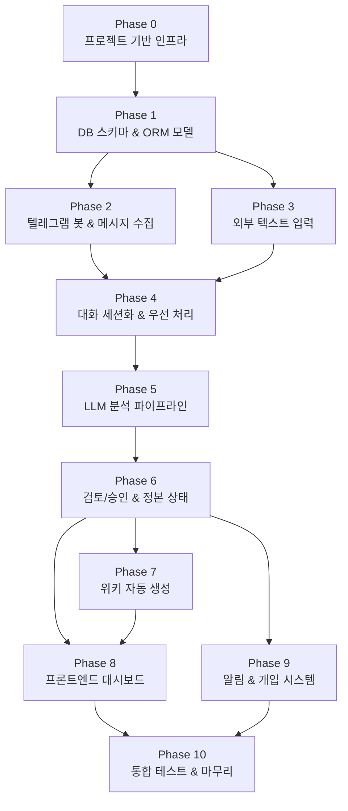
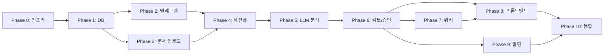

# 🏗️ AI 협업 코치 — 중심 구현 계획서 (Master Plan)

> **프로젝트명**: AI 협업 코치 (텔레그램 기반 준실시간 프로젝트 메모리 및 변경 추적 시스템)
> **기반 문서**: [AI_협업_코치_프로젝트_상세설명서_v2.md](file:///c:/Users/andyw/Desktop/Like_a_Lion_myproject/AI_%ED%98%91%EC%97%85_%EC%BD%94%EC%B9%98_%ED%94%84%EB%A1%9C%EC%A0%9D%ED%8A%B8_%EC%83%81%EC%84%B8%EC%84%A4%EB%AA%85%EC%84%9C_v2.md)
> **작성일**: 2026-04-09

---

## 📋 전체 Phase 구조 개요



| Phase | 이름 | 핵심 목표 | 예상 난이도 |
|:---:|------|----------|:---:|
| 0 | 프로젝트 기반 인프라 구축 | 프로젝트 스캐폴딩, Docker, 환경설정 | ⭐⭐ |
| 1 | DB 스키마 & ORM 모델 | 전체 테이블 정의, 마이그레이션 | ⭐⭐⭐ |
| 2 | 텔레그램 봇 & 메시지 수집 | Bot 생성, Webhook, 원문 실시간 저장 | ⭐⭐⭐ |
| 3 | 외부 텍스트 입력 시스템 | 회의록/교수 피드백 업로드 API | ⭐⭐ |
| 4 | 대화 세션화 & 우선 처리 | Sessionizer, 키워드 기반 우선 감지 | ⭐⭐⭐ |
| 5 | LLM 분석 파이프라인 | Celery Worker, 이벤트 후보 추출 | ⭐⭐⭐⭐⭐ |
| 6 | 검토/승인 & 정본 상태 | Review Queue, 승인/반려, 정본 갱신 | ⭐⭐⭐⭐ |
| 7 | 위키 자동 생성 | Wiki Generator, 마크다운 문서 생성 | ⭐⭐⭐ |
| 8 | 프론트엔드 대시보드 | Dashboard, Review UI, Wiki Viewer | ⭐⭐⭐⭐ |
| 9 | 알림 & 개입 시스템 | 텔레그램 알림, 리마인더 | ⭐⭐⭐ |
| 10 | 통합 테스트 & 마무리 | E2E 테스트, 샘플 데이터, UX 개선 | ⭐⭐⭐ |

---

## Phase 0: 프로젝트 기반 인프라 구축

### 🎯 목표
프로젝트 폴더 구조 생성, Docker 환경 구성, 기본 설정 파일 작성, 개발 환경 세팅

### 📦 상세 작업

#### 0-1. 프로젝트 디렉토리 구조 생성
```text
project-root/
├─ apps/
│  ├─ api/                 # FastAPI 서버
│  │  ├─ __init__.py
│  │  ├─ main.py           # FastAPI 앱 엔트리포인트
│  │  ├─ config.py         # 환경설정 (Pydantic Settings)
│  │  ├─ dependencies.py   # DI 의존성
│  │  └─ routers/          # API 라우터 모듈
│  ├─ bot/                 # Telegram Bot 로직
│  │  ├─ __init__.py
│  │  └─ handlers.py
│  ├─ worker/              # 비동기 분석 워커 (Celery)
│  │  ├─ __init__.py
│  │  ├─ celery_app.py
│  │  └─ tasks/
│  └─ web/                 # React + Vite 프론트엔드 (Dashboard SPA)
├─ packages/
│  ├─ core/                # 공통 도메인 로직
│  ├─ llm/                 # 프롬프트, 분석기
│  ├─ db/                  # DB 모델, 마이그레이션
│  │  ├─ models/
│  │  ├─ migrations/
│  │  └─ session.py
│  └─ shared/              # 공통 타입/상수/유틸
├─ docs/
├─ data/
│  ├─ samples/
│  └─ fixtures/
├─ scripts/
├─ tests/
│  ├─ unit/
│  ├─ integration/
│  └─ e2e/
├─ .env.example
├─ docker-compose.yml
├─ Dockerfile
├─ pyproject.toml
└─ README.md
```

#### 0-2. Docker Compose 구성 (로컬 개발용)
- `api`: FastAPI 서버 (포트 8000)
- `worker`: Celery Worker
- `redis`: Redis 7+ (포트 6379)
- `web`: React + Vite 프론트엔드 (포트 5173)

> [!NOTE]
> **PostgreSQL은 Docker에 포함하지 않습니다.** Supabase(Managed PostgreSQL)를 사용하며,
> `DATABASE_URL` 환경 변수로 외부 연결합니다. 인프라 관리 부담을 제거하고 무료 티어를 활용합니다.

#### 0-3. Python 프로젝트 설정
- `pyproject.toml` 작성 (Poetry 또는 pip)
- 핵심 의존성:
  ```
  fastapi>=0.115, uvicorn[standard]>=0.30
  sqlalchemy[asyncio]>=2.0, asyncpg, alembic>=1.13
  celery>=5.4, redis>=5.0
  python-telegram-bot>=21.0
  openai>=1.50, httpx>=0.27
  pydantic>=2.5, pydantic-settings
  structlog (로깅), ruff (린터/포맷터)
  ```

#### 0-4. 환경 변수 설정
- `.env.example` 작성
  - `DATABASE_URL`, `REDIS_URL`, `TELEGRAM_BOT_TOKEN`, `OPENAI_API_KEY`, `SECRET_KEY`, `WEBHOOK_URL`

#### 0-5. 기본 FastAPI 앱 부트스트랩
- Health check 엔드포인트 (`GET /health`)
- CORS 설정
- 에러 핸들링 미들웨어

### ✅ 검증 기준
- `docker-compose up`으로 api, worker, redis 정상 기동
- `GET /health` → `200 OK`
- Supabase PostgreSQL 연결 확인 (asyncpg)
- Redis 연결 확인

### 📄 산출물
- 전체 디렉토리 구조
- `docker-compose.yml`, `Dockerfile`
- `pyproject.toml`, `.env.example`
- `apps/api/main.py` (기본 FastAPI 앱)
- `README.md` (실행 방법)

---

## Phase 1: 데이터베이스 스키마 & ORM 모델

### 🎯 목표
프로젝트 상세설명서 §15의 데이터 모델을 SQLAlchemy ORM으로 구현하고, Alembic 마이그레이션 설정

### 📦 상세 작업

#### 1-1. SQLAlchemy Base 및 DB 세션 설정
- `packages/db/session.py`: AsyncSession 팩토리
- `packages/db/base.py`: DeclarativeBase, 공통 Mixin (TimestampMixin, UUIDMixin)

#### 1-2. Raw Source Layer 모델
| 모델 | 파일 | 설명 |
|------|------|------|
| `Project` | `models/project.py` | 프로젝트 기본 정보 |
| `User` | `models/user.py` | 사용자/팀원 정보 |
| `Channel` | `models/channel.py` | 데이터 출처 채널 |
| `RawMessage` | `models/raw_message.py` | 텔레그램 원문 메시지 (§15.3 raw_messages 스키마) |
| `RawDocument` | `models/raw_document.py` | 회의록/교수 피드백 원문 (§15.3 raw_documents 스키마) |

#### 1-3. Event Proposal Layer 모델
| 모델 | 파일 | 설명 |
|------|------|------|
| `ConversationSession` | `models/conversation_session.py` | 대화 세션 (§15.3 conversation_sessions) |
| `ExtractedEvent` | `models/extracted_event.py` | AI 추출 이벤트 후보 (§15.3 extracted_events) |

#### 1-4. Review / Audit Layer 모델
| 모델 | 파일 | 설명 |
|------|------|------|
| `ReviewAction` | `models/review_action.py` | 승인/반려 이력 (§15.3 review_actions) |

#### 1-5. Canonical State Layer 모델
| 모델 | 파일 | 설명 |
|------|------|------|
| `RequirementState` | `models/requirement_state.py` | 현재 요구사항 정본 |
| `DecisionState` | `models/decision_state.py` | 현재 유효한 결정사항 정본 |
| `TaskState` | `models/task_state.py` | 현재 작업 상태 정본 |
| `IssueState` | `models/issue_state.py` | 현재 이슈 상태 정본 |
| `FeedbackState` | `models/feedback_state.py` | 교수 피드백 정본/반영 상태 |

#### 1-6. Presentation Layer 모델
| 모델 | 파일 | 설명 |
|------|------|------|
| `WikiPage` | `models/wiki_page.py` | 자동 생성 위키 문서 |
| `WikiRevision` | `models/wiki_revision.py` | 위키 변경 이력 |

#### 1-7. Intervention Layer 모델
| 모델 | 파일 | 설명 |
|------|------|------|
| `Intervention` | `models/intervention.py` | 알림/개입 내역 |

#### 1-8. Alembic 마이그레이션 설정
- `alembic.ini` 설정
- 초기 마이그레이션 생성 및 적용

#### 1-9. Enum 및 상수 정의
- `packages/shared/enums.py`
  - `EventType`: `decision`, `requirement_change`, `task`, `issue`, `feedback`, `question`
  - `EventState`: `observed`, `extracted`, `needs_review`, `approved`, `rejected`, `applied`, `superseded`
  - `ReviewActionType`: `approve`, `reject`, `hold`, `edit_and_approve`
  - `SourceType`: `meeting`, `professor_feedback`, `manual_note`
  - `SessionStatus`: `open`, `closed`, `analyzed`
  - `VisibilityStatus`: `visible`, `unknown`, `soft_deleted`

### ✅ 검증 기준
- `alembic upgrade head` 성공
- 모든 테이블이 PostgreSQL에 정상 생성
- 기본 CRUD 단위 테스트 통과

### 📄 산출물
- `packages/db/models/*.py` (전체 ORM 모델)
- `packages/db/session.py`, `packages/db/base.py`
- `packages/shared/enums.py`
- `alembic/` 마이그레이션 파일
- `tests/unit/test_models.py`

---

## Phase 2: 텔레그램 봇 & 메시지 수집 (Raw Source Layer)

### 🎯 목표
Telegram Bot API를 통해 프로젝트 단톡방 메시지를 실시간 수집하고, 원문을 DB에 저장

### 📦 상세 작업

#### 2-1. Telegram Bot 생성 및 설정
- BotFather를 통한 봇 생성
- Privacy Mode 비활성화 설정 가이드 문서화
- 봇 관리자 권한 설정

#### 2-2. Webhook 엔드포인트 구현
- `POST /api/v1/telegram/webhook` (§21.1)
- 요청 본문 파싱 (Update 객체)
- 인증/검증 (텔레그램 시크릿 토큰)

> [!IMPORTANT]
> Webhook 경로에서는 **LLM을 직접 호출하지 않는다** (§11.1).
> 저장과 큐 적재만 수행.

#### 2-3. 메시지 저장 로직
- 메시지 본문, 발신자, 채팅방 ID, 전송 시각 저장
- `reply_to_message_id` 관계 저장
- 메시지 유형 (`text`, `photo`, `document` 등) 메타데이터 저장
- 편집 이벤트(`edited_message`) 추적 → `edited_at` 업데이트

#### 2-4. 메시지 편집/삭제 처리
- **편집**: `edited_message` 이벤트 감지 → 기존 메시지의 `edited_at`, `text` 업데이트 (이전 버전은 히스토리로 보관 가능)
- **삭제**: Bot API의 한계로 완전 보장 불가 → `visibility_status` 필드로 관리

#### 2-5. 발신자(User) 자동 등록/매핑
- 텔레그램 `user_id`로 내부 `User` 레코드 자동 생성 또는 매핑
- `telegram_id`, `username`, `first_name` 저장

#### 2-6. 채널(Channel) 관리
- `chat_id`별 Channel 레코드 관리
- Project ↔ Channel 연결

#### 2-7. Webhook 등록 스크립트
- `scripts/set_webhook.py`: 텔레그램 API로 webhook URL 등록

### ✅ 검증 기준
- 텔레그램 단톡방에서 메시지 전송 → DB `raw_messages`에 저장 확인
- 편집 메시지 → `edited_at` 업데이트 확인
- 응답 시간 1~3초 이내 (§14.1)

### 📄 산출물
- `apps/api/routers/telegram.py` (webhook 라우터)
- `apps/bot/handlers.py` (메시지 처리 핸들러)
- `packages/core/services/message_service.py`
- `scripts/set_webhook.py`
- `docs/TELEGRAM_SETUP.md` (봇 설정 가이드)

---

## Phase 3: 외부 텍스트 입력 시스템

### 🎯 목표
회의록, 교수 피드백, 수동 노트를 텍스트로 업로드하는 API 구현

### 📦 상세 작업

#### 3-1. 문서 업로드 API
- `POST /api/v1/sources/documents` (§21.2)
- 요청 스키마:
  ```json
  {
    "project_id": "uuid",
    "source_type": "meeting | professor_feedback | manual_note",
    "title": "string",
    "content": "string (텍스트 원문)"
  }
  ```

#### 3-2. 문서 저장 서비스
- `RawDocument` 레코드 생성
- 원문 보존 원칙 (수정 불가, 새 버전으로만 관리)
- 업로드 사용자(`created_by`) 기록

#### 3-3. 문서 조회 API
- `GET /api/v1/projects/{projectId}/documents` — 프로젝트별 문서 목록
- `GET /api/v1/sources/documents/{documentId}` — 개별 문서 조회

#### 3-4. 입력 유효성 검증
- `source_type` Enum 검증
- `content` 빈 값 방지
- `project_id` 존재 여부 확인

### ✅ 검증 기준
- 회의록 업로드 → `raw_documents` 저장 확인
- 잘못된 `source_type` → 400 에러 반환
- 문서 목록/상세 조회 정상 동작

### 📄 산출물
- `apps/api/routers/documents.py`
- `apps/api/schemas/document.py` (Pydantic 스키마)
- `packages/core/services/document_service.py`
- `tests/unit/test_document_upload.py`

---

## Phase 4: 대화 세션화 & 우선 처리 감지

### 🎯 목표
텔레그램 메시지를 대화 세션 단위로 묶고, 긴급 키워드를 감지하여 우선 처리 후보를 식별

### 📦 상세 작업

#### 4-1. Conversation Sessionizer 구현
- **세션 생성 규칙** (§12.2):
  - 같은 채팅방에서 **1시간 이상 대화 공백** → 세션 종료
  - `idle_threshold` 환경설정으로 조정 가능
- **세션 상태 관리**:
  - `open`: 메시지 수신 중
  - `closed`: idle timeout으로 종료됨
  - `analyzed`: LLM 분석 완료

#### 4-2. 세션 종료 처리
- 새 메시지 수신 시 마지막 메시지와의 시간 차이 계산
- `idle_threshold` 초과 시:
  1. 현재 세션을 `closed`로 전환
  2. Analysis Queue에 등록
  3. 새 세션 생성

#### 4-3. 세션-메시지 연결
- `raw_messages` → `conversation_sessions` 다대일 관계
- `conversation_sessions.message_count` 업데이트

#### 4-4. 규칙 기반 우선 처리 감지 (Lightweight Rule Engine)
- **키워드 감지** (§12.3):
  - 한국어: `교수님`, `마감`, `배포`, `오류`, `확정`, `결정`, `변경`, `긴급`, `발표`
  - 영어: `deadline`, `deploy`, `bug`, `decision`, `change`
- **명시 명령어 감지**:
  - `/decision`, `/change`, `/issue`, `/feedback`
- 감지 시: 메시지를 **중요 후보**로 표시, Analysis Queue에서 우선 처리

#### 4-5. Analysis Queue (Redis) 등록
- 종료된 세션 → `analysis_queue`에 push
- 우선 처리 후보 → `priority_analysis_queue`에 push

#### 4-6. 스케줄러 (선택)
- 주기적으로 열린 세션 중 idle timeout 초과 세션을 강제 종료하는 백그라운드 태스크
- Celery Beat 또는 APScheduler 활용

### ✅ 검증 기준
- 1시간 이상 간격의 메시지 → 별도 세션 생성 확인
- `교수님` 키워드 포함 메시지 → 우선 처리 대상 표시 확인
- `/decision` 명령어 → 우선 큐 등록 확인

### 📄 산출물
- `packages/core/services/session_service.py`
- `packages/core/services/priority_detector.py`
- `apps/worker/tasks/session_tasks.py`
- `packages/shared/constants.py` (키워드 목록)
- `tests/unit/test_sessionizer.py`
- `tests/unit/test_priority_detector.py`

---

## Phase 5: LLM 분석 파이프라인 (비동기 Worker)

### 🎯 목표
Celery Worker를 통해 대화 세션/문서를 비동기 분석하고, 구조화된 이벤트 후보를 생성

> [!CAUTION]
> 이 Phase는 프로젝트의 **핵심 AI 로직**이며 가장 난이도가 높습니다.
> 프롬프트 설계와 응답 파싱의 품질이 전체 시스템의 가치를 좌우합니다.

### 📦 상세 작업

#### 5-1. Celery 앱 구성
- `apps/worker/celery_app.py`: Celery 인스턴스 설정
- Redis를 Broker 및 Result Backend로 설정
- Task 기본 설정: retry, timeout, rate limit

#### 5-2. LLM 클라이언트 래퍼 (모델 라우팅 전략)
- `packages/llm/client.py`: OpenAI API 호출 래퍼
- **모델 라우팅**: 역할별 최적 모델 자동 선택
  | 역할 | 모델 | 이유 |
  |------|------|------|
  | Classifier (분류) | **GPT-4.1 Nano** | 단순 분류, 저비용 |
  | Extractor (추출) | **GPT-4.1** | 한국어 구조화 추출에 높은 정확도 |
  | Comparator (비교) | **GPT-4.1** | 정본 상태와 비교하는 추론 필요 |
  | Review Assistant | **GPT-4.1 Nano** | 정형화된 질문 생성 |
  | Wiki Writer | **GPT-4.1** | 자연스러운 한국어 문서 작성 |
  | Coach (요약) | **GPT-4.1 Nano** | 짧은 알림 메시지 |
- 재시도 로직 (exponential backoff)
- 비용 추적 로깅 (모델별 토큰 사용량 기록)
- **Structured Outputs** 활용 → JSON 파싱 실패율 최소화
- 응답 파싱 유틸리티

#### 5-3. 프롬프트 설계 (§19.2 역할 분리)

| 프롬프트 | 파일 | 역할 |
|----------|------|------|
| **Classifier** | `packages/llm/prompts/classifier.py` | 메시지/문서 유형 분류 |
| **Extractor** | `packages/llm/prompts/extractor.py` | 구조화 이벤트 후보 생성 |
| **Comparator** | `packages/llm/prompts/comparator.py` | 기존 정본과 변경 전/후 비교 |
| **Review Assistant** | `packages/llm/prompts/review_assistant.py` | 누락 정보 질문 생성 |

각 프롬프트의 응답 스키마:
```json
{
  "event_type": "decision | requirement_change | task | issue | feedback | question",
  "summary": "한 줄 요약",
  "topic": "관련 주제/기능",
  "details": {
    "before": "변경 전 (해당 시)",
    "after": "변경 후 (해당 시)",
    "reason": "변경 이유",
    "related_people": ["관련 인물"],
    "source_quotes": ["근거 원문"]
  },
  "confidence": 0.85,
  "fact_type": "confirmed_fact | inferred_interpretation | unresolved_ambiguity"
}
```

#### 5-4. 분석 태스크 구현
- `analyze_session_task`: 세션 ID를 받아 분석 수행
  1. 세션에 속한 메시지 조회
  2. Classifier 프롬프트로 메시지 유형 분류
  3. Extractor 프롬프트로 이벤트 후보 추출
  4. `extracted_events` 테이블에 저장
  5. 중요 이벤트(confidence ≥ threshold)는 `needs_review`로 설정
  6. 세션 상태를 `analyzed`로 업데이트

- `analyze_document_task`: 문서 ID를 받아 분석 수행
  1. 문서 원문 조회
  2. Classifier → Extractor 파이프라인 실행
  3. 이벤트 후보 저장

#### 5-5. 사실/추론 분리 (§19.3)
- 각 이벤트에 `fact_type` 필드 포함:
  - `confirmed_fact`: 원문에서 직접 확인
  - `inferred_interpretation`: AI가 추론한 해석
  - `unresolved_ambiguity`: 확정 불가

#### 5-6. 에러 핸들링 및 재시도
- LLM API 실패 시 Celery 자동 재시도 (최대 3회)
- 파싱 실패 시 원문과 함께 에러 로그 저장
- Dead letter queue 관리

### ✅ 검증 기준
- 테스트 세션 데이터로 이벤트 후보 추출 확인
- `event_type`, `confidence`, `fact_type` 필드 정상 생성
- LLM API 실패 시 재시도 동작 확인

### 📄 산출물
- `apps/worker/celery_app.py`
- `apps/worker/tasks/analysis_tasks.py`
- `packages/llm/client.py`
- `packages/llm/prompts/*.py` (각 프롬프트 모듈)
- `packages/llm/schemas.py` (응답 스키마)
- `docs/PROMPT_SPEC.md` (프롬프트 명세서)
- `tests/unit/test_analysis_pipeline.py`

---

## Phase 6: 검토/승인 워크플로우 & 정본 상태 관리

### 🎯 목표
팀장이 이벤트 후보를 검토/승인하는 워크플로우 구현, 승인된 이벤트를 정본 상태에 반영

### 📦 상세 작업

#### 6-1. Review Queue API (§21.3, §21.4)
- `GET /api/v1/projects/{projectId}/reviews/pending`
  - 검토 대기(`needs_review`) 이벤트 목록 반환
  - 이벤트 요약, 신뢰도, 원문 근거, 변경 전/후 포함
- `GET /api/v1/projects/{projectId}/reviews/{eventId}`
  - 개별 이벤트 상세 조회 (§17.2 검토 화면 정보)

#### 6-2. 리뷰 액션 API
- `POST /api/v1/projects/{projectId}/reviews/{eventId}`
  ```json
  {
    "action": "approve | reject | hold | edit_and_approve",
    "review_note": "검토 의견 (선택)",
    "patch": { "summary": "수정된 요약" }
  }
  ```

#### 6-3. 이벤트 상태 전이 구현 (§16)
```
observed → extracted → needs_review → approved/rejected
approved → applied → superseded
```

- 상태 전이 유효성 검증 (잘못된 전이 차단)
- 각 전이 시 감사 로그(`review_actions`) 자동 생성

#### 6-4. 정본 상태 갱신 로직 (§13.1.7)
승인(`approved`)된 이벤트를 정본 테이블에 반영:

| 이벤트 유형 | 정본 테이블 | 반영 내용 |
|------------|-----------|----------|
| `requirement_change` | `requirements_state` | 요구사항 추가/수정/삭제/우선순위 변경 |
| `decision` | `decisions_state` | 결정사항 추가, 기존 결정 `superseded` 처리 |
| `task` | `tasks_state` | 작업 생성/수정/완료 |
| `issue` | `issues_state` | 이슈 생성/해결/보류 |
| `feedback` | `feedback_state` | 교수 피드백 등록/반영 상태 |

#### 6-5. Supersede 처리 (§7 원칙 7)
- 새 결정이 기존 결정을 대체할 때:
  1. 기존 레코드의 `status` → `superseded`
  2. 기존 레코드의 `superseded_by` → 새 정본 레코드 ID (decisions_state.id)
  3. 새 레코드 생성 with `status: active`

#### 6-6. 정보 부족 시 보완 요청 생성 (§17.3)
- Review Assistant 프롬프트를 활용하여 누락 정보 질문 자동 생성
- 검토 화면에 보완 질문 표시

### ✅ 검증 기준
- 이벤트 승인 → 해당 정본 테이블에 레코드 생성/업데이트 확인
- 기존 결정 승인 후 새 결정 승인 → 기존 결정이 `superseded` 처리 확인
- 잘못된 상태 전이 시 에러 반환 확인
- 감사 로그(`review_actions`) 정상 기록 확인

### 📄 산출물
- `apps/api/routers/reviews.py`
- `apps/api/schemas/review.py`
- `packages/core/services/review_service.py`
- `packages/core/services/canonical_state_service.py`
- `packages/core/services/state_transition.py` (상태 전이 머신)
- `tests/unit/test_review_workflow.py`
- `tests/unit/test_state_transition.py`
- `tests/unit/test_canonical_state.py`

---

## Phase 7: 위키 자동 생성

### 🎯 목표
정본 상태를 기반으로 마크다운 위키 문서를 자동 생성/재생성

### 📦 상세 작업

#### 7-1. Wiki Generator 서비스
- `packages/llm/wiki_writer.py`: 정본 데이터 → 마크다운 변환
- LLM 기반 자연어 문서 생성 (Wiki Writer 프롬프트)
- 템플릿 기반 구조화 문서 생성 (LLM 없이 가능한 부분)

#### 7-2. 필수 문서 자동 생성 (§18.3)

| 문서 | slug | 소스 |
|------|------|------|
| 프로젝트 개요 | `project_overview` | 프로젝트 설정 + 요구사항 요약 |
| 요구사항 문서 | `requirements` | `requirements_state` |
| 결정사항 문서 | `decisions` | `decisions_state` |
| 변경 이력 문서 | `change_log` | `review_actions` + 이벤트 |
| 교수 피드백 문서 | `professor_feedback` | `feedback_state` |
| 미해결 이슈 문서 | `open_issues` | `issues_state` (active) |
| 주간 브리핑 문서 | `weekly_brief` | 최근 7일 승인 이벤트 |
| 타임라인 문서 | `timeline` | 전체 승인 이벤트 시간순 |

#### 7-3. 위키 재생성 트리거
- 정본 상태 갱신 시 자동 트리거 (이벤트 기반)
- 수동 재생성 API: `POST /api/v1/projects/{projectId}/wiki/regenerate` (§21.7)
- 재생성 시 `wiki_revisions`에 이전 버전 보관

#### 7-4. 위키 조회 API (§21.6)
- `GET /api/v1/projects/{projectId}/wiki/{slug}`
- 마크다운 내용 + 근거 이벤트 링크 + 수정 시각 반환

#### 7-5. 위키 리비전 관리
- 재생성 시 이전 내용을 `wiki_revisions`에 저장
- 리비전 조회 API (선택)

### ✅ 검증 기준
- 정본 상태 갱신 → 관련 위키 문서가 자동 재생성 확인
- 수동 재생성 API 호출 → 전체 위키 재생성 확인
- 각 문서에 근거 이벤트 링크가 포함되어 있는지 확인

### 📄 산출물
- `packages/llm/wiki_writer.py`
- `packages/llm/prompts/wiki_writer.py`
- `packages/core/services/wiki_service.py`
- `apps/api/routers/wiki.py`
- `apps/api/schemas/wiki.py`
- `tests/unit/test_wiki_generator.py`

---

## Phase 8: 프론트엔드 — 대시보드 & UI

### 🎯 목표
**React + Vite** SPA로 웹 대시보드를 구현하여 프로젝트 요약, 검토 큐, 위키 뷰어, 문서 업로드 화면 제공

> [!NOTE]
> 대시보드는 로그인 뒤 화면으로 SEO가 불필요하며, SSR의 이점이 없습니다.
> React + Vite는 Next.js 대비 아키텍처가 단순하고 개발 속도가 빠릅니다.

### 📦 상세 작업

#### 8-1. React + Vite 프로젝트 초기화
- `apps/web/` 디렉토리에 Vite + React + TypeScript 프로젝트 생성
- **UI 라이브러리**: shadcn/ui + Tailwind CSS
- **라우팅**: React Router v6
- API 클라이언트 설정 (axios 래퍼)
- 전역 레이아웃, 사이드바 네비게이션, 다크 테마 설정

#### 8-2. 메인 대시보드 (§24.1)
- **오늘의 요약** 카드: 오늘 승인된 변경 건수, 미해결 이슈 수
- **최근 승인된 변경사항** 리스트
- **현재 요구사항** 카드/테이블
- **미해결 이슈** 리스트
- **교수 피드백 반영 현황** (반영/미반영 비율)
- **검토 대기 항목** 배지 + 리스트

#### 8-3. 리뷰 큐 화면 (§24.2)
- 이벤트 카드 목록 (검토 대기 중)
- 개별 이벤트 상세 뷰:
  - 이벤트 요약
  - 변경 전/후 diff 뷰
  - 근거 원문 하이라이트
  - AI 추론 이유 / 신뢰도
  - 관련 작업/이슈 링크
- **액션 버튼**: 승인 / 보류 / 반려 / 수정 후 승인
- 검토 의견 입력 텍스트 필드

#### 8-4. 위키 문서 화면 (§24.3)
- 사이드바: 문서 목록 (slug 기반)
- 메인 영역: react-markdown으로 마크다운 렌더링
- 근거 이벤트 링크 (클릭 시 이벤트 상세로 이동)
- 최근 수정 이력 표시

#### 8-5. 소스 입력 화면 (§24.4)
- 회의록 / 교수 피드백 업로드 폼 (shadcn/ui Form 컴포넌트)
  - 출처 유형 선택 (드롭다운)
  - 제목 입력
  - 내용 입력 (텍스트에어리어)
- 업로드 성공/실패 Toast 피드백

#### 8-6. 타임라인 화면 (§24.5)
- 날짜별 승인된 변경 이력 (수직 타임라인)
- 각 항목: 이벤트 요약, 유형 아이콘, 승인자, 근거 원문 미리보기
- 필터: 이벤트 유형별, 날짜 범위

#### 8-7. 프로젝트 요약 조회 API 연동 (§21.5, §21.8)
- `GET /api/v1/projects/{projectId}/summary`
- `GET /api/v1/projects/{projectId}/dashboard`

### ✅ 검증 기준
- 대시보드에서 최근 변경사항, 미해결 이슈 정상 표시
- 리뷰 큐에서 승인/반려 → 상태 변경 확인
- 위키 문서 정상 렌더링
- 문서 업로드 → 성공 피드백

### 📄 산출물
- `apps/web/` (React + Vite 프로젝트)
  - `src/pages/Dashboard.tsx`
  - `src/pages/Reviews.tsx`, `src/pages/ReviewDetail.tsx`
  - `src/pages/Wiki.tsx`
  - `src/pages/Upload.tsx`
  - `src/pages/Timeline.tsx`
  - `src/components/` (shadcn/ui 기반 공용 컴포넌트)
  - `src/lib/api.ts` (API 클라이언트)
  - `src/App.tsx` (React Router 라우팅)

---

## Phase 9: 알림 & 개입(Intervention) 시스템

### 🎯 목표
1차 MVP 개입 범위(§20.1)를 텔레그램 메시지로 구현

### 📦 상세 작업

#### 9-1. 알림 종류 정의 (§20.1)

| 알림 유형 | 트리거 | 내용 |
|----------|--------|------|
| 검토 요청 | 이벤트 후보가 `needs_review`로 생성 | "요구사항 변경 후보가 1건 생성되었습니다. 검토해주세요." |
| 최근 승인 변경 요약 | 정본 상태 갱신 완료 | "오늘 승인된 핵심 변경: 로그인 기능 우선순위 하향" |
| 미검토 리마인드 | 스케줄러 (1일 1회) | "검토 대기 이벤트가 3건 있습니다." |

#### 9-2. 텔레그램 알림 발송 서비스
- `packages/core/services/notification_service.py`
- Bot을 통해 팀장에게 DM으로 검토 요청
- 프로젝트 채팅방에 승인 변경 요약 전송

#### 9-3. Coach 프롬프트 (§19.2)
- `packages/llm/prompts/coach.py`: 요약/리마인드 메시지 생성
- 일일 승인 변경 요약 메시지 자동 작성

#### 9-4. Intervention 로그 저장
- `interventions` 테이블에 발송 내역, 대상, 시각 기록

#### 9-5. 리마인드 스케줄러
- Celery Beat로 1일 1회 미검토 항목 확인
- 팀장에게 리마인드 발송

### ✅ 검증 기준
- 이벤트 후보 생성 → 팀장에게 텔레그램 알림 전송 확인
- 미검토 항목 3건 이상 → 리마인드 메시지 발송 확인
- `interventions` 테이블에 발송 기록 저장 확인

### 📄 산출물
- `packages/core/services/notification_service.py`
- `packages/llm/prompts/coach.py`
- `apps/worker/tasks/notification_tasks.py`
- `apps/worker/tasks/scheduler_tasks.py`
- `tests/unit/test_notification.py`

---

## Phase 10: 통합 테스트 & 최종 마무리

### 🎯 목표
전체 파이프라인을 E2E 테스트하고, 샘플 데이터로 실사용 시나리오를 검증. UX 개선 및 배포 준비

### 📦 상세 작업

#### 10-1. E2E 시나리오 테스트 (§26.2)

| 시나리오 | 테스트 내용 |
|---------|-----------|
| A: 회의 후 변경사항 반영 | 텔레그램 메시지 → 세션 → 이벤트 추출 → 팀장 승인 → 정본 반영 → 위키 재생성 |
| B: 초보 팀원 상황 파악 | 대시보드 접속 → 최근 변경/이슈/요구사항 확인 |
| C: 발표 전 근거 확인 | 특정 결정 검색 → 근거 원문/승인 기록 확인 → 타임라인 확인 |

#### 10-2. 샘플 데이터 준비
- `data/fixtures/`: 실제 대화 시나리오 기반 샘플 데이터
- `scripts/seed_data.py`: DB에 샘플 데이터 투입

#### 10-3. 품질 점검 (§26.3)
- AI 추출 결과 ↔ 원문 근거 연결 정확성
- 팀장 검토 화면에서 판단 가능한 수준의 정보 제공 여부
- 초보 팀원이 최신 상태를 빠르게 이해할 수 있는지 확인

#### 10-4. UX 개선
- 로딩 상태, 에러 메시지 개선
- 반응형 디자인 최적화
- 접근성(a11y) 기본 적용

#### 10-5. Railway 배포 준비
- Railway 프로젝트 구성:
  - Service 1: `api` (FastAPI + Bot Webhook)
  - Service 2: `worker` (Celery Worker)
  - Service 3: `beat` (Celery Beat Scheduler)
  - Plugin: Redis
  - DB: Supabase (외부 연결)
  - 프론트엔드: Vite 정적 빌드 배포
- `Dockerfile` 최적화 (multi-stage build)
- 환경별 설정 분리 (dev/prod)
- CI/CD 파이프라인 설정 (GitHub → Railway 자동 배포)

#### 10-6. 문서 최종 정리
- `docs/API_SPEC.md`: Swagger 기반 자동 생성 보완
- `docs/DB_SCHEMA.md`: ER 다이어그램 포함
- `docs/PROMPT_SPEC.md`: 프롬프트 명세 최종판
- `README.md`: 설치/실행/개발 가이드

### ✅ 검증 기준
- 3개 E2E 시나리오 모두 정상 수행
- `docker-compose up`으로 전체 시스템 기동 → 정상 동작
- 샘플 데이터 기반 데모 가능

### 📄 산출물
- `tests/e2e/test_scenario_*.py`
- `data/fixtures/*.json`
- `scripts/seed_data.py`
- `docker-compose.prod.yml`
- `.github/workflows/ci.yml`
- 최종 문서들 (`docs/*`)

---

## 📊 Phase 간 의존성 요약



> [!TIP]
> **Phase 2와 3은 병렬 진행 가능** — 둘 다 Phase 1(DB 모델)에만 의존합니다.
> **Phase 7, 8, 9도 부분 병렬 가능** — 모두 Phase 6(검토/승인)에 의존하지만, 서로 간에는 독립적입니다.

---

## ✅ 확정된 기술 스택 요약

> 상세 근거는 [기술_스택_추천서.md](file:///c:/Users/andyw/Desktop/Like_a_Lion_myproject/%EA%B8%B0%EC%88%A0_%EC%8A%A4%ED%83%9D_%EC%B6%94%EC%B2%9C%EC%84%9C.md) 참조

| 영역 | 확정 기술 | 핵심 이유 |
|:---:|----------|----------|
| 백엔드 | **FastAPI (Python)** | 비동기 네이티브, LLM/Webhook 최적 |
| 비동기 워커 | **Celery + Redis** | Celery Beat 내장, 풍부한 자료 |
| 데이터베이스 | **Supabase (Managed PostgreSQL)** | 인프라 관리 제거, 무료 티어 |
| 프론트엔드 | **React + Vite + shadcn/ui** | 대시보드 SPA, SSR 불필요 |
| 텔레그램 봇 | **python-telegram-bot** | 풍부한 문서, ConversationHandler |
| LLM API | **GPT-4.1 + GPT-4.1 Nano** | 모델 라우팅으로 비용 최적화 |
| 배포 | **Railway** | Docker 간편 배포, 학생 크레딧 |

---

## ✅ 확정된 프로젝트 전제 조건

| 항목 | 확정 내용 |
|------|----------|
| 팀 구성 | **1인 개발** (병렬 진행 가능) |
| 일정 | 여유 있음, 시간 날 때마다 **Phase 순서대로** 진행 |
| OpenAI API 키 | ✅ 준비 완료 |
| Supabase | ✅ 무료 티어 사용 동의, 필요 시 유료 결제 가능 |

> [!TIP]
> 모든 전제 조건이 확정되었습니다. **Phase 0부터 순서대로 진행**합니다.
> 각 Phase를 시작할 때 해당 Phase의 세부 계획서를 작성하고 코드 작성을 진행합니다.
