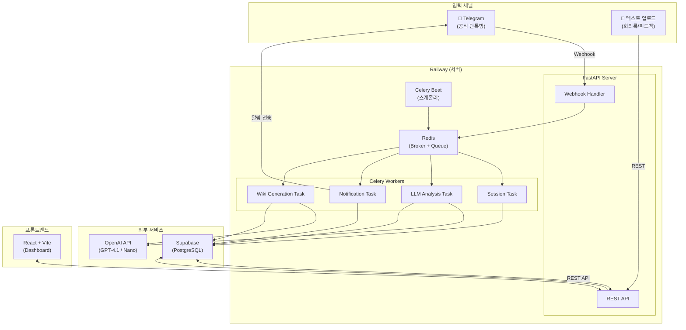

# 🛠️ AI 협업 코치 — 기술 스택 추천서

> **작성일**: 2026-04-09
> **목적**: 프로젝트 특성(텔레그램 봇, 실시간 수집, 비동기 LLM 분석, 대시보드)에 최적화된 기술 스택 선정

---

## 📊 최종 추천 스택 요약

| 영역 | 추천 기술 | 대안 | 선정 이유 |
|:---:|----------|------|----------|
| **백엔드** | **FastAPI (Python)** | Django | 비동기 네이티브, LLM 연동 최적, API 문서 자동 생성 |
| **비동기 워커** | **Celery + Redis** | Dramatiq, Taskiq | 업계 표준, 풍부한 문서, Celery Beat 스케줄러 내장 |
| **데이터베이스** | **Supabase (PostgreSQL)** | 자체 호스팅 PostgreSQL | 인프라 관리 부담 제거, 무료 티어, 대시보드 제공 |
| **프론트엔드** | **React + Vite** | Next.js | 대시보드에 SSR 불필요, 빠른 개발 속도, 심플한 구조 |
| **텔레그램 봇** | **python-telegram-bot** | aiogram | 풍부한 문서와 커뮤니티, ConversationHandler 내장 |
| **LLM API** | **GPT-4.1 (메인) + GPT-4.1 Nano (분류)** | Claude, Gemini | 속도·범용성·한국어 성능의 균형, 모델 라우팅으로 비용 최적화 |
| **인프라** | **Railway** | Render, AWS EC2 | 학생 프로젝트에 적합, Docker 배포 간편, 무료 크레딧 |

---

## 1. 백엔드 프레임워크: **FastAPI** ✅

### 왜 FastAPI인가?

```
FastAPI는 이 프로젝트의 핵심 요구사항에 정확히 맞습니다.
```

| 평가 기준 | FastAPI | Django |
|----------|---------|--------|
| 비동기 처리 | ✅ 네이티브 ASGI, async/await 전면 지원 | ⚠️ WSGI 기반, async 부분 지원 |
| 텔레그램 Webhook 처리 | ✅ 경량 I/O 처리에 최적 | ⚠️ 무거운 요청/응답 사이클 |
| LLM API 연동 | ✅ 비동기 HTTP 호출에 유리 | ⚠️ 가능하지만 비효율적 |
| API 문서 자동 생성 | ✅ Swagger/OpenAPI 내장 | ⚠️ DRF 추가 필요 |
| 타입 안전성 | ✅ Pydantic v2 기반 | ⚠️ Serializer 기반 |
| 학습 곡선 | ✅ 낮음 (간결한 코드) | ⚠️ 높음 (batteries-included) |
| 어드민 패널 | ❌ 없음 | ✅ Django Admin 내장 |

### 결정 근거

1. **Webhook 처리 = I/O 바운드 작업** → FastAPI의 비동기 처리가 훨씬 효율적
2. **LLM API 호출 = 외부 API 비동기 대기** → `async/await`로 자연스런 처리
3. **API 중심 설계** → FastAPI의 자동 문서 생성이 팀 협업에 큰 도움
4. **Django의 Admin 패널은 불필요** → 대시보드를 별도 프론트엔드로 구현
5. **ORM은 SQLAlchemy** → FastAPI와 가장 잘 어울리는 조합

### 핵심 의존성

```
fastapi>=0.115
uvicorn[standard]>=0.30
sqlalchemy[asyncio]>=2.0
pydantic>=2.5
httpx>=0.27
alembic>=1.13
```

---

## 2. 비동기 워커/큐: **Celery + Redis** ✅

### 후보 비교

| 항목 | Celery | Dramatiq | Taskiq | Huey |
|------|--------|----------|--------|------|
| 성숙도 | ⭐⭐⭐⭐⭐ | ⭐⭐⭐⭐ | ⭐⭐⭐ | ⭐⭐⭐ |
| 스케줄러 내장 | ✅ Celery Beat | ❌ (별도 addon) | ⚠️ 제한적 | ✅ |
| 재시도 / 에러 핸들링 | ✅ 매우 강력 | ✅ 좋음 | ✅ 좋음 | ⚠️ 기본적 |
| 모니터링 | ✅ Flower | ⚠️ 별도 구축 | ⚠️ 별도 구축 | ⚠️ 별도 구축 |
| 학습 자료 | ✅ 압도적으로 많음 | ⚠️ 보통 | ⚠️ 적음 | ⚠️ 적음 |
| async 네이티브 | ⚠️ 부분 지원 | ❌ 동기 기반 | ✅ 완전 지원 | ❌ 동기 기반 |

### 왜 Celery인가?

1. **스케줄러(Celery Beat) 내장** — 이 프로젝트에서 매우 중요:
   - 세션 idle timeout 감지 (주기적 체크)
   - 미검토 항목 리마인드 (1일 1회)
   - 일일 승인 변경 요약 전송
2. **참고 자료가 압도적** — 대학생 팀에서 문제 발생 시 해결 가능
3. **Flower 모니터링** — 워커 상태, 태스크 성공/실패를 시각적으로 확인
4. **재시도 전략 풍부** — LLM API 실패 시 exponential backoff 등 쉽게 구현

### Taskiq를 선택하지 않은 이유

Taskiq는 async-native로 기술적으로 더 현대적이지만:
- 학습 자료와 커뮤니티가 Celery에 비해 매우 부족
- 대학생 팀이 문제에 맞닥뜨렸을 때 해결이 어려움
- Celery의 async 제한은 이 프로젝트 규모에서 병목이 되지 않음

### 메시지 브로커: **Redis**

- Celery 브로커 + Result Backend 겸용
- 세션화 큐 (Analysis Queue, Priority Queue)에도 Redis 활용
- 경량, 설치 간편, Supabase와 별도로 Redis만 호스팅 (Railway/Upstash)

---

## 3. 데이터베이스: **Supabase (Managed PostgreSQL)** ✅

### 왜 Supabase인가?

| 평가 기준 | Supabase | 자체 호스팅 PostgreSQL | SQLite |
|----------|----------|---------------------|--------|
| 설정 시간 | ✅ 수 분 | ❌ 수 시간~수 일 | ✅ 즉시 |
| 인프라 관리 | ✅ 없음 | ❌ 백업/보안/패치 직접 | ✅ 없음 |
| JSONB 지원 | ✅ | ✅ | ❌ 제한적 |
| 동시성 | ✅ 다중 사용자 | ✅ 다중 사용자 | ❌ 쓰기 충돌 |
| 무료 티어 | ✅ 넉넉함 | ❌ VPS 비용 발생 | ✅ 무료 |
| SQL Editor/대시보드 | ✅ 내장 | ❌ 별도 도구 필요 | ⚠️ |
| pgvector 확장 | ✅ 지원 | ✅ 직접 설치 | ❌ 미지원 |

### 핵심 선정 이유

1. **인프라 관리 부담 제거** — 대학생 팀이 DB 서버 관리에 시간을 쏟을 필요 없음
2. **PostgreSQL 기반** → SQLAlchemy/Alembic과 100% 호환
3. **무료 티어** → 학생 프로젝트에 충분한 용량 (500MB DB, 50,000행)
4. **JSONB 컬럼** → `extracted_events.details`, `raw_messages.metadata` 등 유연한 JSON 데이터 저장
5. **pgvector 확장 가능** → 2차 버전에서 유사도 검색 확장 시 활용
6. **SQL Editor 내장** → 데이터 확인/디버깅이 웹 브라우저에서 즉시 가능

### ⚠️ 주의사항

> Supabase의 Auth, Realtime, Edge Functions 같은 BaaS 기능은 사용하지 않습니다.
> **오직 Managed PostgreSQL로만 활용**합니다.
> 이유: 백엔드 로직은 FastAPI에서 직접 제어해야 하며, Supabase 고유 기능에 종속되면 벤더 lock-in 발생

### 연결 방식

```python
# .env
DATABASE_URL=postgresql+asyncpg://postgres:[PASSWORD]@[HOST]:5432/postgres

# SQLAlchemy + asyncpg 드라이버로 직접 연결
```

---

## 4. 프론트엔드: **React + Vite** ✅

### 왜 Next.js 대신 React + Vite인가?

| 평가 기준 | React + Vite | Next.js |
|----------|-------------|---------|
| SEO 필요성 | ❌ 대시보드는 SEO 불필요 | ✅ SSR/SSG로 SEO 최적화 |
| 아키텍처 복잡도 | ✅ 심플한 SPA | ⚠️ SSR/RSC 이해 필요 |
| 개발 서버 속도 | ✅ 극도로 빠름 (ESM) | ✅ Turbopack으로 개선 |
| 학습 곡선 | ✅ React만 알면 됨 | ⚠️ 서버/클라이언트 경계 이해 필요 |
| 라우팅 | React Router (수동) | 파일 기반 (자동) |
| 백엔드 API | ❌ 별도 FastAPI 사용 | ✅ API Routes 내장 (불필요) |

### 핵심 선정 이유

1. **대시보드 = SPA** — SSR이 전혀 필요 없음 (로그인 뒤 화면)
2. **Vite 개발 속도** — HMR이 거의 즉시, 소규모 팀의 생산성에 직결
3. **Next.js의 장점이 이 프로젝트에서 의미 없음** — SEO, API Routes 모두 불필요
4. **아키텍처 단순성** — Server Component 등 불필요한 복잡성 제거

### 핵심 의존성

```
react, react-dom
react-router-dom      # 라우팅
axios / ky            # API 호출
react-markdown        # 위키 마크다운 렌더링
recharts / chart.js   # 대시보드 차트
date-fns              # 날짜 처리
```

### UI 라이브러리 추천

| 옵션 | 특징 | 추천도 |
|------|------|:---:|
| **shadcn/ui** | 복사-붙여넣기 컴포넌트, Tailwind 기반, 커스터마이징 자유도 최고 | ⭐⭐⭐⭐⭐ |
| Ant Design | 데이터 테이블/폼이 강력, 대시보드에 잘 맞음 | ⭐⭐⭐⭐ |
| Material UI (MUI) | 범용적이지만 번들 크기가 큼 | ⭐⭐⭐ |

> **추천: shadcn/ui + Tailwind CSS** — 대시보드와 리뷰 큐에 필요한 카드, 테이블, 버튼, 모달을 깔끔하게 구현 가능

---

## 5. 텔레그램 봇 라이브러리: **python-telegram-bot** ✅

### 후보 비교

| 항목 | python-telegram-bot | aiogram |
|------|:---:|:---:|
| 문서/튜토리얼 양 | ✅ 압도적으로 많음 | ⚠️ 보통 |
| 커뮤니티 크기 | ✅ 매우 큼 | ⚠️ 큼 (러시아권 중심) |
| async 지원 | ✅ 완전 지원 (v20+) | ✅ 완전 지원 |
| ConversationHandler | ✅ 내장 | ⚠️ FSM으로 대체 |
| 학습 곡선 | ✅ 낮음 | ⚠️ asyncio 깊은 이해 필요 |
| Webhook 모드 | ✅ 쉽게 설정 가능 | ✅ 쉽게 설정 가능 |

### 선정 이유

1. **풍부한 문서와 예제** — 팀원 누구나 빠르게 학습 가능
2. **ConversationHandler 내장** — 팀장 승인/반려 등 multi-step interaction 구현에 유리
3. **v20+는 완전 async** — FastAPI와 자연스러운 통합
4. **Webhook 모드** — FastAPI에 webhook 엔드포인트를 통합하여 단일 서버로 운영 가능

---

## 6. LLM API: **GPT-4.1 (메인) + GPT-4.1 Nano (분류)** ✅

### 모델 라우팅 전략 (비용 최적화)

이 프로젝트는 LLM을 최소 4가지 역할로 사용합니다. 모든 작업에 동일한 모델을 쓰면 비용이 폭증하므로, **역할별 모델 라우팅**을 적용합니다.

| 역할 | 모델 | 이유 | 예상 비용 (1M tokens) |
|------|------|------|:---:|
| **Classifier** (메시지 분류) | **GPT-4.1 Nano** | 단순 분류 작업, 빠르고 저렴 | ~$0.10 |
| **Extractor** (이벤트 추출) | **GPT-4.1** | 한국어 구조화 추출에 높은 정확도 | ~$2.00 |
| **Comparator** (변경 비교) | **GPT-4.1** | 정본 상태와 비교하는 추론 필요 | ~$2.00 |
| **Wiki Writer** (문서 생성) | **GPT-4.1** | 자연스러운 한국어 문서 작성 | ~$2.00 |
| **Coach** (요약 메시지) | **GPT-4.1 Nano** | 짧은 요약, 간결한 알림 | ~$0.10 |
| **Review Assistant** (질문 생성) | **GPT-4.1 Nano** | 정형화된 질문 생성 | ~$0.10 |

### 왜 GPT-4.1 계열인가? (Claude, Gemini 대신)

| 기준 | GPT-4.1 | Claude 4.6 Sonnet | Gemini 3 Pro |
|------|---------|-------------------|--------------|
| 한국어 성능 | ✅ 우수 | ✅ 매우 우수 | ✅ 우수 |
| 구조화 출력 (JSON) | ✅ Structured Outputs 기능 | ✅ Tool Use로 가능 | ⚠️ 가능하나 일관성 낮음 |
| 응답 속도 | ✅ 매우 빠름 | ⚠️ 보통 | ✅ 빠름 |
| SDK/문서 성숙도 | ✅ 가장 풍부 | ⚠️ 좋음 | ⚠️ 좋음 |
| Nano급 저가 모델 | ✅ GPT-4.1 Nano | ⚠️ Haiku (상대적 제한) | ✅ Flash Lite |
| 비용 | ✅ 경쟁력 있음 | ⚠️ 약간 비쌈 | ✅ 저렴 |

### 핵심 선정 이유

1. **Structured Outputs** — JSON 스키마를 강제할 수 있어 파싱 실패율 최소화
2. **모델 라우팅** — Nano/Standard 조합으로 비용 80% 이상 절감 가능
3. **SDK 성숙도** — `openai` Python 라이브러리가 가장 안정적
4. **Batch API (50% 할인)** — 세션 종료 후 비동기 분석은 실시간이 아니므로 Batch API 활용 가능

### 비용 예측 (월간)

```
가정: 하루 50개 메시지, 주 3회 회의, 월 12회 회의록 업로드

분류 작업 (Nano): ~50 메시지/일 × 30일 × ~500 tokens = 750K tokens → $0.08
추출 작업 (Standard): ~5 세션/일 × 30일 × ~2000 tokens = 300K tokens → $0.60
위키 생성 (Standard): ~4회/주 × 4주 × ~3000 tokens = 48K tokens → $0.10
기타: ~$0.22

예상 월 비용: 약 $1.00 이하 (매우 저렴)
```

---

## 7. 인프라/배포: **Railway** ✅

### 왜 Railway인가?

| 항목 | Railway | Render | AWS EC2 |
|------|---------|--------|---------|
| Docker 지원 | ✅ | ✅ | ✅ |
| 설정 난이도 | ✅ 매우 쉬움 | ✅ 쉬움 | ❌ 어려움 |
| Redis 내장 | ✅ 플러그인 | ✅ 가능 | ❌ ElastiCache 별도 |
| 비용 (학생) | ✅ $5/월 크레딧 | ⚠️ 무료 티어 제한적 | ❌ 프리 티어 복잡 |
| 커스텀 도메인 | ✅ 무료 | ✅ 무료 | ✅ 별도 설정 |
| CI/CD | ✅ GitHub 연동 자동 | ✅ GitHub 연동 자동 | ⚠️ GitHub Actions 구성 필요 |
| 수면 정책 | ⚠️ 유료 플랜 상시 가동 | ❌ 무료 시 15분 수면 | ✅ 상시 가동 |

### 배포 구성

```
Railway 프로젝트
├─ Service 1: api (FastAPI + Bot Webhook)      포트 8000
├─ Service 2: worker (Celery Worker)           백그라운드
├─ Service 3: beat (Celery Beat Scheduler)     백그라운드
├─ Plugin: Redis                               포트 6379
└─ Service 4: web (React Vite, 정적 빌드)      포트 3000

DB: Supabase (외부) — DATABASE_URL로 연결
```

---

## 8. 기타 유틸리티

| 용도 | 도구 | 설명 |
|------|------|------|
| ORM | **SQLAlchemy 2.0+** | Async 지원, PostgreSQL 완벽 호환 |
| 마이그레이션 | **Alembic** | SQLAlchemy 공식 마이그레이션 도구 |
| 환경 변수 | **Pydantic Settings** | 타입 안전한 설정 관리 |
| HTTP 클라이언트 | **httpx** | 비동기 HTTP 요청 (LLM API, Telegram API) |
| 로깅 | **structlog** | 구조화된 JSON 로깅 |
| 테스트 | **pytest + pytest-asyncio** | 비동기 테스트 지원 |
| 코드 포맷팅 | **ruff** | 린터 + 포맷터 일체형 (Black + isort 대체) |

---

## 📐 전체 아키텍처 다이어그램



---

## ⚠️ 확인 필요 사항

> [!IMPORTANT]
> 아래 사항을 확인해 주세요:

1. **Supabase 관련**
   - Supabase 무료 티어를 사용하는 데 동의하시나요?
   - 아니면 Docker Compose로 PostgreSQL을 직접 띄우는 것을 선호하시나요?

2. **UI 라이브러리**
   - shadcn/ui + Tailwind CSS 사용에 동의하시나요?
   - 다른 UI 프레임워크 선호가 있으시나요?

3. **LLM 비용**
   - OpenAI API 키가 준비되어 있나요?
   - 팀에서 사용할 수 있는 API 크레딧/예산이 있나요?

4. **팀원 기술 수준**
   - Python/React 경험이 있는 팀원이 몇 명인가요?
   - 이에 따라 Phase별 역할 분담이 달라질 수 있습니다.
